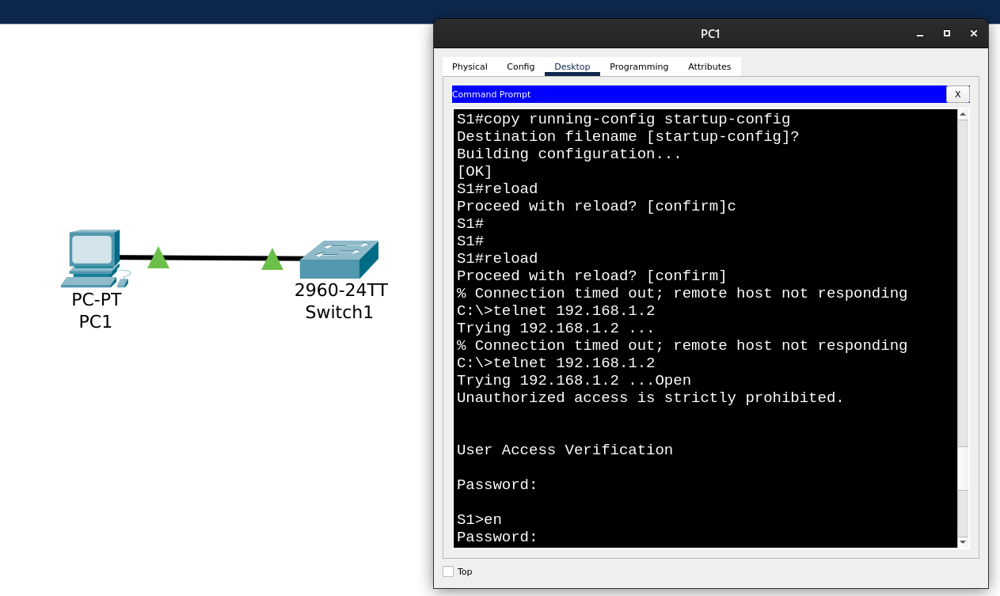

# Лабораторная работа №1. Базовая настройка коммутатора

## Часть 1. Создание сети и проверка настроек коммутатора по умолчанию

### Шаг 1. Соединение компьютера с коммутатором консольным кабелем


Вопрос: Почему нужно использовать консольное подключение для первоначальной настройки коммутатора? Почему нельзя подключиться к коммутатору через Telnet или SSH?

Ответ: Соединения Telnet или SSH выполняются поверх IP, т.е. для соединения с неким дестинейшеном должен быть известен его, дестинейшена, IP-адрес. Поскольку мы выполняем первоначальную настройку коммутатора, его виртуальный интерфейс SVI еще не настроен и IP адрес ему не назначен. Так что пока подключиться к коммутатору придётся с помощью консольного кабеля.

### Шаг 2. Просмотр настроек коммутатора по умолчанию

a. Подкючились к коммутатору, в терминале перешли в привелегированный режим, смотрим вывод ```show running-config```.


b. Файл running configuration.
Вопрос: Сколько интерфейсов FastEthernet имеется на коммутаторе 2960?

Ответ: 24

Вопрос: Сколько интерфейсов Gigabit Ethernet имеется на коммутаторе 2960?

Ответ: 2

Вопрос: Каков диапазон значений, отображаемых в vty-линиях?

Ответ:
```
Switch(config)#line vty ?
    <0-15>  First Line number
```
0-15

c. Хотим посмотреть файл загрузочной конфигурации (startup configuration), который содержится в энергонезависимом ОЗУ (NVRAM):
```Switch#show startup-config 
startup-config is not present
```

Изначально startup конфига нет:
```
Switch#dir flash: 
Directory of flash:/

    1  -rw-     4670455          <no date>  2960-lanbasek9-mz.150-2.SE4.bin

64016384 bytes total (59345929 bytes free)
```

d. Характеристики SVI для VLAN 1.
Вопрос: Назначен ли IP-адрес сети VLAN 1?

Ответ: Нет, судя по выводу show running-config:
```
interface Vlan1
 no ip address
 shutdown
```

Вопрос: Какой MAC-адрес имеет SVI?

Ответ: Судя по выводу ```show interfaces Vlan 1```: 00:E0:8F:34:78:14


Похоже на то, что увидели в ```show version```:


Вопрос: Данный интерфейс включен?

Ответ: Vlan1 is administratively down, line protocol is down

e. IP-свойства интерфейса SVI сети VLAN 1 - похоже, описывается ответом из d. ```no ip address```

f. Задание:
> Подсоедините кабель Ethernet компьютера PC-A к порту 6 на коммутаторе и изучите IP-свойства интерфейса SVI сети VLAN 1. Дождитесь согласования параметров скорости и дуплекса между коммутатором и ПК.


>...и изучите IP-свойства интерфейса SVI сети VLAN 1...

Непонятно, что именно имеется в виду, мы не делали никаких новых настроек SVI интерфейса, когда соединяли кабелем компьютер и порт FastEthernet 0/6 коммутатора.

g. Cведения о версии ОС Cisco IOS на коммутаторе.

Вопрос:
Под управлением какой версии ОС Cisco IOS работает коммутатор?

Ответ:
```
Switch#show version | section IOS
Cisco IOS Software, C2960 Software (C2960-LANBASEK9-M), Version 15.0(2)SE4, RELEASE SOFTWARE (fc1)
```
Вопрос:
Как называется файл образа системы?

Ответ: 2960-lanbasek9-mz.150-2.SE4.bin

Увидели среди прочего, что показывает ```show version```:
```
Switch#show version | section image
System image file is "flash:c2960-lanbasek9-mz.150-2.SE4.bin"
```

Совпадает с тем, что нашли во flash memory c помощью ```dir flash:```:

```
Switch#dir flash: 
Directory of flash:/

    1  -rw-     4670455          <no date>  2960-lanbasek9-mz.150-2.SE4.bin

64016384 bytes total (59345929 bytes free)
```

h. Свойства по умолчанию интерфейса FastEthernet, который используется компьютером PC-A.


Вопросы:
Интерфейс включен или выключен?

Ответ: Включен (is up)

Вопрос:
Что нужно сделать, чтобы включить интерфейс?

Ответ:
Перейти в привилегированный режим, оттуда в режим конфигурации, выбрать конфигурирование интересующего нас интерфейса и дать команду ```no shutdown```

```
Switch>enable 
Switch#con
Switch#conf
Switch#configure ter
Switch#configure terminal 
Enter configuration commands, one per line.  End with CNTL/Z.
Switch(config)#interface fa0/6
Switch(config-if)#no shutdown 

Switch(config-if)#
%LINK-5-CHANGED: Interface FastEthernet0/6, changed state to up

%LINEPROTO-5-UPDOWN: Line protocol on Interface FastEthernet0/6, changed state to up
```

Вопрос: Какой MAC-адрес у интерфейса?

Ответ: 00:01:C9:AC:7C:06 (из вывода ```show interfaces fa0/6```)

Вопрос:
Какие настройки скорости и дуплекса заданы в интерфейсе?

Ответ: Full-duplex, 100Mb/s (из вывода ```show interfaces fa0/6```)

i.Флеш-память.

Вопрос:
Какое имя присвоено образу Cisco IOS?

Ответ:
2960-lanbasek9-mz.150-2.SE4.bin

## Часть 2. Настройка базовых параметров сетевых устройств

### Шаг 1. Настройка базовые параметры коммутатора.

a. Выполнение команд:

```
Switch>enable 
Switch#conf
Switch#configure t
Switch#configure terminal 
Enter configuration commands, one per line.  End with CNTL/Z.
Switch(config)#no ip domain-lookup
Switch(config)#hostname S1
S1(config)#service password-encryption
S1(config)#enable secret class
S1(config)#banner motd #
Enter TEXT message.  End with the character '#'.
Unauthorized access is strictly prohibited. #
```


b. Назначение IP-адреса интерфейсу SVI на коммутаторе.

```
S1#conf terminal 
Enter configuration commands, one per line.  End with CNTL/Z.
S1(config)#interface Vlan ?
  <1-4094>  Vlan interface number
S1(config)#interface Vlan 1
S1(config-if)#ip address 192.168.1.1
% Incomplete command.
S1(config-if)#ip address 192.168.1.1 ?
  A.B.C.D  IP subnet mask
S1(config-if)#ip address 192.168.1.1 255.255.255.0
S1(config-if)#
S1(config-if)#exit
S1(config)#exit
```


c. Ограничение доступа через порт консоли с помощью пароля. Чтобы консольные сообщения не прерывали выполнение команд, используем параметр logging synchronous.


Вопрос:
Для чего нужна команда login?

Ответ: Из описания команды:
```
login         Enable password checking
```
Т.е., очевидно, команда ```set password``` позволяет задать пароль, но для включение проверки этого пароля нужна отдельная команда - ```login```.

d. Настройка каналов виртуального соединения для удаленного управления (vty), чтобы коммутатор разрешил доступ через Telnet.

```
S1>en
Password: 
S1#conf t
Enter configuration commands, one per line.  End with CNTL/Z.
S1(config)#line vty 0
S1(config-line)#passwo
S1(config-line)#password something-else
S1(config-line)#end
S1#
```

Теперь в ```running-config```:


Заходим через Telnet из командной строки PC1 (сверху несколько неудачных попыток до выставления пароля на line vty 0):


Сконфигурировали диапазоны vty:

```
S1(config)#line vty 0 4
S1(config-line)#password cisco
S1(config-line)#exit
S1(config)#line vty 5 15
S1(config-line)#password cisco
S1(config-line)#end
S1#
```


### Шаг 2. Настройка IP-адреса на компьютере PC-A.


## Часть 3. Проверка сетевых подключений

### Шаг 1. Полученная конфигурация коммутатора.

a. Вывод ```show running-config```

Пришлось заменить IP-адрес коммутатора на 192.168.1.2 (изначально выбрали 192.168.1.1, но в проверочном конфиге из описания задания это IP шлюза по умолчанию).

```C:\>telnet 192.168.1.2
Trying 192.168.1.2 ...Open
Unauthorized access is strictly prohibited. 


User Access Verification

Password: 
S1>en
Password: 
S1#show
S1#show ru
S1#show running-config 
Building configuration...

Current configuration : 1318 bytes
!
version 15.0
no service timestamps log datetime msec
no service timestamps debug datetime msec
service password-encryption
!
hostname S1
!
enable secret 5 $1$mERr$9cTjUIEqNGurQiFU.ZeCi1
!
!
!
no ip domain-lookup
!
!
!
spanning-tree mode pvst
spanning-tree extend system-id
!
!
interface FastEthernet0/1
!
interface FastEthernet0/2
!
interface FastEthernet0/3
!
interface FastEthernet0/4
!
interface FastEthernet0/5
!
interface FastEthernet0/6
!
interface FastEthernet0/7
!
interface FastEthernet0/8
!
interface FastEthernet0/9
!
interface FastEthernet0/10
!
interface FastEthernet0/11
!
interface FastEthernet0/12
!
interface FastEthernet0/13
!
interface FastEthernet0/14
!
interface FastEthernet0/15
!
interface FastEthernet0/16
!
interface FastEthernet0/17
!
interface FastEthernet0/18
!
interface FastEthernet0/19
!
interface FastEthernet0/20
!
interface FastEthernet0/21
!
interface FastEthernet0/22
!
interface FastEthernet0/23
!
interface FastEthernet0/24
!
interface GigabitEthernet0/1
!
interface GigabitEthernet0/2
!
interface Vlan1
 ip address 192.168.1.2 255.255.255.0
!
ip default-gateway 192.168.1.1
!
banner motd ^C
Unauthorized access is strictly prohibited. ^C
!
!
!
line con 0
 password 7 0822455D0A16
 logging synchronous
 login
!
line vty 0 4
 password 7 0822455D0A16
 login
line vty 5 15
 password 7 0822455D0A16
 login
!
!
!
!
end
```
b. Параметры VLAN 1.


Вопрос: Какова полоса пропускания этого интерфейса?

Ответ: Из вывода ```show interface vlan 1```:
BW (bandwidth) 100000 Kbit

### Шаг 2. Тестирование сквозного соединения отправкой эхо-запроса.

```
C:\>
C:\>ping 192.168.1.2

Pinging 192.168.1.2 with 32 bytes of data:

Reply from 192.168.1.2: bytes=32 time<1ms TTL=255
Reply from 192.168.1.2: bytes=32 time<1ms TTL=255
Reply from 192.168.1.2: bytes=32 time<1ms TTL=255
Reply from 192.168.1.2: bytes=32 time<1ms TTL=255

Ping statistics for 192.168.1.2:
    Packets: Sent = 4, Received = 4, Lost = 0 (0% loss),
Approximate round trip times in milli-seconds:
    Minimum = 0ms, Maximum = 0ms, Average = 0ms

C:\>
```

### Шаг 3. Проверка удаленного управления коммутатором S1.

Сохранили конфигурацию и перезагрузили коммутатор. После перезагрузки удалось зайти по Telnet, при входе запросил пароль - очевидно, что прогрузилась именно наша конфигурация (в которой мы добавляли IP-адрес и пароли), которую мы сохранили до перезагрузки.



## Вопросы для повторения

Зачем необходимо настраивать пароль VTY для коммутатора?

Ответ: Без пароля не удастся установить Telnet-соединение (само по себе незащищенное) с коммутатором.

Что нужно сделать, чтобы пароли не отправлялись в незашифрованном виде?

Ответ: В режиме конфигурирования (config terminal) применить команду ```service password-encryption```
