# Лабораторная работа №2. Просмотр таблицы MAC-адресов коммутатора

## Часть 1. Создание и настройка сети

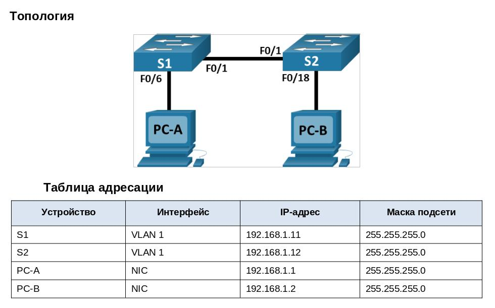

Настройка имен устройств в соответствии с топологией.

```
Switch>en
Switch#conf t
Enter configuration commands, one per line.  End with CNTL/Z.
Switch(config)#host
Switch(config)#hostname S1

S1(config)#enable secret class
S1(config)#
S1(config)#line console 0
S1(config-line)#password cisco
S1(config-line)#exit

S1(config)#line vty ?
  <0-15>  First Line number
S1(config)#line vty 0 15
S1(config-line)#password cisco
S1(config-line)#login
S1(config-line)#exit

S1(config)#service password-encryption 
S1(config)#

S1(config)#interface Vlan 1
S1(config-if)#ip ad
S1(config-if)#ip address 192.168.1.11 255.255.255.0
S1(config-if)#no shutdown 

S1(config-if)#
%LINK-5-CHANGED: Interface Vlan1, changed state to up

S1(config-if)#
S1(config-if)#
S1(config-if)#exit

```

Конфигурация S1:

```
S1#show running-config 
Building configuration...

Current configuration : 1228 bytes
!
version 15.0
no service timestamps log datetime msec
no service timestamps debug datetime msec
service password-encryption
!
hostname S1
!
enable secret 5 $1$mERr$9cTjUIEqNGurQiFU.ZeCi1
!
!
!
!
!
!
spanning-tree mode pvst
spanning-tree extend system-id
!
interface FastEthernet0/1
..................................
interface FastEthernet0/24
!
interface GigabitEthernet0/1
!
interface GigabitEthernet0/2
!
interface Vlan1
 ip address 192.168.1.11 255.255.255.0
!
!
!
!
line con 0
 password 7 0822455D0A16
 login
!
line vty 0 4
 password 7 0822455D0A16
 login
line vty 5 15
 password 7 0822455D0A16
 login
!
!
!
!
end
```

Убедились, что интерфейс Vlan1 на коммутаторе поднят:
```
S1#show interfaces Vlan 1 | include is
Vlan1 is up, line protocol is up
  Hardware is CPU Interface, address is 0002.4a42.9b94 (bia 0002.4a42.9b94)
  Internet address is 192.168.1.11/24
```

Подключились к коммутатору S1 через telnet c PC-A:

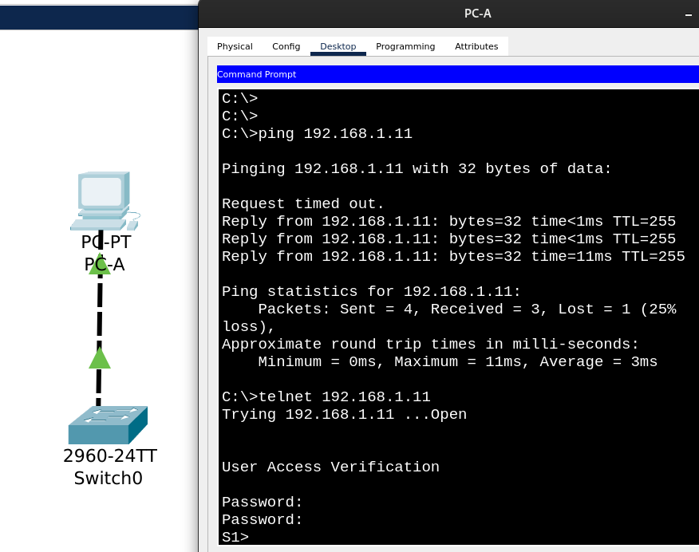

Последовательность команд настройки коммутатора S2:

```
Switch>en
Switch#conf t
Enter configuration commands, one per line.  End with CNTL/Z.
Switch(config)#ho
Switch(config)#hostname S2

S2(config)#enable secret class
S2(config)#
S2(config)#line console 0
S2(config-line)#password cisco
S2(config-line)#login
S2(config-line)#exit

S2(config)#line vty ?
  <0-15>  First Line number
S2(config)#line vty 0 15
S2(config-line)#password cisco
S2(config-line)#exit

S2(config)#interface Vlan ?
  <1-4094>  Vlan interface number
S2(config)#interface Vlan 1
S2(config-if)#ip address 192.168.1.12 255.255.255.0
S2(config-if)#no shutdown

S2(config-if)#
%LINK-5-CHANGED: Interface Vlan1, changed state to up

S2(config-if)#exit
S2(config)#service password-encryption
S2(config)#exit
```

Конфигурация S2:

```
S2#show running-config 
Building configuration...

Current configuration : 1218 bytes
!
version 15.0
no service timestamps log datetime msec
no service timestamps debug datetime msec
service password-encryption
!
hostname S2
!
enable secret 5 $1$mERr$9cTjUIEqNGurQiFU.ZeCi1
!
!
!
!
!
!
spanning-tree mode pvst
spanning-tree extend system-id
!
interface FastEthernet0/1
!
..................................
!
interface FastEthernet0/24
!
interface GigabitEthernet0/1
!
interface GigabitEthernet0/2
!
interface Vlan1
 ip address 192.168.1.12 255.255.255.0
!
!
!
!
line con 0
 password 7 0822455D0A16
 login
!
line vty 0 4
 password 7 0822455D0A16
 login
line vty 5 15
 password 7 0822455D0A16
 login
!
!
!
!
end
```

Сохранили текущий конфиг S2:

```
S2#copy running-config startup-config 
Destination filename [startup-config]? 
Building configuration...
[OK]
S2#
```

Убедились, что конфиг применился после перезагрузки коммутатора:

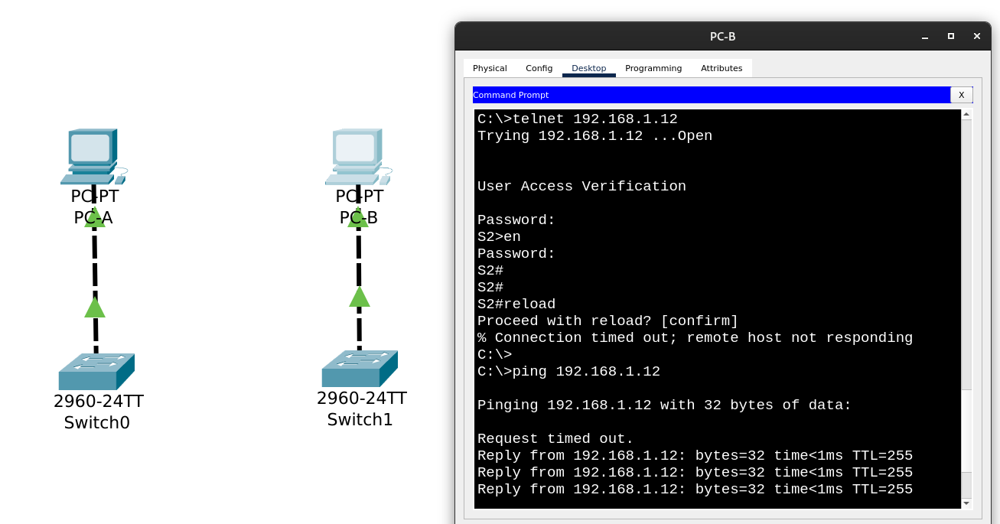

Соединили коммутаторы между собой и проверили, что с PC-A ip-адреса S2 и PC-B успешно пингуются:

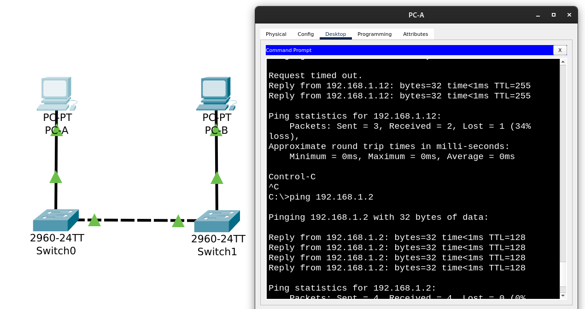

## Часть 2. Изучение таблицы МАС-адресов коммутатора

### Шаг 1. Выяснение МАС-адресов сетевых устройств

Применяем в командной строке на PC-A и PC-B команду ```ipconfig /all```

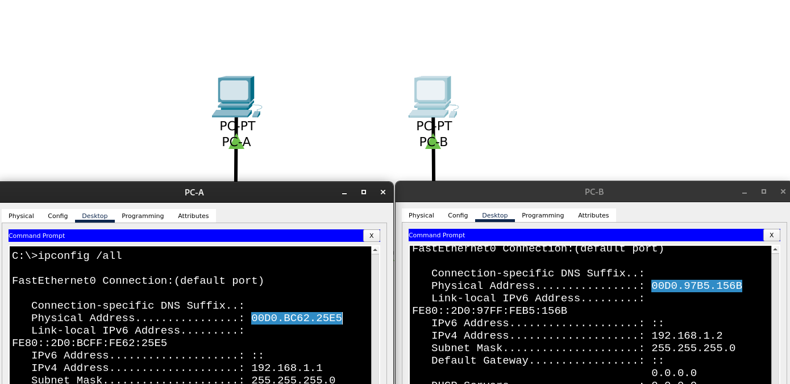

MAC-адрес компьютера PC-A: ```00:D0:BC:62:25:E5```

MAC-адрес компьютера PC-B: ```00:D0:97:B5:15:6B```

На коммутаторах S1 и S2 смотрим вывод команды ```show interface F0/1```

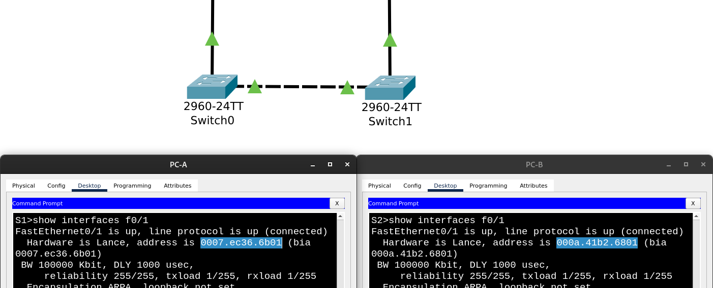

МАС-адрес коммутатора S1 Fast Ethernet 0/1: ```00:07:EC:36:6B:01```

МАС-адрес коммутатора S2 Fast Ethernet 0/1: ```00:0A:41:B2:68:01```

### Шаг 2. Просмотр таблицы МАС-адресов коммутатора

Смотрим таблицу MAC-адресов на коммутаторе S2:

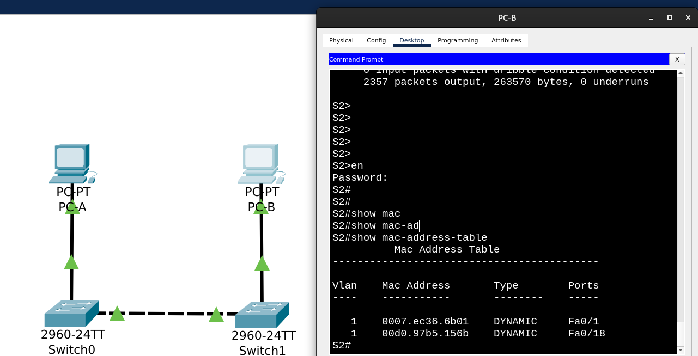

Вопрос:
Записаны ли в таблице МАС-адресов какие-либо МАС-адреса?

Ответ: Да, MAC-адрес коммутатора S1, подключенный к интерфейсу Fa0/1, и MAC-адрес компьютера PC-B, подключенный к интерфейсу Fa0/18.

Вопрос:
Если вы не записали МАС-адреса сетевых устройств в шаге 1, как можно определить, каким устройствам принадлежат МАС-адреса, используя только выходные данные команды ```show mac address-table```?

Ответ: Мы знаем, к каким интерфейсам подключали коммутатор и компьютер, так что по содержимому столбца ```Ports``` можно понять, в какой строке чей MAC-адрес.

Вопрос: Работает ли это решение в любой ситуации?

Ответ:

Попинговали PC-B с PC-A, в таблицу MAC-адресов S2 добавился MAC-адрес PC-A:

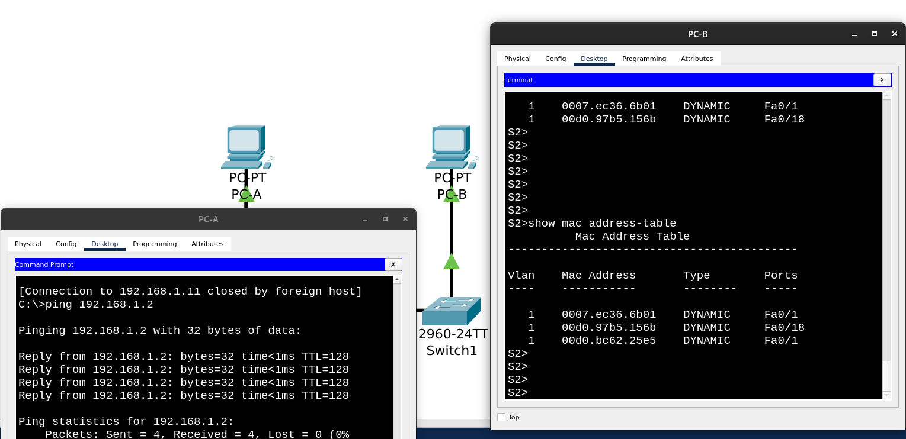

Так что теперь понять, какой из MAC-адресов на Fa0/1 относится к коммутатору, а какой - к компьютеру, нельзя.

### Шаг 3. Очистка и повторный просмотр таблицы МАС-адресов коммутатора

На коммутаторе S2 (подключаемся через консоль) в привилегированном режиме EXEC вводим команду ```clear mac address-table dynamic```, после чего смотрим таблицу MAC-адресов:

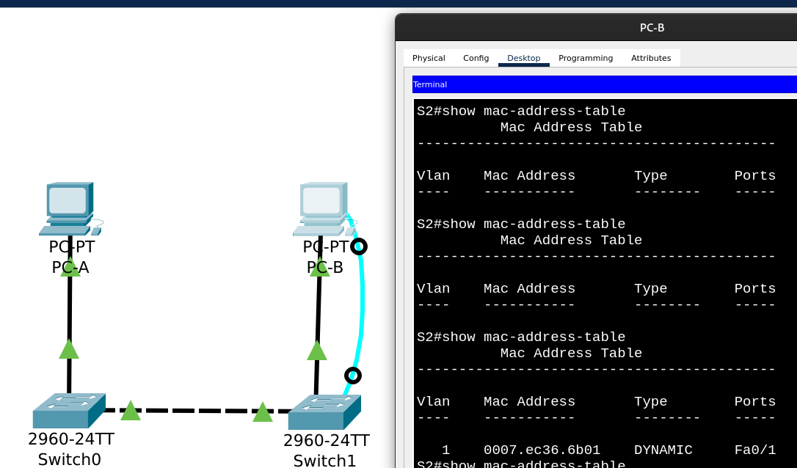

Видим, что через некоторе время MAC-адрес соседнего коммутатора снова появился в таблице.

### Шаг 4. Отправка эхо-запросов устройствам в сети и повторный просмотр таблицу МАС-адресов коммутатора

a. На компьютере PC-B в командной строке вводим команду ```arp -a```.

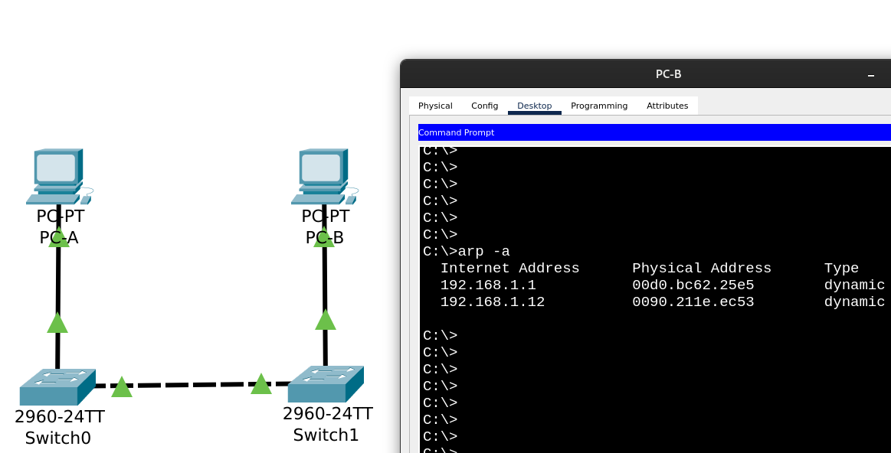

Не считая адресов многоадресной и широковещательной рассылки, сколько пар IP- и МАС-адресов устройств было получено через протокол ARP?

b. Из командной строки PC-B отправляем эхо-запросы на компьютер PC-A, а также на коммутаторы S1 и S2.

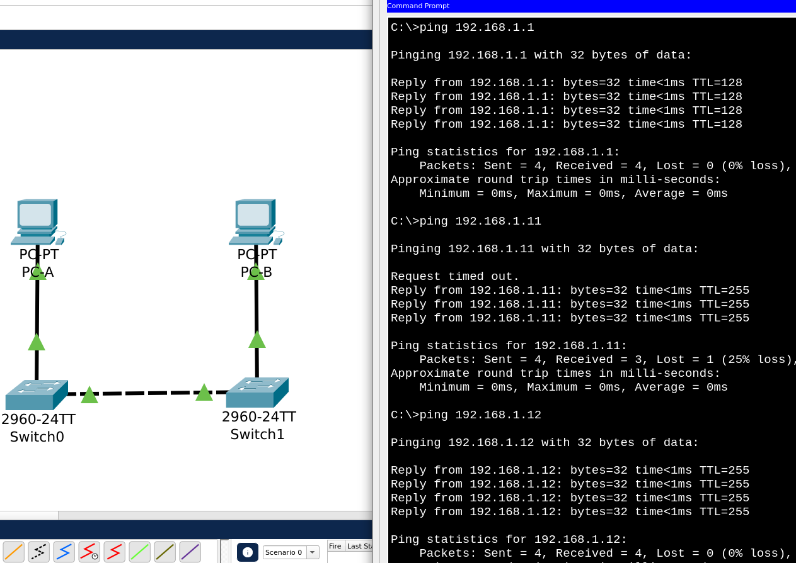

c. Подключившись через консоль к коммутатору S2, вводим команду ```show mac address-table```.

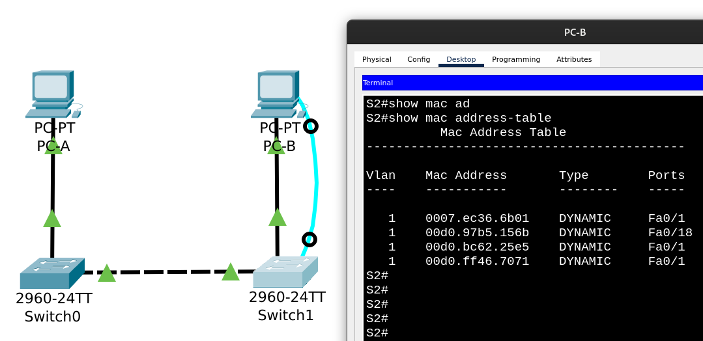

Появилась новая запись с MAC-адресом ```00:D0:FF:46:70:71```

Все остальные MAC-адреса нам были знакомы ранее:

MAC-адрес компьютера PC-A: ```00:D0:BC:62:25:E5```

MAC-адрес компьютера PC-B: ```00:D0:97:B5:15:6B```

МАС-адрес коммутатора S1 Fast Ethernet 0/1: ```00:07:EC:36:6B:01```

Посмотрели MAC-адрес виртуального интерфейса Vlan1 коммутатора S1, к которому привязан IP-адрес 192.168.1.11, который мы пинговали с PC-B:

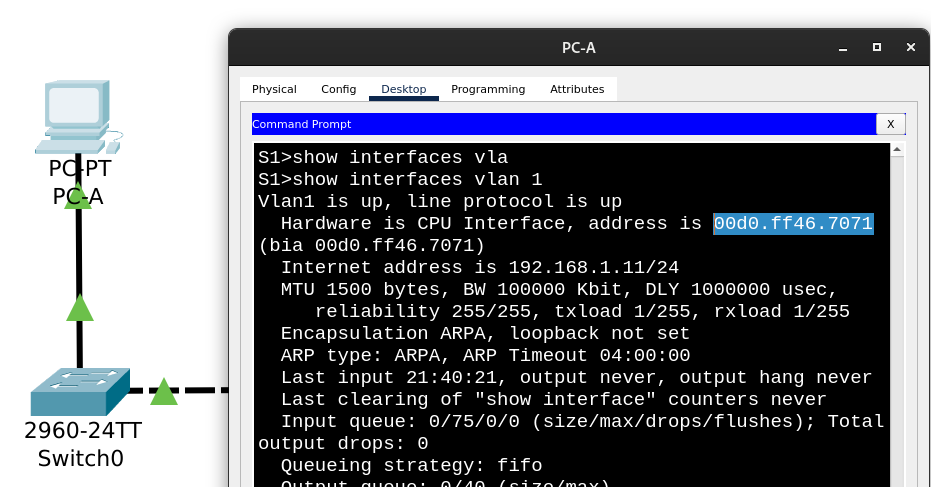

На компьютере PC-B в командной строке снова выполнили команду ```arp -a```.

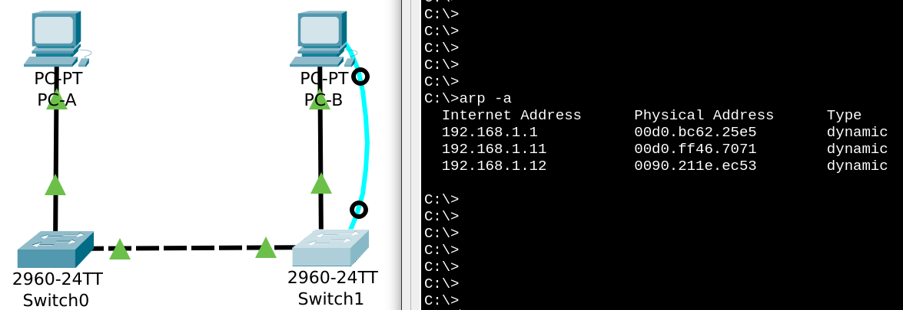

Вопрос:
Появились ли в ARP-кэше компьютера PC-B дополнительные записи для всех сетевых устройств, которым были отправлены эхо-запросы?

Ответ:
Да, как раз запись с MAC-адресом ```00:D0:FF:46:70:71``` виртуального интерфейса Vlan1 коммутатора S1.
