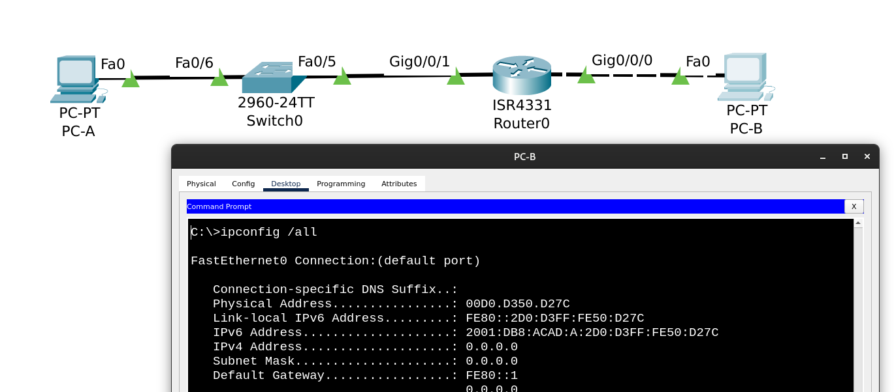
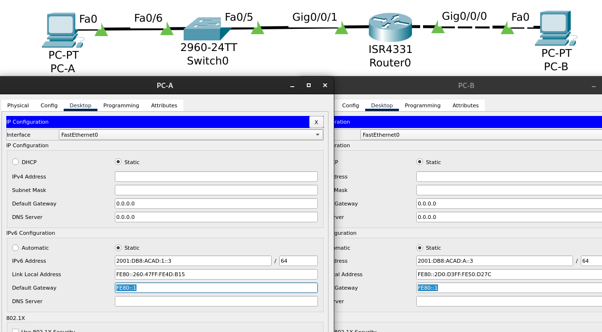
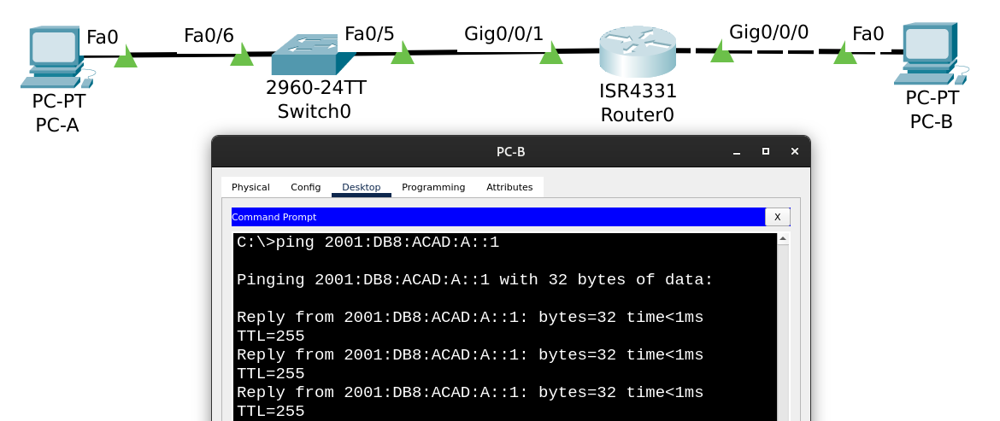

# Лабораторная работа №4. Настройка IPv6-адресов на сетевых устройствах


Убедились, что у всех маршрутизаторов и коммутаторов была удалена начальная конфигурация.


Шаблон default bias, который по умолчанию используется диспетчером SDM (диспетчер базы данных коммутатора), не предоставляет возможностей адресации IPv6.


Установили шаблон dual-ipv4-and-ipv6 и перезагрузили коммутатор.


## Часть 1. Настройка топологии и конфигурация основных параметров маршрутизатора и коммутатора

Назначили имена хоста маршрутизатору и коммутатору.

```
Router>en
Router#conf t
Enter configuration commands, one per line.  End with CNTL/Z.
Router(config)#host
Router(config)#hostname R1
```

## Часть 2. Ручная настройка IPv6-адресов

### Шаг 1. Назначить IPv6-адреса интерфейсам Ethernet на R1.

С помощью ```show ipv6 interface brief``` убеждаемся, что каждому интерфейсу назначен корректный индивидуальный IPv6-адрес.

```
R1>
R1>
R1>en
R1#conf t
Enter configuration commands, one per line.  End with CNTL/Z.
R1(config)#int g 0/0/0
R1(config-if)#ipv6 address 2001:db8:acad:a::1/64
R1(config-if)#exit
R1(config)#int g 0/0/1
R1(config-if)#
R1(config-if)#ipv6 address 2001:db8:acad:1::1/64
R1(config-if)#exit
R1(config)#exit
R1#
%SYS-5-CONFIG_I: Configured from console by console

R1#
R1#
R1#show ipv6 interface brief 
GigabitEthernet0/0/0       [administratively down/down]
    FE80::201:96FF:FE28:1301
    2001:DB8:ACAD:A::1
GigabitEthernet0/0/1       [administratively down/down]
    FE80::201:96FF:FE28:1302
    2001:DB8:ACAD:1::1
GigabitEthernet0/0/2       [administratively down/down]
    unassigned
Vlan1                      [administratively down/down]
    unassigned
R1#
```

Отображаемый локальный адрес канала основан на адресации EUI-64, которая автоматически использует MAC-адрес интерфейса для создания 128-битного локального IPv6-адреса канала.

Проверяем:

Link-local IPv6 на gigabitEthernet 0/0/0: ```FE80::201:96FF:FE28:1301```

InterfaceId-часть LLA = 64 бита = 4 хекстета: ```0201:96FF:FE28:1301```

MAC-адрес на gigabitEthernet 0/0/0:
```
R1#show interface gigabitEthernet 0/0/0 | include addr
  Hardware is ISR4331-3x1GE, address is 0001.9628.1301 (bia 0001.9628.1301)
```

Т.е. взяли ```0001:9628:1301```, в 7-ом бите поменяли 0 на 1, так что ```0000 0000``` (первый хекстет до) превратился в ```0000 0010``` (первый хекстет после), получили ```0201:9628:1301```.
Затем в середину ```0201:9628:1301``` вставили ```FF:FE```, получили ```0201:96FF:FE28:1301```

Совпадает с InterfaceId-частью самосгенеренного link-local IPv6 адреса.

Аналогично для второго интерфейса.

Link-local IPv6 на gigabitEthernet 0/0/0: ```FE80::201:96FF:FE28:1302```

InterfaceId-часть LLA = 64 бита = 4 хекстета: ```0201:96FF:FE28:1302```

MAC-адрес на gigabitEthernet 0/0/1:

```
R1#show interface gigabitEthernet 0/0/1 | include addr
  Hardware is ISR4331-3x1GE, address is 0001.9628.1302 (bia 0001.9628.1302)
```

Взяли MAC-адрес ```0001:9628:1302``` -> поменяли 0 на 1 в 7-ом бите ```0201:9628:1302``` -> вставили ```FF:FE``` в середину ```0201:96FF:FE28:1302``` - совпало с InterfaceId-частью самосгенеренного link-local IPv6 адреса.

Вручную задаем link-local адреса на каждом интерфейсе маршрутизатора. Поскольку каждый интерфейс относится к отдельной сети, не страшно, что они имеют одинаковые link-local адреса, т.к. их видно только в своей сети.

```
R1(config)#interface gigabitEthernet 0/0/0
R1(config-if)#ipv6 address fe80::1 link-local 
R1(config-if)#exit
R1(config)#interface gigabitEthernet 0/0/1
R1(config-if)#
R1(config-if)#ipv6 address fe80::1 link-local 
R1(config-if)#exit
R1(config)#exit
R1#show ipv6 interface brief 
GigabitEthernet0/0/0       [administratively down/down]
    FE80::1
    2001:DB8:ACAD:A::1
GigabitEthernet0/0/1       [administratively down/down]
    FE80::1
    2001:DB8:ACAD:1::1
GigabitEthernet0/0/2       [administratively down/down]
    unassigned
Vlan1                      [administratively down/down]
    unassigned
R1#
```

Вопрос:
Какие группы многоадресной рассылки назначены интерфейсу G0/0?

Ответ: Пока только ```FF02::1``` (которая назначается всем IPv6 узлам).


Забыли поднять интерфейсы:

На маршрутизаторе:
```
R1(config)#interface gigabitEthernet 0/0/0
R1(config-if)#no shutdown 

R1(config-if)#
%LINK-5-CHANGED: Interface GigabitEthernet0/0/0, changed state to up

%LINEPROTO-5-UPDOWN: Line protocol on Interface GigabitEthernet0/0/0, changed state to up

R1(config-if)#
R1(config-if)#exit
R1(config-if)#
R1(config)#interface g 0/0/1
R1(config-if)#no shutdown 

R1(config-if)#
%LINK-5-CHANGED: Interface GigabitEthernet0/0/1, changed state to up

%LINEPROTO-5-UPDOWN: Line protocol on Interface GigabitEthernet0/0/1, changed state to up

R1(config-if)#
```

На коммутаторе:
```
S1(config)#interface fastEthernet 0/5
S1(config-if)#no shu
S1(config-if)#no shutdown 
S1(config-if)#exit
S1(config)#exit
S1#
%SYS-5-CONFIG_I: Configured from console by console

%LINK-5-CHANGED: Interface FastEthernet0/5, changed state to up

%LINEPROTO-5-UPDOWN: Line protocol on Interface FastEthernet0/5, changed state to up

S1#
```

### Шаг 2. Активация IPv6-маршрутизации на R1.

a. В командной строке на PC-B вводим команду ```ipconfig```, чтобы получить данные IPv6-адреса, назначенного интерфейсу ПК.


Вопрос:
Назначен ли индивидуальный IPv6-адрес сетевой интерфейсной карте (NIC) на PC-B?

Ответ: Нет, очевидно, пока маршрутизатор не входит в multicast-группу ```FF02::2```, он никогда не получит от компьютера PC-B сообщения Router Solicitation, и, соответственно не отправит в ответ Router Advertisement с префиксом, который компьютер должен был бы использовать для генерации глобального индивидуального адреса. 

b. Активируем IPv6-маршрутизацию на R1 с помощью команды ipv6 unicast-routing.


c. В IP Configuration компьютера PC-B выставили переключатель (radio button) IPv6 Configuration в Automatic, и видим, что глобальный unicast адрес был назначен.

Из ipconfig на PC-B:

```IPv6 Address....................: 2001:DB8:ACAD:A:2D0:D3FF:FE50:D27C```

Вопрос:
Почему PC-B получил глобальный префикс маршрутизации и идентификатор подсети, которые вы настроили на R1?

Ответ:
Теперь, после включения на маршрутизаторе маршрутизации IPv6
```R1(config)#ipv6 unicast-routing```,
R1 стал входить в multicast-группу маршрутизаторов, получил от PC-B сообщение Router Solicitation, ответил ему сообщением Router Advertisement, в котором содержится префикс.



В IPv6-адресе видим, что префиксная часть (первые 64 бита, т.е. первые 4 хекстета) совпадает с префиксом, заданном на маршрутизаторе (```R1(config-if)#ipv6 address 2001:db8:acad:a::1/64```), а InterfaceId-часть  сгенерирована с помощью метода получения EUI-64 (так же, как и для Link-Local адреса).

### Шаг 3. Назначение IPv6-адреса интерфейсу управления (SVI) на S1.
                
a. Назначаем глобальный unicast адрес 2001:db8:acad:1::b/64 и link-local адрес fe80::b на управляющий интерфейс коммутатора S1.

```
S1>en
S1#conf t
Enter configuration commands, one per line.  End with CNTL/Z.
S1(config)#interface Vlan 1
S1(config-if)#
S1(config-if)#
S1(config-if)#ipv6 address 2001:db8:acad:1::b/64
S1(config-if)#ipv6 address fe80::b link-local 
S1(config-if)#no shutdown 
```

b. Проверяем правильность назначения IPv6-адресов интерфейсу управления с помощью команды ```show ipv6 interface vlan 1```.


### Шаг 4. Назначение компьютерам статических IPv6-адресов.

Сначала PC-A тоже выставили автоматическое назначение IPv6-адреса (переключатель (radio button) IPv6 Configuration в Automatic):


```
C:\>ipconfig /all

FastEthernet0 Connection:(default port)

   Connection-specific DNS Suffix..: 
   Physical Address................: 0060.474D.0B15
   Link-local IPv6 Address.........: FE80::260:47FF:FE4D:B15
   IPv6 Address....................: 2001:DB8:ACAD:1:260:47FF:FE4D:B15
```

Убеждаемся, что и здесь автоматически сгенерированный IPv6 адрес использовал 64 бита префикса сети и 48 бит MAC-адреса с вставленными его середину FF:FE и измененным 7-ым битом (первый байт MAC адреса из 00 превратился в 02).

Теперь зададим IPv6 адреса компьютеров статически:

Из условия
```
PC-A    2001:db8:acad:1::3
PC-B    2001:db8:acad:a::3
```


Link-local адреса остались автоматически сгенерированными (SLAAC).

## Часть 3. Проверка сквозного подключения
 
С PC-A отправляем эхо-запрос на FE80::1. Это локальный адрес канала, назначенный G0/1 на R1.


Отправляем эхо-запрос на интерфейс управления S1 с PC-A.


Маршрутизатор R1 (его интерфейс G0/0/1) пингуется с PC-A, но адрес PC-B - нет.


Похоже, потеряли Default Gateway, когда настраивали на компьютерах статический IPv6-адрес.

Пропишем FE80::1 (link-local адрес маршрутизатора в обеих сетях)



Теперь PC-B пингуется с PC-A:


Смотрим вывод ```tracert``` на PC-A до PC-B.


С PC-B отправляем эхо-запрос на PC-A.


С PC-B отправляем эхо-запрос на локальный адрес канала G0/0 на R1.



        
## Вопросы для повторения
1. Почему обоим интерфейсам Ethernet на R1 можно назначить один и тот же локальный адрес канала — FE80::1?

Потому что эти адреса видны только пределах своих сетей.

2. Какой идентификатор подсети в индивидуальном IPv6-адресе 2001:db8:acad::aaaa:1234/64?

Идентификатор подсети (Subnet ID) - это (обычно?) последний хекстет 64-битного префикса 2001:db8:acad::/64, он попадает на ::, которое скрывает за собой нули. Т.е. идентификатор подсети - это 0000.