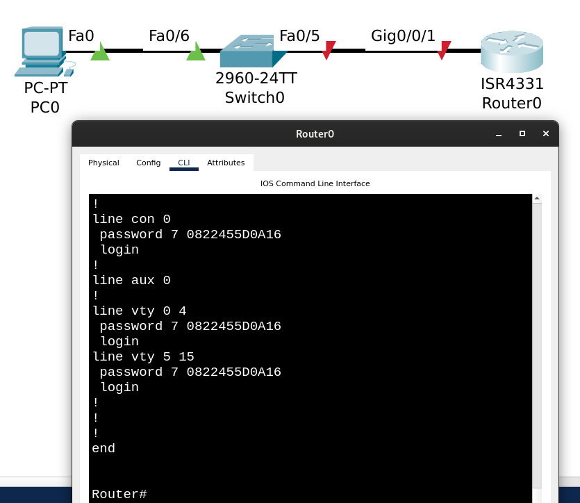
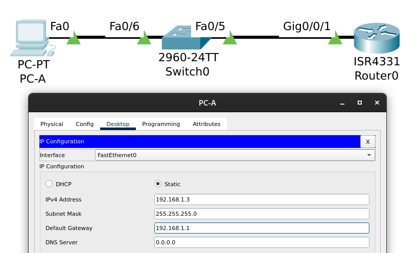
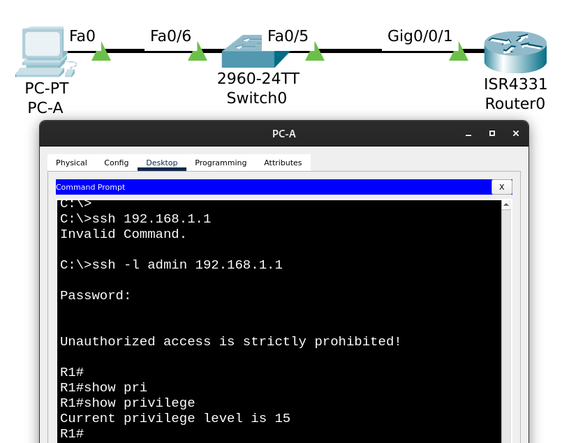

# Лабораторная работа №5. Доступ к сетевым устройствам по протоколу SSH


## Часть 1. Настройка основных параметров устройств

### Настройка маршрутизатора

Отключение поиска DNS, чтобы предотвратить попытки маршрутизатора неверно преобразовывать введенные команды таким образом, как будто они являются именами узлов:

До отключения ```ip domain-lookup```:
```
Router#gfbdfgndrgfn
Translating "gfbdfgndrgfn"...domain server (255.255.255.255) % Name lookup aborted
```
Прервать lookup - комбинация ```Ctrl + Shift + 6```

После:
```
Router#conf t
Enter configuration commands, one per line.  End with CNTL/Z.
Router(config)#no ip domai?
domain  domain-lookup  domain-name  
Router(config)#no ip domain-lookup 
Router(config)#exit
Router#
%SYS-5-CONFIG_I: Configured from console by console

Router#
Router#gfbdfgndrgfn
Translating "gfbdfgndrgfn"
% Unknown command or computer name, or unable to find computer address

Router#
```

Назначаем ```class``` в качестве зашифрованного пароля привилегированного режима EXEC:
```
Router>en
Router#conf t
Enter configuration commands, one per line.  End with CNTL/Z.
Router(config)#service password-encryption 
Router(config)#enable secret ?
  0      Specifies an UNENCRYPTED password will follow
  5      Specifies an ENCRYPTED secret will follow
  LINE   The UNENCRYPTED (cleartext) 'enable' secret
  level  Set exec level password
Router(config)#enable secret class
Router(config)#exit
Router#
%SYS-5-CONFIG_I: Configured from console by console

Router#copy running-config startup-config 
Destination filename [startup-config]? 
Building configuration...
[OK]
Router#show running-config 
Building configuration...

Current configuration : 694 bytes
!
version 16.6.4
no service timestamps log datetime msec
no service timestamps debug datetime msec
service password-encryption
!
hostname Router
!
!
!
enable secret 5 $1$mERr$9cTjUIEqNGurQiFU.ZeCi1
```

Назначаем ```cisco``` в качестве пароля консоли и включите вход в систему по паролю.

```
Router#conf t
Enter configuration commands, one per line.  End with CNTL/Z.
Router(config)#line console ?
  <0-0>  First Line number
Router(config)#line console 0
Router(config-line)#password ?
  7     Specifies a HIDDEN password will follow
  LINE  The UNENCRYPTED (cleartext) line password
Router(config-line)#password 7 cisco
Invalid encrypted password: cisco
Router(config-line)#
Router(config-line)#password cisco
Router(config-line)#login
Router(config-line)#
Router(config-line)#end
Router#
%SYS-5-CONFIG_I: Configured from console by console
```

Убедились, что пароль закодирован и запрашивается при подключении к маршрутизатору по консоли:
```
Router#show running-config 
Building configuration...

Current configuration : 746 bytes
....
!
line con 0
 password 7 0822455D0A16
 login
!
....
```


Назначаем cisco в качестве пароля VTY и включаем вход в систему по паролю:

```
Router#conf t
Enter configuration commands, one per line.  End with CNTL/Z.
Router(config)#line vty ?
  <0-15>  First Line number
Router(config)#line vty 
Router(config)#line vty ?
  <0-15>  First Line number
Router(config)#line vty 0 ?
  <1-15>  Last Line number
  <cr>
Router(config)#line vty 0 15
Router(config-line)#password ?
  7     Specifies a HIDDEN password will follow
  LINE  The UNENCRYPTED (cleartext) line password
Router(config-line)#password cisco
Router(config-line)#login 
Router(config-line)#end
Router#
%SYS-5-CONFIG_I: Configured from console by console
```




Создаем баннер, который предупреждает о запрете несанкционированного доступа.

```
Router#conf t
Router(config)#banner motd ?
  LINE  c banner-text c, where 'c' is a delimiting character
Router(config)#banner motd "
Enter TEXT message.  End with the character '"'.
Unauthorized access is strictly prohibited!"

Router(config)#
```


Настройка и активиация интерфейса G0/0/1:

```
Router>en
Password: 
Router#conf t
Enter configuration commands, one per line.  End with CNTL/Z.
Router(config)#interface gigabitEthernet 0/0/1
Router(config-if)#
Router(config-if)#
Router(config-if)#ip address 192.168.1.1 ?
  A.B.C.D  IP subnet mask
Router(config-if)#ip address 192.168.1.1 255.255.255.0
Router(config-if)#
Router(config-if)#no shutdown 

Router(config-if)#
%LINK-5-CHANGED: Interface GigabitEthernet0/0/1, changed state to up

%LINEPROTO-5-UPDOWN: Line protocol on Interface GigabitEthernet0/0/1, changed state to up

Router(config-if)#end
Router#
%SYS-5-CONFIG_I: Configured from console by console

Router#copy running-config startup-config 
Destination filename [startup-config]? 
Building configuration...
[OK]
Router#
```

### Настройка компьютера PC-A

Выставили IP-адрес, маску подсети и шлюз по умолчанию согласно таблице в условии.



Пингуем маршрутизатор с хоста PC-A:


## Часть 2. Настройка маршрутизатора для доступа по протоколу SSH

### Шаг 1. Настройка аутентификации устройств

При генерации ключа шифрования в качестве его части используются имя устройства и домен. Поэтому эти имена необходимо указать перед вводом команды ```crypto key```.

```
Router#conf t
Enter configuration commands, one per line.  End with CNTL/Z.
Router(config)#hostname R1
R1(config)#ip domain-name ?
  WORD  Default domain name
R1(config)#ip domain-name otus.local
```

### Шаг 2. Создание ключа шифрования с указанием его длины

```
R1(config)#crypto key generate rsa ?
  general-keys  Generate a general purpose RSA key pair for signing and
                encryption
  <cr>
R1(config)#crypto key generate rsa general-keys ?
  modulus  Provide number of modulus bits on the command line
  <cr>
R1(config)#crypto key generate rsa general-keys modulus ?
  <360-4096>  size of the key modulus [360-4096]
R1(config)#crypto key generate rsa general-keys modulus 1024
The name for the keys will be: R1.otus.local

% The key modulus size is 1024 bits
% Generating 1024 bit RSA keys, keys will be non-exportable...[OK]
*Mar 1 0:56:5.512: %SSH-5-ENABLED: SSH 1.99 has been enabled
```

Замечаем ```SSH 1.99 has been enabled```, переключаем SSH на версию 2:

```
R1(config)#ip ssh version ?
  <1-2>  Protocol version
R1(config)#ip ssh version 2
R1(config)#exit
R1#
%SYS-5-CONFIG_I: Configured from console by console

R1#show ip ssh
SSH Enabled - version 2.0
Authentication timeout: 120 secs; Authentication retries: 3
```

### Шаг 3. Создание имени пользователя в локальной базе учетных записей

```
R1#conf t
Enter configuration commands, one per line.  End with CNTL/Z.
R1(config)#username admin ?
  password   Specify the password for the user
  privilege  Set user privilege level
  secret     Specify the secret for the user
  <cr>
R1(config)#username admin secret Adm1nP @55
R1(config)#username admin privilege 15
R1(config)#
```

### Шаг 4. Активация протокола SSH на линиях VTY

Активируем протоколы Telnet и SSH на входящих линиях VTY с помощью команды ```transport input```:

```
R1(config)#line vty ?
  <0-15>  First Line number
R1(config)#line vty 0 15
R1(config-line)#
R1(config-line)#transport input ?
  all     All protocols
  none    No protocols
  ssh     TCP/IP SSH protocol
  telnet  TCP/IP Telnet protocol
R1(config-line)#transport input all
```

Изменяем способ входа в систему так, чтобы использовалась проверка пользователей по локальной базе учетных записей:

```
R1(config-line)#login ?
  authentication  authenticate using aaa method list
  local           Local password checking
  <cr>
R1(config-line)#login local
R1(config-line)#end
```

### Шаг 5. Сохраняем текущую конфигурацию в файл загрузочной конфигурации

```
R1#copy running-config startup-config
```

### Шаг 6. Устанавливаем соединение с маршрутизатором по протоколу SSH.



## Часть 3. Настройка коммутатора для доступа по протоколу SSH

### Шаг 1. Настройка основных параметров коммутатора

Отключаем поиск DNS, чтобы предотвратить попытки коммутатора неверно преобразовывать введенные команды таким образом, как будто они являются именами узлов.

```
Switch>en
Switch#conf t
Enter configuration commands, one per line.  End with CNTL/Z.
Switch(config)#
Switch(config)#no ip domain-lookup
```

Назначаем зашифрованный пароль для привилегированного режима EXEC и пароля для консольных линий и линий VTY, и включаем для них вход в систему по паролю (команда ```login```).

```
Switch(config)#service password-encryption 
Switch(config)#enable secret ?
  0      Specifies an UNENCRYPTED password will follow
  5      Specifies an ENCRYPTED secret will follow
  LINE   The UNENCRYPTED (cleartext) 'enable' secret
  level  Set exec level password
Switch(config)#enable secret class
Switch(config)#line console ?
  <0-0>  First Line number
Switch(config)#line console 0
Switch(config-line)#password ?
  7     Specifies a HIDDEN password will follow
  LINE  The UNENCRYPTED (cleartext) line password
Switch(config-line)#password cisco
Switch(config-line)#log
Switch(config-line)#log?
logging  login  
Switch(config-line)#login
Switch(config-line)#exit
Switch(config)#line vty ?
  <0-15>  First Line number
Switch(config)#line vty 0 15
Switch(config-line)#password cisco
Switch(config-line)#login
Switch(config-line)#exit
```

Создаем баннер, который предупреждает о запрете несанкционированного доступа:

```
Switch(config)#b?
banner  boot  
Switch(config)#ban
Switch(config)#banner ?
  motd  Set Message of the Day banner
Switch(config)#banner motd
Switch(config)#banner motd "
Enter TEXT message.  End with the character '"'.
Unauthorized access is prohibited!"
``` 

Настраиваем и активируем на коммутаторе интерфейс VLAN 1, используя информацию, приведенную в таблице адресации.

```
Switch(config)#interface vlan ?
  <1-4094>  Vlan interface number
Switch(config)#interface vlan 1
Switch(config-if)#ip add
Switch(config-if)#ip address 192.168.1.11 255.255.255.0
Switch(config-if)#no shutdown
```

Сохраняем текущую конфигурацию в файл загрузочной конфигурации:

```
Switch#copy running-config startup-config 
Destination filename [startup-config]? 
Building configuration...
[OK]
Switch#
```

### Шаг 2. Настройка коммутатора для соединения по протоколу SSH

Задаем имя и домен устройства, создаем ключ, переключаем версию SSH, создаем пользователя с максимальными привилегиями:

```
Switch#conf t
Enter configuration commands, one per line.  End with CNTL/Z.
Switch(config)#hostname S1
S1(config)#ip domain-name otus-switch.local
S1(config)#crypto key generate rsa general-keys modulus 1024
The name for the keys will be: S1.otus-switch.local

% The key modulus size is 1024 bits
% Generating 1024 bit RSA keys, keys will be non-exportable...[OK]
*Mar 1 2:14:40.501: %SSH-5-ENABLED: SSH 1.99 has been enabled
S1(config)#ip ssh version 2
S1(config)#do show ip ssh
SSH Enabled - version 2.0
Authentication timeout: 120 secs; Authentication retries: 3
S1(config)#username user0 privilege 15 secret ocsic
```

На VTY линиях включаем Telnet и SSH, выполняем команду ```login```, чтобы при входе по SSH через VTY система проверяла переданное имя пользователя по своей локальной базе учетных записей:

```
S1(config)#line vty 0 15
S1(config-line)#transport input
% Incomplete command.
S1(config-line)#transport input all
S1(config-line)#login local
S1(config-line)#exit
```

### Шаг 3. Установка соединение с коммутатором по протоколу SSH.


## Часть 4. Настройка протокола SSH с использованием интерфейса командной строки (CLI) коммутатора

### Шаг 1. Просмотр доступных параметров для клиента SSH в Cisco IOS

Смотрим доступные параметры, всего того обилия флагов, которые перечислены в методичке (```-c```, ```-p```, ```-vrf```) не видать (видимо, ограничение Packet Tracer-а).


### Шаг 2. Установка с коммутатора S1 соединение с маршрутизатором R1 по протоколу SSH

В команде ```ssh``` указываем флаг с именем пользователя, под которым хотим зайти на R1, вводим пароль:


Попробовали комбинацию ```Ctrl``` + ```Shift``` + ```6``` и последующее нажатие ```x``` для прерывание ssh-сессии, и восстановление соединения нажатием ```Enter``` в пустой строке:


Вопрос:

Какие версии протокола SSH поддерживаются при использовании интерфейса командной строки?

Ответ:

Версия 1 и 2, убедились с помощью ```?``` при вводе команды ```ssh``` с указанием конкретной версии:


Вопрос:

Как предоставить доступ к сетевому устройству нескольким пользователям, у каждого из которых есть собственное имя пользователя?

Ответ:

Добавить каждого из этих пользователей в локальную базу устройства с помощью команды ```username```, и разрешить использовать локальную базу пользователей при установке соединения по виртуальным терминальным линиям vty (```login local```).