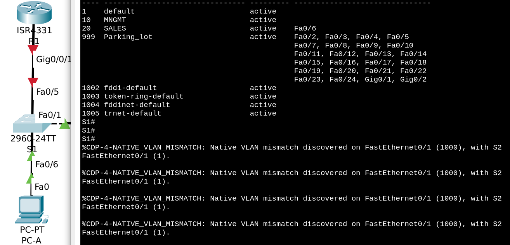
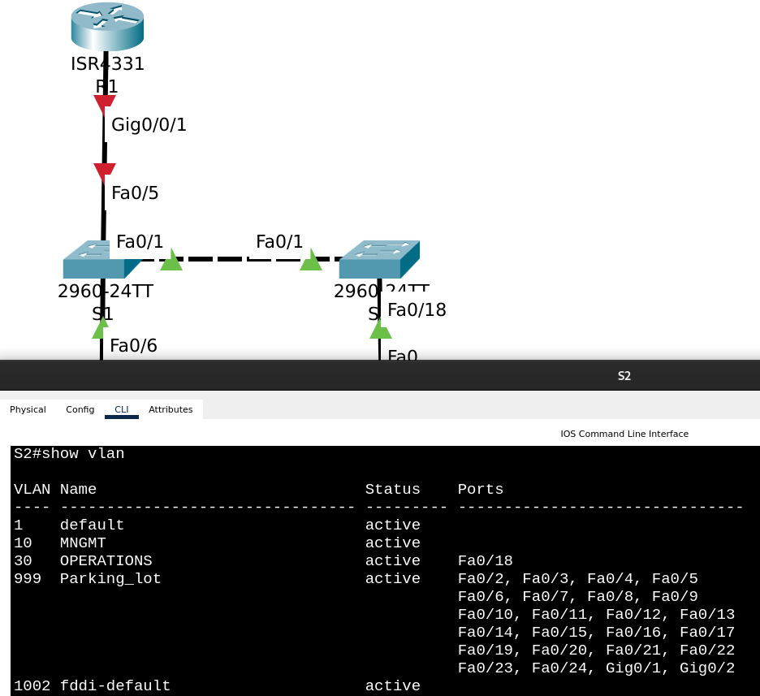

# Лабораторная работа №6. Внедрение маршрутизации между виртуальными локальными сетями


**Таблица адресации**

| Устройство | Интерфейс | IP-адрес | Маска подсети | Шлюз по умолчанию |
| :------------------------ | :------------------ | :------------------ | :------------------ | :------------------ |
| R1 | G0/0/1.10 | 192.168.10.1 | 255.255.255.0 | — |
| | G0/0/1.20 | 192.168.20.1 | 255.255.255.0 | |
| | G0/0/1.30 | 192.168.30.1 | 255.255.255.0 | |
| | G0/0/1.1000 | — | — | — |
| S1 | VLAN 10 | 192.168.10.11 | 255.255.255.0 | 192.168.10.1 |
| S2 | VLAN 10 | 192.168.10.12 | 255.255.255.0 | 192.168.10.1 |
| PC-A | NIC | 192.168.20.3 | 255.255.255.0 | 192.168.20.1 |
| PC-B | NIC | 192.168.30.3 | 255.255.255.0 | 192.168.30.1 |

**Таблица VLAN**

| VLAN | Имя | Назначенный интерфейс |
| :------------------------ | :------------------ | :------------------ |
| 10 | Mngmt | S1: VLAN 10 <br> S2: VLAN 10 |
| 20 | Sales | S1: F0/6 |
| 30 | Operations | S2: F0/18 |
| 999 | Parking_Lot | С1: F0/2-4, F0/7-24, G0/1-2 <br> С2: F0/2-17, F0/19-24, G0/1-2 |
| 1000 | Native | — |


## Часть 1. Создание сети и настройка основных параметров устройств

Собрали сеть согласно топологии:


Настройка маршрутизатора R1 (пароли консоли, виртуального терминала, доступа к привелигированному режиму, message-of-the-day, и т.д.)

```
Router>en
Router#conf t
Enter configuration commands, one per line.  End with CNTL/Z.
Router(config)#hostname R1
R1(config)#no ip domain-lookup
R1(config)#enable secret class
R1(config)#line console 0
R1(config-line)#password cisco
R1(config-line)#login
R1(config-line)#exit
R1(config)#line vty 0 15
R1(config-line)#password cisco
R1(config-line)#login
R1(config-line)#exit
R1(config)#service password-encryption
R1(config)#banner motd @Unauthorized access is prohibited!@
R1(config)#exit
R1#
%SYS-5-CONFIG_I: Configured from console by console

R1#copy running-config startup-config 
Destination filename [startup-config]? 
Building configuration...
[OK]
R1#
```

Попытка настройки времени на маршрутизаторе:

```
R1>show clock
*0:17:50.968 UTC Mon Mar 1 1993
R1>en
Password: 
R1#conf t
Enter configuration commands, one per line.  End with CNTL/Z.
R1(config)#clock set 21:14:20 June 03 2024
                 ^
% Invalid input detected at '^' marker.
R1(config)#clock ?
  timezone  Configure time zone
```

Похоже, можно настроить только часовой пояс.

```
R1(config)#clock timezone MSK -3
R1(config)#do show clock
*21:21:36.645 MSK Sun Feb 28 1993
```

Настройка коммутатора S1

```
Switch>
Switch>en
Switch#conf t
Enter configuration commands, one per line.  End with CNTL/Z.
Switch(config)#hostname S1
S1(config)#no ip domain-lookup
S1(config)#enable secret class
S1(config)#line console 0
S1(config-line)#password cisco
S1(config-line)#exit
S1(config)#line vty 0 15
S1(config-line)#password cisco
S1(config-line)#exit
S1(config)#service password-encryption
S1(config)#banner motd "This switch is a private property! Please, leave"
S1(config)#clock time
S1(config)#clock timezone MSK -3
S1(config)#exit
S1#
%SYS-5-CONFIG_I: Configured from console by console

S1#copy running-config startup-config 
Destination filename [startup-config]? 
Building configuration...
[OK]
```

Забыли настроить запрашивание пароля при логине на устройство через консоль:
```
.......
!
line con 0
 password 7 0822455D0A16
!
line vty 0 4
 password 7 0822455D0A16
 login
line vty 5 15
 password 7 0822455D0A16
 login
!
.......
```

Исправляемся:
```
S1(config)#line console 0
S1(config-line)#login
S1(config-line)#exit
```

Аналогично для второго коммутатора:


Настройка узлов PC:


## Часть 2. Создание сетей VLAN и назначение портов коммутатора

### Шаг 1. Создание сетей VLAN на коммутаторах

Создаем VLAN 10 на S1, задаем ему имя:
```
S1#conf t
Enter configuration commands, one per line.  End with CNTL/Z.
S1(config)#vlan ?
  <1-4094>  ISL VLAN IDs 1-1005
S1(config)#vlan 10
S1(config-vlan)#name MNGMT
S1(config-vlan)#exit
S1(config)#exit
```

Прибиваем к интерфейсу VLAN 10 IP-адрес из таблички:
```
S1(config)#interface vlan ?
  <1-4094>  Vlan interface number
S1(config)#interface vlan 10
S1(config-if)#
%LINK-5-CHANGED: Interface Vlan10, changed state to up

S1(config-if)#
S1(config-if)#ip address 192.168.10.11 255.255.255.0
S1(config-if)#no shutdown
```

Пока табличка VLAN-ов на S1 выглядит следующим образом - появилась строка для только что созданного VLAN-а 10 (MNGMT):


Создаем VLAN 20 (SALES), в который позже добавим интерфейсы, к которым подсоединены компьютеры из соответстующего отдела (у нас один такой компьютер за одним интерфейсом коммутатора Fa0/6)
```
S1(config)#vlan ?
  <1-4094>  ISL VLAN IDs 1-1005
S1(config)#vlan 20 
S1(config-vlan)#name SALES
S1(config-vlan)#exit
```

Назначаем все неиспользуемые порты коммутатора в VLAN Parking_Lot, настраиваем их для статического режима доступа и административно деактивируем их.


Задаем имя 999 VLAN-у:
```
S1(config)#vlan 999
S1(config-vlan)#?
VLAN configuration commands:
  exit         Apply changes, bump revision number, and exit mode
  name         Ascii name of the VLAN
  no           Negate a command or set its defaults
  remote-span  Add the Remote Switched Port Analyzer (RSPAN) feature to the VLAN
S1(config-vlan)#name Parking_lot
S1(config-vlan)#exit
```

Теперь в таблице VLAN-ов все неиспользуемые интерфейсы переехали из VLAN 1 (default) в отдельный, специально нами созданный VLAN 999 (Parking_lot):


Повторяем те же шаги для S2.
Сначала создаем интерфейс VLAN 10, прибиваем к нему ip-адрес и задаем этому VLAN-у имя (MNGMT):

```
S2#conf t
Enter configuration commands, one per line.  End with CNTL/Z.
S2(config)#interface vlan ?
  <1-4094>  Vlan interface number
S2(config)#interface vlan 10
S2(config-if)#ip ad
S2(config-if)#ip address 192.168.10.12 255.255.255.0
S2(config-if)#no shutdown 
S2(config-if)#exit
S2(config)#vlan 10
S2(config-vlan)#
%LINK-5-CHANGED: Interface Vlan10, changed state to up

S2(config-vlan)#name MNGMT
S2(config-vlan)#exit
```

Создаем VLAN 30 (OPERATIONS), в который позже добавим интерфейс Fa0/18:

```
S2(config)#vlan 30
S2(config-vlan)#name OPERATIONS
S2(config-vlan)#exit
```

Также все неиспользуемые порты перемещаем в VLAN Parking_Lot:

```
S2(config)#interface range fa0/2-fa0/17
S2(config-if-range)#switchport access vlan 999
% Access VLAN does not exist. Creating vlan 999
S2(config-if-range)#shutdown

%LINK-5-CHANGED: Interface FastEthernet0/2, changed state to administratively down

%LINK-5-CHANGED: Interface FastEthernet0/3, changed state to administratively down

............

S2(config-if-range)#exit
S2(config)#interface range fa0/19-fa0/24
S2(config-if-range)#switchport access vlan 999
S2(config-if-range)#shutdown

%LINK-5-CHANGED: Interface FastEthernet0/19, changed state to administratively down

............

%LINK-5-CHANGED: Interface FastEthernet0/24, changed state to administratively down
S2(config-if-range)#
S2(config-if-range)#exit
S2(config)#interface range gigabitEthernet 0/1 - gi
S2(config)#interface range gigabitEthernet 0/1 - gigabitEthernet 0/2
S2(config-if-range)#swi
S2(config-if-range)#switchport access vlan 999
S2(config-if-range)#shutdown

%LINK-5-CHANGED: Interface GigabitEthernet0/1, changed state to administratively down

%LINK-5-CHANGED: Interface GigabitEthernet0/2, changed state to administratively down
S2(config-if-range)#
S2(config-if-range)#exit
S2(config)#vlan 999
S2(config-vlan)#name Parking_lot
S2(config-vlan)#exit
S2(config)#exit
```

В итоге после перемещения всех неиспользуемых портов в специально выделенный VLAN табличка на S2 приобрела вид:


### Шаг 2. Назначение сетей VLAN соответствующим интерфейсам коммутатора.

К интерфейсу Fa0/6 коммутатора S1 должен быть прибит VLAN 20 (SALES):  добавим его в этот VLAN, переведем интерфейс в ```access``` режим.

```
S1(config)#interface fastEthernet 0/6
S1(config-if)#switchport ac
S1(config-if)#switchport ?
  access         Set access mode characteristics of the interface
  mode           Set trunking mode of the interface
  nonegotiate    Device will not engage in negotiation protocol on this
                 interface
  port-security  Security related command
  priority       Set appliance 802.1p priority
  protected      Configure an interface to be a protected port
  trunk          Set trunking characteristics of the interface
  voice          Voice appliance attributes
S1(config-if)#switchport access ?
  vlan  Set VLAN when interface is in access mode
S1(config-if)#switchport access vl
S1(config-if)#switchport access vlan ?
  <1-4094>  VLAN ID of the VLAN when this port is in access mode
S1(config-if)#switchport access vlan 20
S1(config-if)#exit
```

Теперь в табличке VLAN-ов на S1 появилось соответствие VLAN-а 20 и физического интерфейса Fa0/6:


К интерфейсу Fa0/18 коммутатора S2 должен быть прибит VLAN 30 (OPERATIONS): добавим его в этот VLAN, переведем интерфейс в ```access``` режим.

```
S2(config)#interface fastEthernet 0/18
S2(config-if)#switchport access vlan 30
S2(config-if)#exit
```

В табличке VLAN-ов на S2 появилось соответствие VLAN-а 30 и физического интерфейса Fa0/18:


## Часть 3. Конфигурация магистрального канала стандарта 802.1Q между коммутаторами

### Шаг 1. Настройка магистрального интерфейса F0/1 на коммутаторах S1 и S2

Настраиваем транковый порт на интерфейсе Fa0/1 (в сторону S2) коммутатора S1:

```
S1(config)#interface fa0/1
S1(config-if)#switchpo
S1(config-if)#switchport mode trunk

S1(config-if)#
%LINEPROTO-5-UPDOWN: Line protocol on Interface FastEthernet0/1, changed state to down

%LINEPROTO-5-UPDOWN: Line protocol on Interface FastEthernet0/1, changed state to up

%LINEPROTO-5-UPDOWN: Line protocol on Interface Vlan10, changed state to up

S1(config-if)#switchport trunk native vlan 1000
S1(config-if)#switchport trunk allowed vlan 10 ?
  <cr>
S1(config-if)#switchport trunk allowed vlan ?
  WORD    VLAN IDs of the allowed VLANs when this port is in trunking mode
  add     add VLANs to the current list
  all     all VLANs
  except  all VLANs except the following
  none    no VLANs
  remove  remove VLANs from the current list
S1(config-if)#switchport trunk allowed vlan 10?
WORD  
S1(config-if)#switchport trunk allowed vlan 10 ?
  <cr>
S1(config-if)#switchport trunk allowed vlan 10, 20, 30
                                                ^
% Invalid input detected at '^' marker.
	
S1(config-if)#
S1(config-if)#
S1(config-if)#switchport trunk allowed vlan 10
S1(config-if)#switchport trunk allowed vlan add 20
S1(config-if)#switchport trunk allowed vlan add 30
S1(config-if)#
%CDP-4-NATIVE_VLAN_MISMATCH: Native VLAN mismatch discovered on FastEthernet0/1 (1000), with S2 FastEthernet0/1 (1).
```

Из таблички пропал интерфейс Fa0/1:


Теперь настраиваем транковый порт на интерфейсе Fa0/1 (в сторону S1) коммутатора S2:

```
S2#conf t
Enter configuration commands, one per line.  End with CNTL/Z.
S2(config)#inter
S2(config)#interface fa0/1
S2(config-if)#switc
S2(config-if)#switchport trunk al
S2(config-if)#switchport trunk allowed vlan
S2(config-if)#switchport trunk allowed vlan ?
  WORD    VLAN IDs of the allowed VLANs when this port is in trunking mode
  add     add VLANs to the current list
  all     all VLANs
  except  all VLANs except the following
  none    no VLANs
  remove  remove VLANs from the current list
S2(config-if)#switchport trunk allowed vlan 10 ?
  <cr>
S2(config-if)#switchport trunk allowed vlan 10
S2(config-if)#switchport trunk allowed vlan add 20
S2(config-if)#switchport trunk allowed vlan add 30
S2(config-if)#end
S2#
%SYS-5-CONFIG_I: Configured from console by console
```

Забыли про native vlan:
```
S2#conf t
Enter configuration commands, one per line.  End with CNTL/Z.
S2(config)#inter
S2(config)#interface fa0/1
S2(config-if)#switchport trunk native ?
  vlan  Set native VLAN when interface is in trunking mode
S2(config-if)#switchport trunk native vlan 1000
S2(config-if)#
S2(config-if)#
S2(config-if)#exit
```

Ошибки в консоли типа ```%CDP-4-NATIVE_VLAN_MISMATCH: Native VLAN mismatch discovered on FastEthernet0/1 (1), with S1 FastEthernet0/1 (1000).``` исчезли, native vlan-ы на транковых интерфейсах S1 и S2 теперь совпадают.

Из таблички пропал интерфейс Fa0/1:



На S1 смотрим транковые интерфейсы: ожидаемый Fa0/1, ожидаемые разрешенные (включая VLAN 30, несмотря на то, что ни один интерфейс коммутатора S1 не принадлежит этому VLAN-у) и активные VLANы:


Повторяем на S2: так же среди разрешенных на транке Fa0/1 есть VLAN 20, несмотря на то, что ни один интерфейс коммутатора S2 не принадлежит этому VLAN-у.


### Шаг 2. Настройка магистрального интерфейса F0/5 на коммутаторе S1.

Сначала убираем интерфейс Fa0/5 из VLAN-а Parking_lot, куда мы его случайно добавили (был в составе рейнджа), и убеждаемся через ```show vlan```, что он и в самом деле больше не входит в Parking_lot:

```
S1(config)#interface fa0/5
S1(config-if)#SWI
S1(config-if)#no swi
S1(config-if)#no switchport acc
S1(config-if)#no switchport access ?
  vlan  Set VLAN when interface is in access mode
S1(config-if)#no switchport access vl
S1(config-if)#no switchport access vlan 999
S1(config-if)#
S1(config-if)#exit
S1(config)#exit
S1#
%SYS-5-CONFIG_I: Configured from console by console

S1#show vlan
```


Теперь делаем интерфейс Fa0/5 транковым портом:

```
S1(config)#interface fa0/5
S1(config-if)#
S1(config-if)#
S1(config-if)#switchport trunk all
S1(config-if)#switchport trunk allowed vlan 10
S1(config-if)#switchport trunk allowed vlan add 20
S1(config-if)#switchport trunk allowed vlan add 320
S1(config-if)#switchport trunk allowed vlan ?
  WORD    VLAN IDs of the allowed VLANs when this port is in trunking mode
  add     add VLANs to the current list
  all     all VLANs
  except  all VLANs except the following
  none    no VLANs
  remove  remove VLANs from the current list
S1(config-if)#switchport trunk allowed vlan remove 320
S1(config-if)#switchport trunk allowed vlan add 30
S1(config-if)#switchport trunk nati
S1(config-if)#switchport trunk native 1000
                                      ^
% Invalid input detected at '^' marker.
	
S1(config-if)#switchport trunk native val
S1(config-if)#switchport trunk native vl
S1(config-if)#switchport trunk native vlan 1000
S1(config-if)#end
S1#
```

Пришлось поднять интерфейс g0/0/1 на R1 руками, с помощью ```no shutdown```, чтобы увидеть fa0/5 на S1 в ```show trunk```:


Если G0/0/1 на R1 снова отключить, интерфейс Fa0/5 на S1 снова пропадет из транков:


## Часть 4. Настройка маршрутизации между сетями VLAN

Настраиваем подинтерфейсы для каждой VLAN, как указано в таблице IP-адресации.

Sub-интерфейс для VLAN 10:
```
R1(config)#interface g0/0/1.10
R1(config-subif)#
%LINK-5-CHANGED: Interface GigabitEthernet0/0/1.10, changed state to up

%LINEPROTO-5-UPDOWN: Line protocol on Interface GigabitEthernet0/0/1.10, changed state to up

R1(config-subif)#ip address ?
  A.B.C.D  IP address
  dhcp     IP Address negotiated via DHCP
R1(config-subif)#ip address 192.168.10.1 255.255.255.0

% Configuring IP routing on a LAN subinterface is only allowed if that
subinterface is already configured as part of an IEEE 802.10, IEEE 802.1Q,
or ISL vLAN.

R1(config-subif)#enc
R1(config-subif)#encapsulation ?
  dot1Q  IEEE 802.1Q Virtual LAN
R1(config-subif)#encapsulation do
R1(config-subif)#encapsulation dot1Q ?
  <1-4094>  IEEE 802.1Q VLAN ID
R1(config-subif)#encapsulation dot1Q 10
R1(config-subif)#ip address 192.168.10.1 255.255.255.0
R1(config-subif)#
R1(config-subif)#description VLAN 10
```


Теперь sub-интерфейс для VLAN 20:

```
R1#conf t
Enter configuration commands, one per line.  End with CNTL/Z.
R1(config)#interface g0/0/1.20
R1(config-subif)#
%LINK-5-CHANGED: Interface GigabitEthernet0/0/1.20, changed state to up

%LINEPROTO-5-UPDOWN: Line protocol on Interface GigabitEthernet0/0/1.20, changed state to up

R1(config-subif)#
R1(config-subif)#
R1(config-subif)#
R1(config-subif)#encapsulation dot1Q 10

%Configuration of multiple subinterfaces of the same main
interface with the same VID (10) is not permitted.
This VID is already configured on GigabitEthernet0/0/1.10.

R1(config-subif)#encapsulation dot1Q 20
R1(config-subif)#ip address 192.168.20.1 255.255.255.0
R1(config-subif)#
R1(config-subif)#
R1(config-subif)#description VLAN 20
```

Теперь sub-интерфейс для VLAN 30:

```
R1(config)#interface g0/0/1.30
R1(config-subif)#
%LINK-5-CHANGED: Interface GigabitEthernet0/0/1.30, changed state to up

%LINEPROTO-5-UPDOWN: Line protocol on Interface GigabitEthernet0/0/1.30, changed state to up

R1(config-subif)#
R1(config-subif)#enca
R1(config-subif)#encapsulation ?
  dot1Q  IEEE 802.1Q Virtual LAN
R1(config-subif)#encapsulation d
R1(config-subif)#encapsulation dot1Q 30
R1(config-subif)#ip address 192.168.30.1 255.255.255.0
R1(config-subif)#
R1(config-subif)#desc
R1(config-subif)#description VLAN 30
R1(config-subif)#
```

И, наконец, sub-интерфейс для native VLAN 1000:

```
R1(config)#interface g0/0/1.1000
R1(config-subif)#
%LINK-5-CHANGED: Interface GigabitEthernet0/0/1.1000, changed state to up

%LINEPROTO-5-UPDOWN: Line protocol on Interface GigabitEthernet0/0/1.1000, changed state to up

R1(config-subif)#
R1(config-subif)#encapsulation dot1Q 1000
R1(config-subif)#
R1(config-subif)#description Native VLAN 1000
R1(config-subif)#exit
```

Смотрим, что на sub-интерфейсах правильные адреса:


## Часть 5. Проверка маршрутизации между VLAN

Отправка эхо-запроса с PC-A на шлюз по умолчанию (для него это 192.168.20.1):


Отправьте эхо-запрос с PC-A (192.168.20.3) на PC-B (192.168.30.3).


Не пингуется. Почему?

Обнаружили странность, как будто интерфейс Fa0/1 на S2 не переключали в транковый режим (mode: auto, encapsulation: n-802.1q), то же самое и на S1:


Но, похоже, истинная причина проблемы в другом. Все роутеры должны знать про все VLAN-ы, на скринах из предыдущих частей с ```show vlan``` видно, что это не так. Пропишем на S1 VLAN 30, а на S2 VLAN 20.


Пробуем теперь - работает:


Теперь пингуем с PC-A коммутатор S2 (192.168.10.12)

Не пингуется. Почему? Опять забыли прописать default gateway на S1 и на S2:

```
S1(config)#ip default-gateway 192.168.10.1
```

```
S2(config)#ip default-gateway 192.168.10.1
```


Теперь на PC-B выполняем команду ```tracert``` на адрес PC-A.

Вопрос:

Какие промежуточные IP-адреса отображаются в результатах?

Ответ:

192.168.30.1 - адрес sub-интерфейса маршрутизатора R1, куда попадает траффик из VLAN-а 30 (к которому относится интерфейс S2, соединенный с PC-B)

192.168.20.3 - адрес самого PC-A

