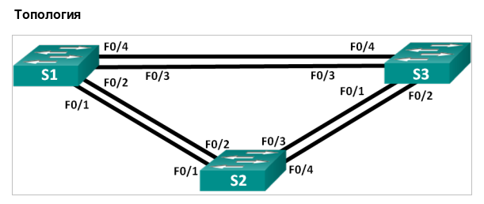
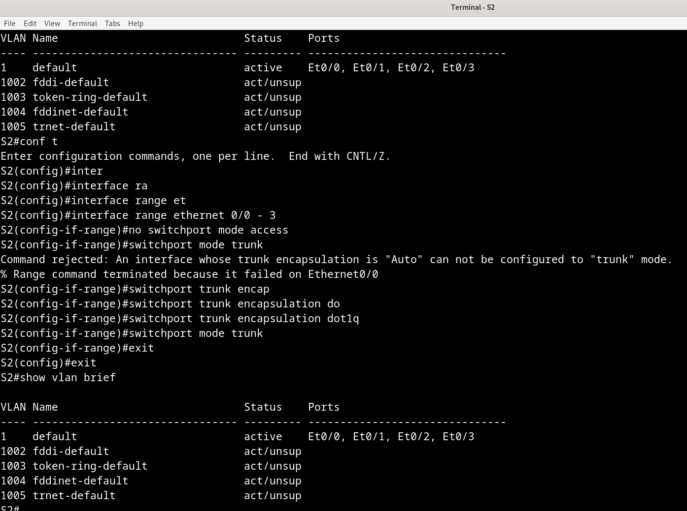

# Лабораторная работа №7. Развертывание коммутируемой сети с резервными каналами



**Таблица адресации**

| Устройство | Интерфейс | IP-адрес | Маска подсети |
| :--------  | :-------- | :------- | :------------ |
| S1         | VLAN 1 | 192.168.1.1 | 255.255.255.0 |
| S2         | VLAN 1 | 192.168.1.2 | 255.255.255.0 |
| S3         | VLAN 1 | 192.168.1.2 | 255.255.255.0 |

## Часть 1. Создание сети и настройка основных параметров устройства

Настраиваем коммутаторы: для каждого задаем имя, отключаем dns lookup, назначаем пароли на привилегированный режим и на консольные и vty линии, активируем на упомянутых линиях вход по паролю, для консольной линии выставляем logging synchronous, на интерфейсе Vlan 1 задаем ip адреса как в таблице, поднимаем этот интерфейс, пишем приветственный баннер и, наконец, сохраняем текущую конфигурацию.

```
Switch(config)#hostname S1
S1(config)#no ip domain-lookup
S1(config)#test
             ^
% Invalid input detected at '^' marker.

S1(config)#enable secret class
S1(config)#line console 0
S1(config-line)#password cisco
S1(config-line)#login
S1(config-line)#logging synchronous
S1(config-line)#exit
S1(config)#line vty ?
  <0-4>  First Line number

S1(config)#line vty 0 4
S1(config-line)#password cisco
S1(config-line)#login
S1(config-line)#exit
S1(config)#service password-encryption 
S1(config)#banner motd "This is S1, unauthorized access is prohibited!"
S1(config)#interface Vlan ?
  <1-4095>  Vlan interface number

S1(config)#interface Vlan 1
S1(config-if)#
*Jun  6 18:43:31.406: %LINEPROTO-5-UPDOWN: Line protocol on Interface Vlan1, changed state to down
S1(config-if)#ip add
S1(config-if)#ip address 192.168.1.1 255.255.255.0
S1(config-if)#no shutdown
S1(config-if)#exit
S1(config)#exit   
S1#copy running-config startup-config
Destination filename [startup-config]? 
Building configuration...
Compressed configuration from 990 bytes to 723 bytes[OK]
S1#
```


Проверяем, что все коммутаторы успешно пингуют друг друга:


## Часть 2. Определение корневого моста

### Шаг 1. Отключение всех портов на всех коммутаторах.

```
S1(config)#interface range ethernet 0/0 - 3  
S1(config-if-range)#shutdown
S1(config-if-range)#exit
S1(config)#exit
*Jun  6 19:21:38.110: %LINK-5-CHANGED: Interface Ethernet0/0, changed state to administratively down
*Jun  6 19:21:38.110: %LINK-5-CHANGED: Interface Ethernet0/1, changed state to administratively down
*Jun  6 19:21:38.110: %LINK-5-CHANGED: Interface Ethernet0/2, changed state to administratively down
*Jun  6 19:21:38.110: %LINK-5-CHANGED: Interface Ethernet0/3, changed state to administratively down
*Jun  6 19:21:39.114: %LINEPROTO-5-UPDOWN: Line protocol on Interface Ethernet0/0, changed state to down
*Jun  6 19:21:39.114: %LINEPROTO-5-UPDOWN: Line protocol on Interface Ethernet0/1, changed state to down
*Jun  6 19:21:39.114: %LINEPROTO-5-UPDOWN: Line protocol on Interface Ethernet0/2, changed state to down
*Jun  6 19:21:39.114: %LINEPROTO-5-UPDOWN: Line protocol on Interface Ethernet0/3, changed state to down
S1(config)#exit
```

### Шаг 2. Настройка подключенных портов в качестве транковых.

Непохоже, что сработало (порты не исчезли из дефолтного vlan-а):



Впрочем, не очень понятно, что имеется в виду под "подключенными" портами.

Видимо, требуется сделать порты транковыми, чтобы показать, что они используются не для связи с конечными устройствами, т.е. не должны мгновенно переводиться в режим передачи (чего можно было бы достичь с помощью ```spanning-tree portfast```), а что эти порты используются для связи с другими коммутаторами, и не стоит на них пропускать состояния Listening и Learning во избежание петли.


### Шаг 3. Поднятие портов F0/2 и F0/4 на всех коммутаторах

В нашем случае это будут E0/1 и E0/3 (т.е. по одному линку между каждым коммутатором, без резервирования).


### Шаг 4. Отображение данных протокола spanning-tree

Вывод команды ```show spanning-tree``` на S1:


```
S1#show spanning-tree 

VLAN0001
  Spanning tree enabled protocol ieee
  Root ID    Priority    32769
             Address     aabb.cc00.1000
             This bridge is the root
             Hello Time   2 sec  Max Age 20 sec  Forward Delay 15 sec

  Bridge ID  Priority    32769  (priority 32768 sys-id-ext 1)
             Address     aabb.cc00.1000
             Hello Time   2 sec  Max Age 20 sec  Forward Delay 15 sec
             Aging Time  300 sec

Interface           Role Sts Cost      Prio.Nbr Type
------------------- ---- --- --------- -------- --------------------------------
Et0/1               Desg FWD 100       128.2    Shr 
Et0/3               Desg FWD 100       128.4    Shr 
```

Видим, что S1 был выбран в качестве корневого коммутатора (This bridge is root), очевидно из-за того, что он имеет наименьший MAС-адрес aabb.cc00.1000. Оба интерфейса имеют роль Designated, как и ожидается от портов корневого коммутатора, оба в состоянии передачи (Forwarding).

На S2:

```
S2#show spanning-tree 

VLAN0001
  Spanning tree enabled protocol ieee
  Root ID    Priority    32769
             Address     aabb.cc00.1000
             Cost        100
             Port        2 (Ethernet0/1)
             Hello Time   2 sec  Max Age 20 sec  Forward Delay 15 sec

  Bridge ID  Priority    32769  (priority 32768 sys-id-ext 1)
             Address     aabb.cc00.3000
             Hello Time   2 sec  Max Age 20 sec  Forward Delay 15 sec
             Aging Time  300 sec

Interface           Role Sts Cost      Prio.Nbr Type
------------------- ---- --- --------- -------- --------------------------------
Et0/1               Root FWD 100       128.2    Shr 
Et0/3               Altn BLK 100       128.4    Shr 
```

Видим, что у S2 самое большое значение MAС-адреса aabb.cc00.3000 (приоритет мы не настраивали, так что у всех трех коммутаторов эта часть Bridge ID будет одинаковой), так что неудивительно, что тот его порт, который смотрит в сторону некорневого коммутатора (т.е. S3), был заблокирован (cost-ы всех портов всех коммутаторов также не настраивались, потому имеют одинаковые значения). Второй порт, соединенный с корневым коммутатором, ожидаемо имеет роль Root и находится в состоянии Forwarding.

Наконец, вывод ```show spanning-tree ``` для S3:

```
S3#show spanning-tree 

VLAN0001
  Spanning tree enabled protocol ieee
  Root ID    Priority    32769
             Address     aabb.cc00.1000
             Cost        100
             Port        4 (Ethernet0/3)
             Hello Time   2 sec  Max Age 20 sec  Forward Delay 15 sec

  Bridge ID  Priority    32769  (priority 32768 sys-id-ext 1)
             Address     aabb.cc00.2000
             Hello Time   2 sec  Max Age 20 sec  Forward Delay 15 sec
             Aging Time  300 sec

Interface           Role Sts Cost      Prio.Nbr Type
------------------- ---- --- --------- -------- --------------------------------
Et0/1               Desg FWD 100       128.2    Shr 
Et0/3               Root FWD 100       128.4    Shr 
```

Действительно, у S3 значение MAС-адреса aabb.cc00.2000, т.е меньше, чем у S2, поэтому оба его порта в состоянии передачи (Forwarding), тот, что соединен с корневым коммутатором S1 имеет соответсвующую роль корневого (Root), второй порт в сторону S2 - Designated.

## Часть 3. Наблюдение за процессом выбора протоколом STP порта, исходя из стоимости портов

### Шаг 1. Определение коммутатора с заблокированным портом

В прошлой части мы увидели, что это коммутатор S2, имеющий самое большое значение MAC-адреса (cost-ы всех портов и приоритеты в Bridge ID всех коммутаторов одинаковые).

### Шаг 2. Изменение стоимости порта

Уменьшаем стоимость НЕЗАБЛОКИРОВАННОГО порта корневого моста до 18, выполнив команду ```spanning-tree vlan 1 cost 18``` режима конфигурации интерфейса:

```
Interface           Role Sts Cost      Prio.Nbr Type
------------------- ---- --- --------- -------- --------------------------------
Et0/1               Root FWD 100       128.2    Shr 
Et0/3               Altn BLK 100       128.4    Shr 

S2#conf t
Enter configuration commands, one per line.  End with CNTL/Z.
S2(config)#interface eth 0/1
S2(config-if)#spanning-tree vlan 1 cost 18
```

### Шаг 3. Просмотр изменений протокола spanning-tree

Повторно выполняем команду ```show spanning-tree``` на обоих коммутаторах некорневого моста.

На S2:


Видим, что порт сменил роль Alternative на Designated и состояние с Blocked на Forwarding.

Очевидно, это произошло из-за того, что теперь стоимость пути через этот порт до S3 (другой некорневой коммутатор) меньше, чем стоимость пути от S1 через S3 до S2 (сравнение cost-ов при выборе роли портов происходит раньше, чем сравнение приоритетов и MAC-адресов из Bridge ID).

На S3 (ожидаем увидеть некорневой порт в заблокированном состоянии):


Так и есть.

### Шаг 4. Удаление изменения стоимости порта

Возвращаемся на интерфейс Eth 0/1 коммутатора S2, и откатываем наше изменение стоимости порта, совершенное на одном из предыдущих шагов:

```
S2(config)#interface e 0/1
S2(config-if)#no spa
S2(config-if)#no spanning-tree vl
S2(config-if)#no spanning-tree vlan 1 co
S2(config-if)#no spanning-tree vlan 1 cost 18
S2(config-if)#exit
```

Видим, что порт вернулся в заблокированное состояние:


На S3:


## Часть 4. Наблюдение за процессом выбора протоколом STP порта, исходя из приоритета портов

Активируем избыточные пути (т.е. включаем интерфейсы Eth 0/0 и Eth 0/2 на всех коммутаторах), чтобы просмотреть, каким образом протокол STP выбирает порт с учетом приоритета портов.

На S3 (для остальных коммутаторов аналогично):
```
S3(config)#interface range eth 0/0 , eth 0/2
S3(config-if-range)#no shutdown
S3(config-if-range)#exit
S3(config)#
S3(config)#
S3(config)#exit
S3#
*Jun  6 21:14:47.460: %LINK-3-UPDOWN: Interface Ethernet0/0, changed state to up
*Jun  6 21:14:47.461: %LINK-3-UPDOWN: Interface Ethernet0/2, changed state to up
S3#
*Jun  6 21:14:48.526: %SYS-5-CONFIG_I: Configured from console by console
*Jun  6 21:14:49.477: %LINEPROTO-5-UPDOWN: Line protocol on Interface Ethernet0/0, changed state to up
*Jun  6 21:14:49.477: %LINEPROTO-5-UPDOWN: Line protocol on Interface Ethernet0/2, changed state to up
S3#
```

Смотрим вывод ```show spanning-tree``` на коммутаторе S2 (с наибольшим значением MAC-адреса)

```
S2#show spanning-tree 

VLAN0001
  Spanning tree enabled protocol ieee
  Root ID    Priority    32769
             Address     aabb.cc00.1000
             Cost        100
             Port        1 (Ethernet0/0)
             Hello Time   2 sec  Max Age 20 sec  Forward Delay 15 sec

  Bridge ID  Priority    32769  (priority 32768 sys-id-ext 1)
             Address     aabb.cc00.3000
             Hello Time   2 sec  Max Age 20 sec  Forward Delay 15 sec
             Aging Time  300 sec

Interface           Role Sts Cost      Prio.Nbr Type
------------------- ---- --- --------- -------- --------------------------------
Et0/0               Root FWD 100       128.1    Shr 
Et0/1               Altn BLK 100       128.2    Shr 
Et0/2               Altn BLK 100       128.3    Shr 
Et0/3               Altn BLK 100       128.4    Shr 

```

Видим, что корневым портом стал порт с наименьшим номером (Eth 0/0, когда он был выключен, корневым был Eth 0/1). Остальные порты стали заблокированными, ибо при выборе между ними и некорневыми портами другого некорневого коммутатора S3, выбор пал на последние из-за значения MAC-адреса S3, меньшее, чем на S2. 

На S3:

```
S3#show spanning-tree 

VLAN0001
  Spanning tree enabled protocol ieee
  Root ID    Priority    32769
             Address     aabb.cc00.1000
             Cost        100
             Port        3 (Ethernet0/2)
             Hello Time   2 sec  Max Age 20 sec  Forward Delay 15 sec

  Bridge ID  Priority    32769  (priority 32768 sys-id-ext 1)
             Address     aabb.cc00.2000
             Hello Time   2 sec  Max Age 20 sec  Forward Delay 15 sec
             Aging Time  300 sec

Interface           Role Sts Cost      Prio.Nbr Type
------------------- ---- --- --------- -------- --------------------------------
Et0/0               Desg FWD 100       128.1    Shr 
Et0/1               Desg FWD 100       128.2    Shr 
Et0/2               Root FWD 100       128.3    Shr 
Et0/3               Altn BLK 100       128.4    Shr 


S3#
```

На S3 порты Eth 0/0 и Eth 0/1 соединены с некорневым коммутатором S2, т.е. ни один из них не может быть корневым. Из двух оставшихся портов, соединенных с корневым S1, наименьший номер имеет Eth 0/2, он и становится корневым. Второй порт Eth 0/3 становится заблокированным во избежание петли на участке "S1 <--> S3".

## Вопросы для повторения

1. Какое значение протокол STP использует первым после выбора корневого моста, чтобы определить выбор порта?

Ответ: сначала используется root path cost - суммарная стоимость пути от порта корневого коммутатора до порта, роль которого сейчас определяется.

2. Если первое значение на двух портах одинаково, какое следующее значение будет использовать протокол STP при выборе порта?

Ответ: в таком случае сравниваются их Bridge ID, состоящий из Priority (в свою очередь состоящую из 4-битного конфигурируемого значения и 12-битного VLAN ID) и "burned-in" MAC-адреса коммутатора.

3. Если оба значения на двух портах равны, каким будет следующее значение, которое использует протокол STP при выборе порта?

Ответ: как мы убедились в Части 4 этой лабораторной работы, при равенстве Root Path Cost и Bridge ID сравниваются приоритеты портов, которые могут быть сконфигурированы ```S3(config-if)#spanning-tree port-priority 64```, при равенстве конфигурируемой части (по умолчанию имеет значение 128) учитываются номера портов.