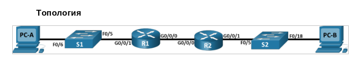

# Лабораторная работа №8. Реализация DHCPv4



**Таблица адресации**

| Устройство | Интерфейс   | IP-адрес | Маска подсети   | Шлюз по умолчанию |
| :--------  | :---------- | :------- | :-------------- | :---------------- |
| R1         | G0/0/0      | 10.0.0.1 | 255.255.255.252 | -                 |
|            | G0/0/1      | -        | -               | -                 |
|            | G0/0/1.100  | ?        | ?               | -                 |
|            | G0/0/1.200  | ?        | ?               | -                 |
|            | G0/0/1.1000 | -        | -               | -                 |
| R2         | G0/0/0      | 10.0.0.2 | 255.255.255.252 | -                 |
|            | G0/0/1      | ?        | ?               | -                 |
| S1         | VLAN 200    | ?        | ?               | ?                 |
| S2         | VLAN 1      | ?        | ?               | ?                 |
| PC-A       | NIC         | DHCP     | DHCP            | DHCP              |
| PC-B       | NIC         | DHCP     | DHCP            | DHCP              |

**Таблица VLAN**

| VLAN | Имя          | Назначенный интерфейс       |
| :--  | :----------- | :-------------------------- |
| 1    |              | S2: F0/18                   |
| 100  | Clients      | S1: F0/6                    |
| 200  | Mngmt        | S1: VLAN 200                |
| 999  | Parkinkg_lot | S1: F0/1-4, F0/7-24, G0/1-2 |
| 1000 | Native       | -                           |

## Часть 1. Создание сети и настройка основных параметров устройства

### Шаг 1. Создание схемы адресации

Из задания:
Подсеть сети 192.168.1.0/24 в соответствии со следующими требованиями:

a. Одна подсеть «Подсеть A», поддерживающая 58 хостов (клиентская VLAN на R1).
Подсеть A:
Запишите первый IP-адрес в таблице адресации для R1 G0/0/1.100.
               
b. Одна подсеть «Подсеть B», поддерживающая 28 хостов (управляющая VLAN на R1). 
Подсеть B:
Запишите первый IP-адрес в таблице адресации для R1 G0/0/1.200.
Запишите второй IP-адрес в таблице адресов для S1 VLAN 200 и введите соответствующий шлюз по умолчанию.

c. Одна подсеть «Подсеть C», поддерживающая 12 узлов (клиентская сеть на R2).
Подсеть C:
Запишите первый IP-адрес в таблице адресации для R2 G0/0/1.

Вычисляем:

a. В подсети A должно быть 58 хостов - смотрим, сколько бит надо выделить на хостовую часть адреса, чтобы ее хватило для идентификации каждого из хостов. Ближайшее сверху число - степень двойки - 64, это 2 ^ 6, т.е. 6 бит (из оставшихся 8 в 192.168.1.0/24) нам хватит, т.е. к сетевой части добавится два бита - префикс 192.168.1.0/26, в маске в последнем октете 2 ^ 7 + 2 ^ 6 = 128 + 64 = 192. Последний адрес в этом префиксе - в последнем октете последние 6 бит заполнены: 32 + 16 + 8 + 4 + 2 + 1 = 63 (быстрее, конечно, вычислить 64 - 1 - одного бита не хватает, чтобы перейти в следующий разряд), получаем 192.168.1.63/26.

В качестве адреса интерфейса G0/0/1.100 маршртутизатора R1 возьмем 192.168.1.1/26, считаем, что 192.168.1.0/26 используется как адрес подсети.

| Устройство | Интерфейс   | IP-адрес    | Маска подсети   | Шлюз по умолчанию |
| :--------  | :---------- | :---------- | :-------------- | :---------------- |
| R1         | G0/0/1.100  | 192.168.1.1 | 255.255.255.192 | -                 |

b. В подсети B должно быть 28 хостов, первый свободный адрес - 192.168.1.64. Ближайшее сверху к 28 число - степень двойки - это 32, т.е 5 бит нам достаточно, чтобы однозначно идентифицировать каждый из 28 хостов, на сетевую часть останется 3 бита, т.е префикс будет иметь вид 192.168.1.64/27. Последний октет маски подсети - 128 + 64 + 32 = 224. Последний адрес в этом префиксе - в последнем октете последние 5 бит заполнены: 16 + 8 + 4 + 2 + 1 = 31, в сетевой части последнего октета есть 64, так что в итоге получаем 192.168.1.95/27.

В качестве адреса интерфейса G0/0/1.200 маршртутизатора R1 возьмем 192.168.1.65/27, считаем, что 192.168.1.64/27 используется как адрес подсети.

| Устройство | Интерфейс   | IP-адрес     | Маска подсети   | Шлюз по умолчанию |
| :--------  | :---------- | :----------- | :-------------- | :---------------- |
| R1         | G0/0/1.200  | 192.168.1.65 | 255.255.255.224 | -                 |
| S1         | VLAN 200    | 192.168.1.66 | 255.255.255.224 | 192.168.1.65      |

c. Подсеть C выделена на R2, который ничего не знает про локальные сети R1, так что в общем-то кажется, что ничего не мешает выделить 12 хостов также из 192.168.1.0/24. Но в данной конкретной работе, R1 должен иметь непересекающиеся пулы, ибо как DHCP-сервер должен обслуживать и подсеть A, и подсеть C, так что выделим 12 хостов из 192.168.1.96/27 (следующая сеть после 192.168.1.64/27, выделенная для B). Нам нужно 12 хостов, т.е. досточно 4 бит, чтобы однозначно идентифицировать каждый из них, т.е. длина префикса 24 + (8 - 4) = 28, адресом сети будет 192.168.1.96/28. В последнем октете маски подсети будет 4 первых бита, в десятичном виде 128 + 64 + 32 + 16 = 160 + 80 = 240.

| Устройство | Интерфейс   | IP-адрес     | Маска подсети   | Шлюз по умолчанию |
| :--------  | :---------- | :----------- | :-------------- | :---------------- |
| R2         | G0/0/1      | 192.168.1.97 | 255.255.255.240 |                   |

Получили:

| Устройство | Интерфейс   | IP-адрес     | Маска подсети   | Шлюз по умолчанию |
| :--------  | :---------- | :----------- | :-------------- | :---------------- |
| R1         | G0/0/0      | 10.0.0.1     | 255.255.255.252 | -                 |
|            | G0/0/1      | -            | -               | -                 |
|            | G0/0/1.100  | 192.168.1.1  | 255.255.255.192 | -                 |
|            | G0/0/1.200  | 192.168.1.65 | 255.255.255.224 | -                 |
|            | G0/0/1.1000 | -            | -               | -                 |
| R2         | G0/0/0      | 10.0.0.2     | 255.255.255.252 | -                 |
|            | G0/0/1      | 192.168.1.97 | 255.255.255.240 |                   |
| S1         | VLAN 200    | 192.168.1.66 | 255.255.255.224 | 192.168.1.65      |
| S2         | VLAN 1      | 192.168.1.98 | 255.255.255.240 | 192.168.1.97      |
| PC-A       | NIC         | DHCP         | DHCP            | DHCP              |
| PC-B       | NIC         | DHCP         | DHCP            | DHCP              |

### Шаг 2. Создание сети согласно топологии.

Собрали:


### Шаг 3. Базовая настройка маршрутизаторов

Как обычно, имя, приветственное сообщение, пароли и их зашифрованность.

### Шаг 4. Настройка маршрутизации между сетями VLAN на маршрутизаторе R1

Поднимаем интерфейс G0/0/1 на R1 и настраиваем его подинтерфейсы для каждого VLAN-а, пользуясь нашей дополненной таблицей адресов, пишем их описания, для native VLAN ip-адрес не настраиваем.

Для подинтерфейса g0/0/1.100:
```
R1(config)#interface g0/0/1
R1(config-if)#no shutdown

R1(config-if)#
%LINK-5-CHANGED: Interface GigabitEthernet0/0/1, changed state to up

%LINEPROTO-5-UPDOWN: Line protocol on Interface GigabitEthernet0/0/1, changed state to up

R1(config-if)#
R1(config-if)#exit
R1(config)#interface g0/0/1.100
R1(config-subif)#
%LINK-5-CHANGED: Interface GigabitEthernet0/0/1.100, changed state to up

%LINEPROTO-5-UPDOWN: Line protocol on Interface GigabitEthernet0/0/1.100, changed state to up

R1(config-subif)#encapsulation dot1Q ?
  <1-4094>  IEEE 802.1Q VLAN ID
R1(config-subif)#encapsulation dot1Q 100
R1(config-subif)#ip address ?
  A.B.C.D  IP address
  dhcp     IP Address negotiated via DHCP
R1(config-subif)#ip address 192.168.1.1 255.255.255.192
R1(config-subif)#de?
delay  description  
R1(config-subif)#descr
R1(config-subif)#description subinterface for VLAN100
R1(config-subif)#exit
R1(config)#exit
R1#
%SYS-5-CONFIG_I: Configured from console by console

R1#show interfaces g0/0/1.100
GigabitEthernet0/0/1.100 is up, line protocol is up (connected)
  Hardware is PQUICC_FEC, address is 0001.c9ec.2e02 (bia 0001.c9ec.2e02)
  Internet address is 192.168.1.1/26
  MTU 1500 bytes, BW 100000 Kbit, DLY 100 usec, 
     reliability 255/255, txload 1/255, rxload 1/255
  Encapsulation 802.1Q Virtual LAN, Vlan ID 100
  ARP type: ARPA, ARP Timeout 04:00:00, 
  Last clearing of "show interface" counters never
  ```

В running-config:
```
!
interface GigabitEthernet0/0/1.100
 description subinterface for VLAN100
 encapsulation dot1Q 100
 ip address 192.168.1.1 255.255.255.192
!
```

Для оставшихся подинтерфейсов:


Убеждаемся, что подинтерфейсы работают:


Опять забыли при конфигурировании подинтерфейса для нативного VLAN-а указать факт нативности:

```
R1(config)#interface g0/0/1.1000
R1(config-subif)#encapsulation dot1Q 1000 ?
  native  Make this as native vlan
  <cr>
R1(config-subif)#encapsulation dot1Q 1000 native
```

### Шаг 5. Настройка интерфейсов R2 и статической маршрутизации для обоих маршрутизаторов

Настраиваем G0/0/1 на R2 с первым IP-адресом подсети C, рассчитанным ранее.


Настраиваем интерфейс G0/0/0 для каждого маршрутизатора на основе таблицы IP-адресации.

Выставили в качестве default-gateway для R1 адрес интерфейса G0/0/0 R2, а default-gateway для R2 - адрес интерфейса G0/0/0 R1. Проверили, что оба маршрутизатора успешно пингуют свои default-gateway-и (т.е. друг друга):


### Шаг 6. Настройка базовых параметров каждого коммутаторов

Стандартный набор.

### Шаг 7. Создание VLAN-ов на коммутаторе S1

Сначала просто создаем VLAN-ы и присваиваем им имена согласно табличке.

```
S1(config)#vlan ?
  <1-4094>  ISL VLAN IDs 1-1005
S1(config)#vlan 100
S1(config-vlan)#?
VLAN configuration commands:
  exit         Apply changes, bump revision number, and exit mode
  name         Ascii name of the VLAN
  no           Negate a command or set its defaults
  remote-span  Add the Remote Switched Port Analyzer (RSPAN) feature to the VLAN
S1(config-vlan)#name Clients
S1(config-vlan)#vlan 200
S1(config-vlan)#name Mngmt
S1(config-vlan)#vlan 999
S1(config-vlan)#name Parking_lot
S1(config-vlan)#vlan 1000
S1(config-vlan)#name Native
S1(config-vlan)#exit
S1(config)#exit
```

Соответствие номеров и имен появилось, интерфейсы в VLAN-ы пока не переносили:


Конфигурируем SVI-интерфейс VLAN 200 (Mngmt) на S1:

```
S1(config)#interface Vl
S1(config)#interface Vlan ?
  <1-4094>  Vlan interface number
S1(config)#interface Vlan 200
S1(config-if)#
%LINK-5-CHANGED: Interface Vlan200, changed state to up

S1(config-if)#
S1(config-if)#ip address 192.168.1.66 255.255.255.224
S1(config-if)#exit
S1(config)#ip default-gateway ?
  A.B.C.D  IP address of default gateway
S1(config)#ip default-gateway 
S1(config)#ip default-gateway 192.168.1.65
```

Конфигурируем интерфейс VLAN 1 на S2, задаем ip-адрес из таблицы, устанавливаем шлюз по умолчанию.

```
S2(config)#interface Vlan1
S2(config-if)#ip address 192.168.1.98 255.255.255.240
S2(config-if)#no shutdown

S2(config-if)#
%LINK-5-CHANGED: Interface Vlan1, changed state to up

%LINEPROTO-5-UPDOWN: Line protocol on Interface Vlan1, changed state to up

S2(config-if)#exit
S2(config)#ip default-gateway 192.168.1.97
```

### Шаг 8. Назначение сетей VLAN соответствующим интерфейсам коммутатора.

Прибиваем интерфейс Fa0/6 к VLAN 100:

```
S1#conf t
Enter configuration commands, one per line.  End with CNTL/Z.
S1(config)#interface f0/6             up 
GigabitEthernet0/0/2   unassigned      YES unset  administratively down down 
Vlan1                  unassigned      YES unset  administratively down down 
Vlan1000               unassigned      YES unset  down                  down
S1(config-if)#switchport mode access
S1(config-if)#switchport access ?
  vlan  Set VLAN when interface is in access mode
S1(config-if)#switchport access vla
S1(config-if)#switchport access vlan 100
S1(config-if)#exit
```

Переносим неиспользуемые порты в VLAN Parking_lot:
```
S1(config)#interface range f0/1-4, f0/7-24
S1(config-if-range)#switchport mode acc
S1(config-if-range)#switchport mode access 
S1(config-if-range)#switchport access vlan 999
S1(config-if-range)#exit

S1(config)#interface range g0/1-2
S1(config-if-range)#swit
S1(config-if-range)#switchport mode access
S1(config-if-range)#switchport access vlan 999
S1(config-if-range)#end
```

Интерфейс Fa 0/5 смотрит в сторону R1 (на котором несколько подинтерфейсов, соответствующих каждому VLAN-у, известному S1), на нем позже настроим транк.


Деактивируем все порты, принадлежащие 999 VLAN-у (Parking_lot):

```
S1(config)#interface range f0/1-4,f0/7-24,g0/1-2
S1(config-if-range)#shutdown
```

Фрагмент ```running-config``` на S1:


Деактивируем все неиспользуемые порты на S2:

```
S1(config)#interface range f0/1-4,f0/6-17,f0/19-24,g0/1-2
S1(config-if-range)#shutdown
```


### Шаг 9. Настройка интерфейса S1 F0/5 в качестве транка 802.1Q

Выставляем для интерфейса f0/5 режим trunk, устанавливаем native vlan 1000, перечисляем список VLAN-ов, которые входят в транк (включая native vlan):

```
S1(config)#interface f0/5
S1(config-if)#switchport mode trunk 

S1(config-if)#
%LINEPROTO-5-UPDOWN: Line protocol on Interface FastEthernet0/5, changed state to down

%LINEPROTO-5-UPDOWN: Line protocol on Interface FastEthernet0/5, changed state to up

%LINEPROTO-5-UPDOWN: Line protocol on Interface Vlan200, changed state to up

S1(config-if)#
S1(config-if)#switchport trunk native vlan 1000
S1(config-if)#switchport trunk allowed vlan 100,200,1000
S1(config-if)#
S1(config-if)#exit
S1(config)#exit
```

Смотрим вывод команды ```show interfaces trunk ```:


Из дефолтного Vlan-а 1 пропал объявленный транковым интерфейс Fa0/5 (можно сравнить с выводом на предыдущем шаге):


## Часть 2. Настройка и проверка двух серверов DHCPv4 на R1

### Шаг 1. Настройка R1 с пулами DHCPv4 для двух поддерживаемых подсетей

> Исключите первые пять используемых адресов из каждого пула адресов.

Команда ```ip dhcp excluded-address``` выполняется не для конкретного пула, а для всех. Из адресов для подсети А у нас уже использовано три адреса - адрес подсети 192.168.1.0 и адрес самого R1 192.168.1.1, из адресов в подсети B -  адрес подсети 192.168.1.64, адрес R1 192.168.1.65 и адрес SVI (Vlan 200) на S1 192.168.1.66, итого всего 5.

```
R1(config)#ip dhcp excluded-address 192.168.1.64 192.168.1.66
R1(config)#ip dhcp excluded-address 192.168.1.0 192.168.1.1
```


Создали пул DHCP для подсети А: указали адрес сети с маской, default gateway и имя домена.


Опция ```lease```, видимо, в Packet Tracer-е не представлена.


Создали второй пул DHCP для подсети B, имя домена и время аренды те же, что и для предыдущего пула DHCP.


### Шаг 2. Сохраняем кофигурацию

```
R1#copy running-config startup-config 
Destination filename [startup-config]? 
Building configuration...
[OK]
R1#
```

### Шаг 3. Проверка конфигурации сервера DHCPv4

Сведения о пулах ```show ip dhcp pool```:


Переключили на PC-A IP Configuration со Static на DHCP, увидели DHCP request successful:


Подсеть А связана с VLAN-ом 100 (Clients) - эта связка появилась при конфигурировании подинтерфейса G0/0/1.100 для R1 и назначения ему соответствующего префикса и default gateway-я, на этот подинтерфейс попадает трафик от VLAN 100, т.е. PC-A может получить адрес только в этом префиксе 192.168.1.0/26 - так и получилось, ему выдали второй адрес пула 192.168.1.2 (первый занят самим маршрутизатором), маска	255.255.255.192 ожидаемая.

Увидели выданный PC-A адрес и в ```show ip dhcp binding```:


Команда ```show ip dhcp server statistics ```, видимо, также недоступна в Packet Tracer-е (```show ip dhcp ?``` не предлагает подставить ```server```).


## Часть 3. Настройка и проверка DHCP-ретрансляции на R2

### Шаг 1. Настройка R2 в качестве агента DHCP-ретрансляции для локальной сети на G0/0/1

Выполняем ```ip helper-address``` на G0/0/1 (интерфейс в сторону клиентов), указав IP-адрес G0/0/0 R1 и сохраняем конфигурацию.


### Шаг 2. Попытка получить IP-адрес от DHCP на PC-B

Пробуем:


Не получилось.

Очевидно, на DHCP-сервере надо было создавать пул не для подсети B, а для подсети C, которая находится за R2: указывать адрес и маску именно этой подсети С и default gateway в этой сети (т.е. адрес R2 в этой подсети).

Пробуем добавить пул на R1:


Вот этот новый пул:


Пробуем еще раз, смотрим симуляцию. DHCP-пакет доходит до R1 (во внутренностях видно, что R2 прописал свой адрес в src ip и в relay agent address), но ответ не отправляется.


Похоже, что этого недостаточно. Пропустили один шаг при конфигурировании маршрутизаторов (Часть 1 Шаг 5):
> Убедитесь, что статическая маршрутизация работает с помощью пинга до адреса G0/0/1 R2 от R1.

Пинги с R1 на 192.168.1.97 (G0/0/1 интерфейс маршрутизатора R2, он же будет src ip в relay dhcp-сообщениях, которые R2 будет пробрасывать от PC-B) не уходят (хотя default gateway на R1 прописан).


Смотрим, что происходит, пакет почему-то не уходит в default gateway (пробовали назначить какой-то другой адрес на G0/0/1 маршрутизатора R2, результат тот же)


Прописали маршрут руками на R1 (несмотря на то, что когда маршрута нет, должен использоваться дефолт, а это как раз 10.0.0.2):

```R1(config)#ip route 192.168.1.96 255.255.255.240 10.0.0.2```


> The DHCP pool does not have any more available IP addresses. It drops the packet.

??? Видимо, слишком надолго оставили крутиться симуляцию, и она затопила dhcp-реквестами наш сервер.

Перезагрузили R1. Теперь сработало:


Смотрим, кому, какие и насколько выдал адреса DHCP-сервер:
```
R1#show ip dhcp binding 
IP address       Client-ID/              Lease expiration        Type
                 Hardware address
192.168.1.2      0060.479E.AAC9           --                     Automatic
192.168.1.99     0007.EC63.8322           --                     Automatic
```