# Лабораторная работа №8 часть 2. Настройка DHCPv6

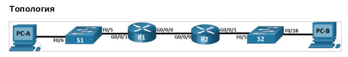

**Таблица адресации**

| Устройство | Интерфейс   | IPv6-адрес            |
| :--------  | :---------- | :-------------------- |
| R1         | G0/0/0      | 2001:db8:acad:2::1/64 |
|            |             | fe80::1               |
|            | G0/0/1      | 2001:db8:acad:1::1/64 |
|            |             | fe80::1               |
| R2         | G0/0/0      | 2001:db8:acad:2::2/64 |
|            |             | fe80::2               |
|            | G0/0/1      | 2001:db8:acad:3::1/64 |
|            |             | fe80::1               |
| PC-A       | NIC         | DHCP                  |
| PC-B       | NIC         | DHCP                  |

## Часть 1. Создание сети и настройка основных параметров устройства

Воспрользуемся уже выстроенной топологией из предыдущей части этой лабораторной работы (посвященной DHCPv4). Как увидим в дальнейшем, очень зря, ибо мы сами себе добавили проблем с подинтерфейсами.

Включаем маршрутизацию ipv6 на обоих маршрутизаторах:

```
R1(config)#ipv6 unicast-routing
```
```
R2(config)#ipv6 unicast-routing
```

Конфигурируем ipv6-адреса на интерфейсах маршрутизаторов:

```
R1(config)#interface g0/0/0
R1(config-if)#ipv6 address 2001:db8:acad:2::1/64
R1(config-if)#ipv6 address fe80::1 link-local 
R1(config-if)#exit
R1(config)#interface g0/0/1
R1(config-if)#ipv6 address 2001:db8:acad:1::1/64
R1(config-if)#ipv6 address fe80::1 link-local
R1(config-if)#exit
```

```
R2(config)#interface g0/0/0
R2(config-if)#ipv6 address 2001:db8:acad:2::2/64
R2(config-if)#ipv6 address fe80::2 link-local
R2(config-if)#exit
R2(config)#interface g 0/0/1
R2(config-if)#ipv6 address 2001:db8:acad:3::1/64
R2(config-if)#ipv6 address fe80::1 link-local 
R2(config-if)#exit
```

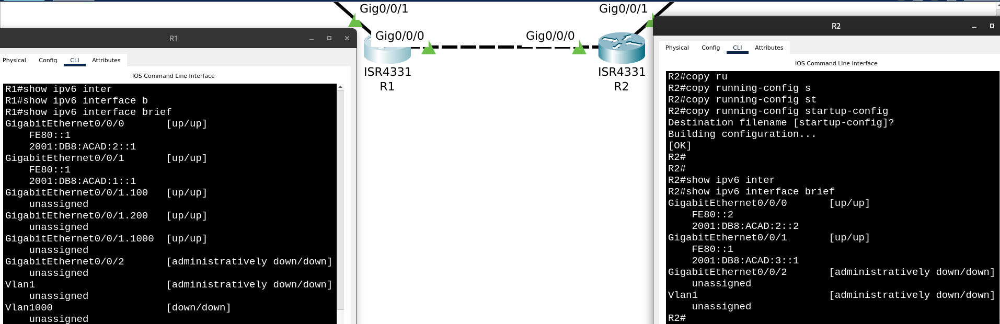

> Убедитесь, что маршрутизация работает с помощью пинга адреса G0/0/1 R2 из R1

Маршрутизатор R1 должен как-то узнать об адресе интерфейса g0/0/1 R2 (т.е. НЕ того интерфейса, с которым напрямую соединен он сам).

Добавили статический маршрут на обоих маршрутизаторах, указав в качестве соседа link-local адреса друг друга:

Решили добавить конкретные адреса, а не ```::/0```:

```
R1(config)#ipv6 route 2001:db8:acad:3::/64 g0/0/0 fe80::2
```
```
R2(config)#ipv6 route 2001:db8:acad:1::/64 g0/0/0 fe80::1
```

Проверили пинг с R1 интерфейса G0/0/1 R2 и пинг с R2 интерфейса G0/0/1 R1, работает:
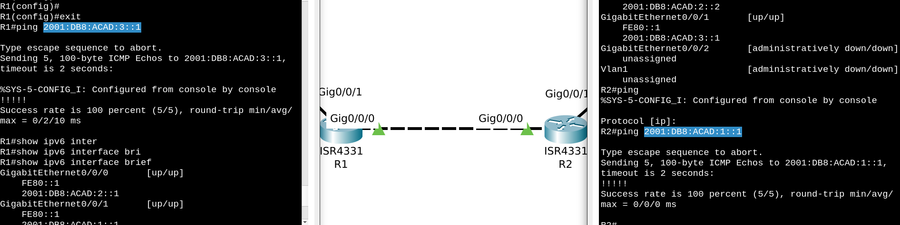

## Часть 2. Проверка назначения адреса SLAAC от R1

Почему не работает автоконфигурация адреса на PC-A.

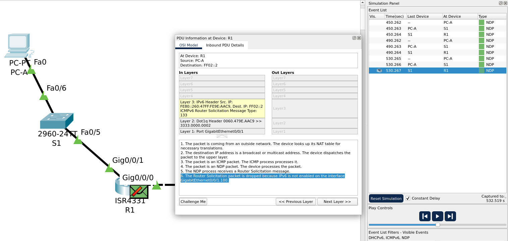

>The Router Solicitation packet is dropped because IPv6 is not enabled on the interface GigabitEthernet0/0/1.100.

Пробуем исправить:
```
R1(config)#interface g0/0/1.100
R1(config-subif)#ipv6 enable
R1(config-subif)#exit
```

Видим, что теперь PC-A получил RA в ответ на свой RS:
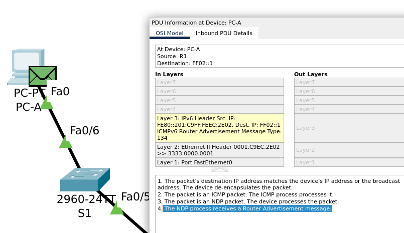

Адрес на PC-A все равно не появился.

Странный src ip в пакете от R1: ```FE80::201:C9FF:FEEC:2E02```

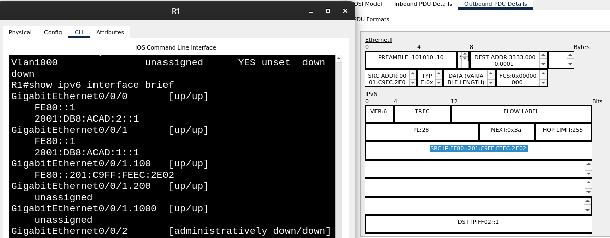

Возможно, дело в том, что RS-пакет приходит на интефейс g0/0/1.100 (ибо PC-A в VLAN 100), а на него никаких адресов мы не назначали.

Переместим адрес 2001:DB8:ACAD:1::1/64 с g0/0/1 на подинтерфейс g0/0/1.100 (новый адрес 2001:DB8:ACAD:1::2/64 из того же префикса на подинтерфейс прибить, очевидно, нельзя, поэтому пришлось поступить так):

```
R1(config)#interface g0/0/1.100
R1(config-subif)#ipv6 address fe80::1 link-local
R1(config-subif)#ipv6 address 2001:DB8:ACAD:1::2/64
%GigabitEthernet0/0/1.100: Error: 2001:DB8:ACAD:1::/64 is overlapping with 2001:DB8:ACAD:1::/64 on GigabitEthernet0/0/1
R1(config-subif)#exit
R1(config)#interface g0/0/1
R1(config-if)#no ipv6 address 2001:DB8:ACAD:1::1/64
R1(config-if)#exit
R1(config)#interface g0/0/1.100
R1(config-subif)#ipv6 address 2001:DB8:ACAD:1::1/64
R1(config-subif)#
R1(config-subif)#
R1(config-subif)#
R1(config-subif)#exit
```

Теперь адрес сгенерировался (видно, что это SLAAC, в середине адреса FF:FE, которое навешивается при генерации с помощью EUI-64)

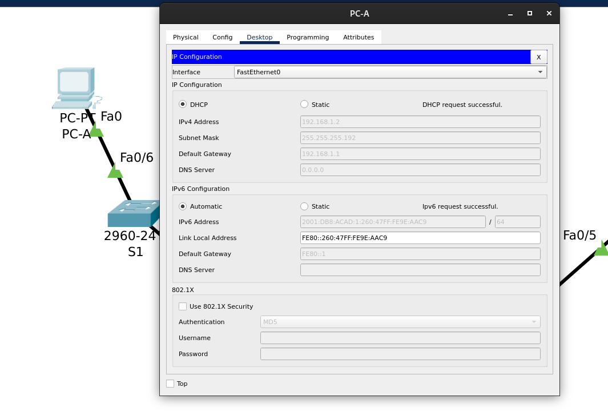

## Часть 3. Настройка и проверка сервера DHCPv6 на R1

Смотрим вывод ```ipconfig /all``` на PC-A:

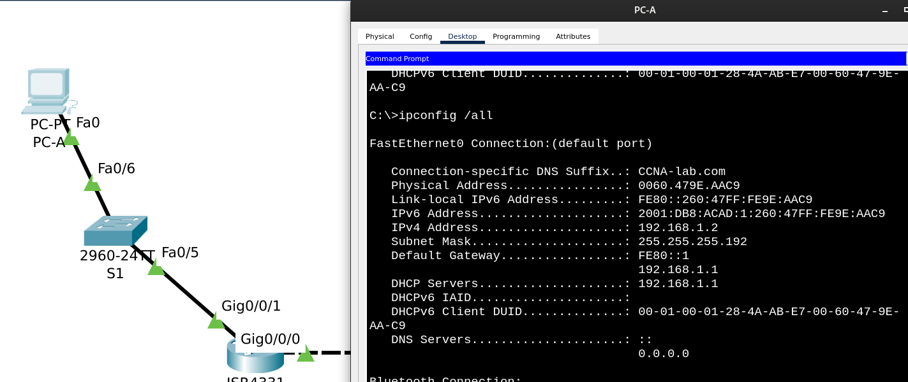

Хотим, чтобы информация к PC-A о dns-сервере приходила от DHCPv6 сервера на R1:

Добавляем пул и конфигурируем нужные параметры.
```
R1(config)#ipv6 dhcp pool R1-STATELESS
R1(config-dhcpv6)#dns-server 2001:db8:acad::254
R1(config-dhcpv6)#domain-name STATELESS.com
R1(config-dhcpv6)#exit
```

Очевидно, и в этот раз нужно конфигурировать подинтерфейс g0/0/1.100, на который будет попадать трафик от PC-A.


Выставляем флаг O в RA-сообщениях, привязываем пул к интерфейсу (если правильно помним, для DHCPv4 этого делать не требовалось):

```
R1(config)#interface g0/0/1.100
R1(config-subif)#ipv6 nd other-config-flag
R1(config-subif)#ipv6 dhcp server R1-STATELESS
R1(config-subif)#exit
R1(config)#exit
R1#
%SYS-5-CONFIG_I: Configured from console by console

R1#copy run st
Destination filename [startup-config]? 
Building configuration...
```

Убеждаемся, что информация о dns-сервере проросла на PC-A:

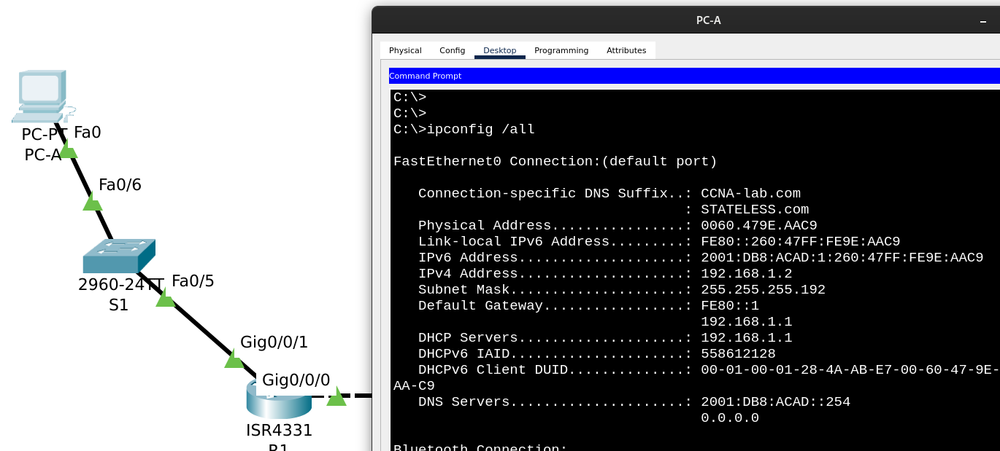

## Часть 4. Настройка сервера DHCPv6 с сохранением состояния на R1

```
R1(config)#ipv6 dhcp pool R2-STATEFUL
R1(config-dhcpv6)#address prefix 2001:db8:acad:3:aaa::/80
R1(config-dhcpv6)#dns-server 2001:db8:acad::254
R1(config-dhcpv6)#domain-name STATEFUL.com
R1(config-dhcpv6)#exit
R1(config)# interface g0/0/0
R1(config-if)#ipv6 dhcp server R2-STATEFUL
R1(config-if)#exit
```

## Часть 5. Настройка и проверка ретрансляции DHCPv6 на R2.

Смотрим ipv6-адрес на PC-B, сгенерированный с помощью SLAAC:

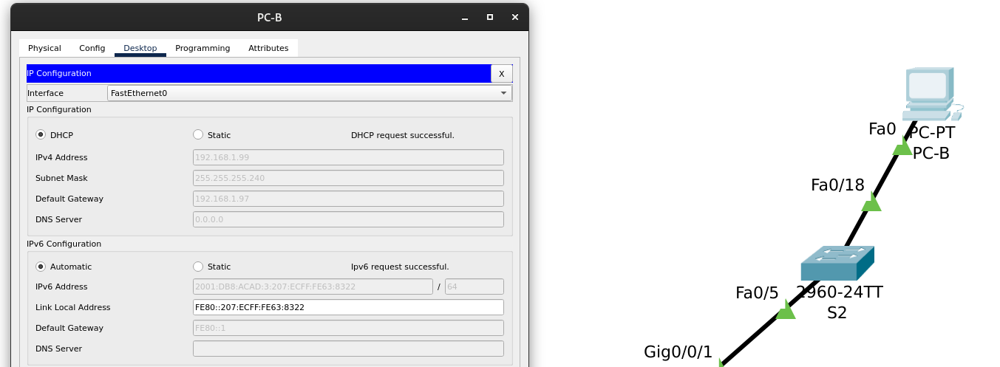

Настраиваем R2 в качестве агента DHCP-ретрансляции для локальной сети на G0/0/1 (здесь, к счастью, никаких сюрпризов с подинтерфейсами и VLAN-ами).

С помощью флага M в RA-сообщении даем понять получателю, что выдачей глобальных unicast-адресов занимается DHCPv6-сервер

```
R2(config-if)#ipv6 nd managed-config-flag
```

Снова в Packet Tracer-е (слева на скрине) не хватает команд:
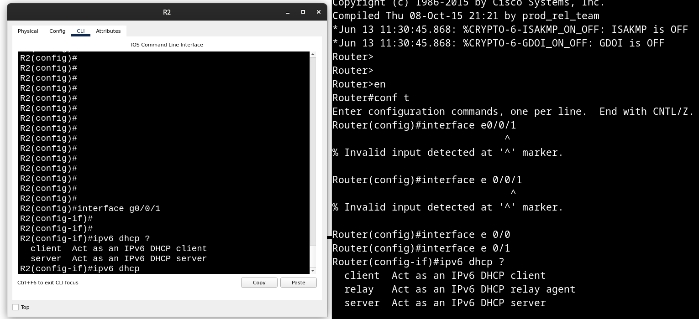


Пробуем в эмуляторе, смотрим сгенерированный с помощью SLAAC адрес на PC-B:

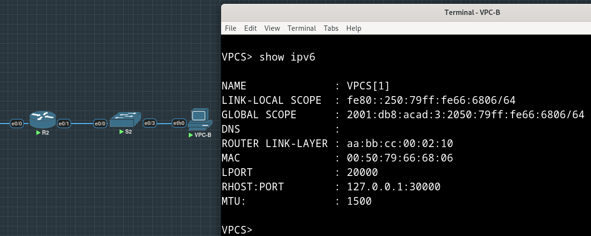

Но не только в Packet Tracer-e не хватает команд - настроили relay на R2, но теперь PC-B не умеет в DHCPv6, только Get IPv4 address via DHCP:

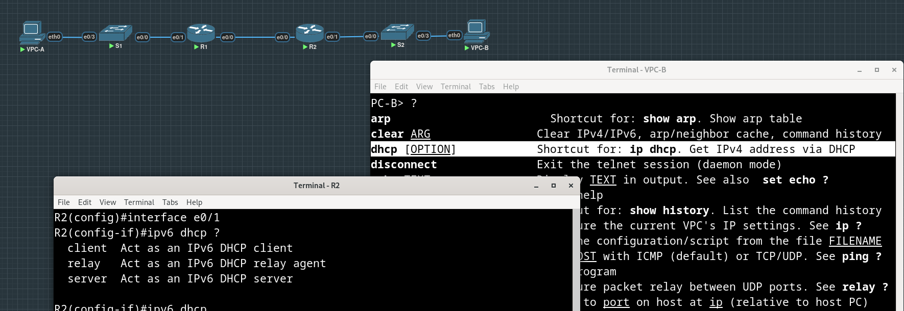

Таки убедились, что relay через R2 работает (видим в dhcp bindings на R1 клиента, находящегося за R2)

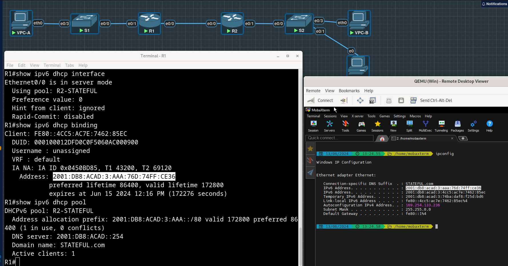

Пингуем с компьютера за R2 оба интерфейса R1 (пакеты на каждый ловятся на e0/0, т.е. тот, который соединен с R2):

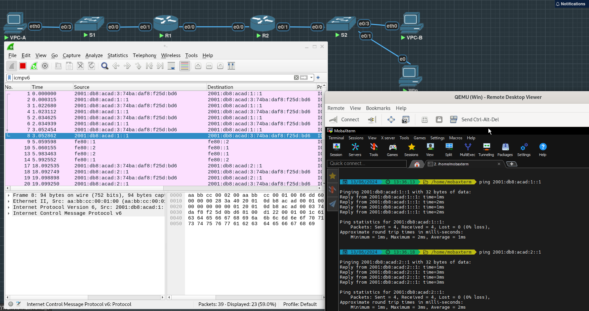