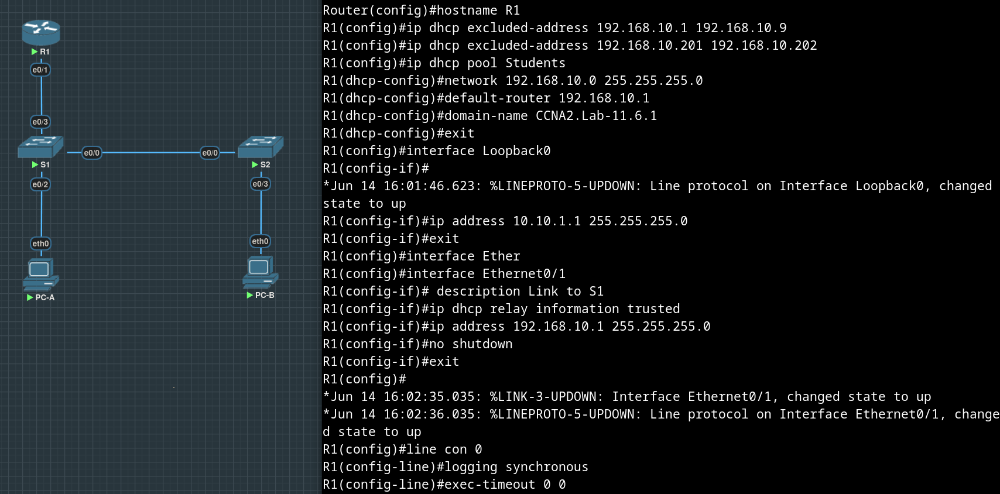

# Лабораторная работа №9. Конфигурация безопасности коммутатора


**Таблица адресации**

| Устройство | Interface/VLAN | IP-адрес       | Маска подсети |
| :--------- | :------------- | :------------- | :------------ |
| R1         | G0/0/1         | 192.168.10.1   | 255.255.255.0 |
|            | Loopback 0     | 10.10.1.1      | 255.255.255.0 |
| S1         | VLAN 10        | 192.168.10.201 | 255.255.255.0 |
| S2         | VLAN 10        | 192.168.10.202 | 255.255.255.0 |
| PC-A       | NIC            | DHCP           | 255.255.255.0 |
| PC-B       | NIC            | DHCP           | 255.255.255.0 | 

## Часть 1. Настройка основного сетевого устройства

Собрали сеть согласно топологии, выполнили предложенные команды на R1:



Настроили default-gateway на коммутаторах S1 и S2:

```
Switch(config)#hostname S1
S1(config)#no ip domain-lo
S1(config)#no ip domain-lookup 
S1(config)#inter
S1(config)#interface e0/0
S1(config-if)#description Link to S2
S1(config-if)#exit
S1(config)#interface e0/2        
S1(config-if)#description Link to Users
S1(config-if)#exit
S1(config)#ip default-ga
S1(config)#ip default-gateway 192.168.10.1
S1(config)#exit
S1#copy
*Jun 14 16:11:51.122: %SYS-5-CONFIG_I: Configured from console by console
S1#copy run sta
S1#copy run startup-config
Destination filename [startup-config]? 
Building configuration...
Compressed configuration from 808 bytes to 560 bytes[OK]
S1#
```

```
Switch(config)#hostname S2
S2(config)#no ip domain-lo
S2(config)#no ip domain-lookup 
S2(config)#inter
S2(config)#interface e0/0
S2(config-if)#description Link to S1
S2(config-if)#exit
S2(config)#interface e0/3        
S2(config-if)#description Link to Users
S2(config-if)#exit
S2(config)#ip default-ga
S2(config)#ip default-gateway 192.168.10.1
S2(config)#exit
S2#copy
*Jun 14 16:16:16.998: %SYS-5-CONFIG_I: Configured from console by console
S2#copy run sta
S2#copy run startup-config
Destination filename [startup-config]? 
Building configuration...
Compressed configuration from 808 bytes to 560 bytes[OK]
S2#
```


## Часть 2. Настройка сетей VLAN на коммутаторах

Конфигруриуем VLAN 10 - Management.

```
S1(config)#vlan 10
S1(config-vlan)#name Management
S1(config-vlan)#exit
```

```
S2(config)#vlan 10
S2(config-vlan)#name Management
S2(config-vlan)#exit
```

Настраиваем IP-адрес в соответствии с таблицей адресации для SVI для VLAN 10 на S1 и S2. Включаем интерфейсы SVI и добавляем описание для интерфейса.

```
S1(config)#interface Vlan 10
S1(config-if)#descript
*Jun 14 16:24:15.170: %LINEPROTO-5-UPDOWN: Line protocol on Interface Vlan10, changed state to down
S1(config-if)#description VLAN 10 for Management
S1(config-if)#ip add
S1(config-if)#ip address 192.168.10.201 ?
  A.B.C.D  IP subnet mask

S1(config-if)#ip address 192.168.10.201 255.255.255.0
S1(config-if)#no shut
S1(config-if)#
*Jun 14 16:24:56.954: %LINK-3-UPDOWN: Interface Vlan10, changed state to down
S1(config-if)#
S1(config-if)#exit
```
```
S2(config)#
S2(config)#inter
S2(config)#interface Vl
S2(config)#interface Vlan 10
S2(config-if)#desc
*Jun 14 16:33:53.224: %LINEPROTO-5-UPDOWN: Line protocol on Interface Vlan10, changed state to down
S2(config-if)#description VLAN 10 for Management
S2(config-if)#ip address 192.168.10.202 255.255.255.0
S2(config-if)#no shut
S2(config-if)#
S2(config-if)#exit 
S2(config)#
*Jun 14 16:34:40.479: %LINK-3-UPDOWN: Interface Vlan10, changed state to down
S2(config)#
```


Конфигруриуем VLAN 333 - Native и VLAN 999 - Parking_lot на обоих коммутаторах.

```
S1#conf t
Enter configuration commands, one per line.  End with CNTL/Z.
S1(config)#vlan 333
S1(config-vlan)#name Native
S1(config-vlan)#vlan 999
S1(config-vlan)#name Parking_lot
S1(config-vlan)#exit
S1(config)#exit
```

```
S2#conf t
Enter configuration commands, one per line.  End with CNTL/Z.
S2(config)#vlan 333
S2(config-vlan)#name Native
S2(config-vlan)#vlan 999
S2(config-vlan)#name Parking_lot
S2(config-vlan)#exit
S2(config)#exit
```


## Часть 3. Настройки безопасности коммутатора

### Шаг 1. Релизация магистральных соединений 802.1Q

Настраиваем все магистральные порты Fa0/1 (у нас им соответствуют E0/0 - порты между коммутаторами) на обоих коммутаторах для использования VLAN 333 в качестве native VLAN.

```
S1(config)#interface e0/0
S1(config-if)#switchport mode trunk
Command rejected: An interface whose trunk encapsulation is "Auto" can not be configured to "trunk" mode.
S1(config-if)#switchport trunk encapsulation ?
  dot1q      Interface uses only 802.1q trunking encapsulation when trunking
  isl        Interface uses only ISL trunking encapsulation when trunking
  negotiate  Device will negotiate trunking encapsulation with peer on
             interface

S1(config-if)#switchport trunk encapsulation dot1q 
S1(config-if)#switchport mode trunk                
S1(config-if)#
S1(config-if)#
S1(config-if)#switchport trunk na                  
S1(config-if)#switchport trunk native ?
  vlan  Set native VLAN when interface is in trunking mode

S1(config-if)#switchport trunk native vl
S1(config-if)#switchport trunk native vlan ?
  <1-4094>  VLAN ID of the native VLAN when this port is in trunking mode

S1(config-if)#switchport trunk native vlan 333
```

```
S2#conf t
Enter configuration commands, one per line.  End with CNTL/Z.
S2(config)#interface e0/0
S2(config-if)#switchport trunk encapsulation dot1q 
S2(config-if)#switchport mode trunk                
S2(config-if)#
S2(config-if)#switchport trunk native vlan 333
S2(config-if)#exit
```


Отключаем протокол DTP (с помощью ```switchport nonegotiate ```) и проверяем:

```
S1#show interfaces e0/0 switchport | inc Negot
Negotiation of Trunking: On
S1#conf t
Enter configuration commands, one per line.  End with CNTL/Z.
S1(config)#interface e0/0
S1(config-if)#switch 
S1(config-if)#switchport non
S1(config-if)#switchport nonegotiate 
S1(config-if)#exit
S1(config)#exit                   
S1#show interfaces e0/0 switchport | inc Negot
Negotiation of Trunking: Off
```

```
S2(config)#interface e0/0
S2(config-if)#switchport nonegotiate 
S2(config-if)#exit
S2(config)#exit
S2#show inter
S2#show interfaces e0/0 switchport | incl Nego
Negotiation of Trunking: Off
S2#
```

### Шаг 2. Настройка портов доступа

Порты в сторону пользователя (у нас e0/2) и маршрутизатора (e0/3) на S1 и порт в сторону пользователя (e0/3) на S2 должны быть настроены как access-порты и добавлены в VLAN 10 (Management).

```
S1(config)#interface range e0/2-3
S1(config-if-range)#switchport mode access
S1(config-if-range)#switchport access vl
S1(config-if-range)#switchport access vlan 10
```

```
S2(config)#interface e0/3
S2(config-if)#switchport mode access
S2(config-if)#switchport access vlan 10
```

Теперь табличка VLAN-ов выглядит так (транковые порты исчезли как непринадлежащие одному VLAN-у, порты до устройств переместились в строку с VLAN-ом Management):


### Шаг 3. Безопасность неиспользуемых портов коммутатора

Переносим неиспользуемые порты на коммутаторах из VLAN 1 в VLAN 999 и отключаем их.

```
S1(config)#inter
S1(config)#interface e0/1
S1(config-if)#switchport access vla
S1(config-if)#switchport access vlan 999
S1(config-if)#shutdown
S1(config-if)#exit
S1(config)#
*Jun 14 17:34:48.050: %LINK-5-CHANGED: Interface Ethernet0/1, changed state to administratively down
*Jun 14 17:34:49.054: %LINEPROTO-5-UPDOWN: Line protocol on Interface Ethernet0/1, changed state to down
```

```
S2(config)#interface range e0/1-2
S2(config-if-range)#switchport acc
S2(config-if-range)#switchport access vlan
S2(config-if-range)#switchport access vlan 999
S2(config-if-range)#shutdown
S2(config-if-range)#
*Jun 14 17:32:56.987: %LINK-5-CHANGED: Interface Ethernet0/1, changed state to administratively down
*Jun 14 17:32:56.987: %LINK-5-CHANGED: Interface Ethernet0/2, changed state to administratively down
*Jun 14 17:32:57.991: %LINEPROTO-5-UPDOWN: Line protocol on Interface Ethernet0/1, changed state to down
*Jun 14 17:32:57.991: %LINEPROTO-5-UPDOWN: Line protocol on Interface Ethernet0/2, changed state to down
S2(config-if-range)#
S2(config-if-range)#exit
```
Теперь табличка VLAN-ов выглядит так (неиспользуемые порты переместились в строку с VLAN-ом Parking_lot, дефолтный VLAN стал пустым):


Убеждаемся, что неиспользуемые порты отключены, смотрим вывод ```show interfaces status```:


### Шаг 4. Документирование и реализация функций безопасности порта

На S1, вводим команду ```show port-security interface e0/2``` для отображения настроек по умолчанию безопасности порта для интерфейса e0/2 (порт в сторону пользователя).

Записываем ответы в таблицу:

| Функция                                     | Настройка по умолчанию | 
| :------------------------------------------ | :--------------------- | 
| Защита портов                               | Disabled               |
| Максимальное количество записей MAC-адресов | 1                      |
| Режим проверки на нарушение безопасности    | Shutdown               |
| Aging Time                                  | 0 mins                 |
| Aging Type                                  | Absolute               |
| Secure Static Address Aging                 | Disabled               |
| Sticky MAC Addresses                        | 0                      | 

Включаем защиту порта на e0/2 со следующими настройками:

• Максимальное количество записей MAC-адресов: 3

• Режим безопасности: restrict

• Aging time: 60 мин

• Aging type: неактивный

```
S1(config)#interface e0/2
S1(config-if)#switchport port-security 
S1(config-if)#switchport port-security violation ?
  protect   Security violation protect mode
  restrict  Security violation restrict mode
  shutdown  Security violation shutdown mode

S1(config-if)#switchport port-security violation res
S1(config-if)#switchport port-security violation restrict 
S1(config-if)#switchport port-security agi                
S1(config-if)#switchport port-security aging time 60
S1(config-if)#switchport port-security aging type ina
S1(config-if)#switchport port-security aging type inactivity 
S1(config-if)#switchport port-security maxi                  
S1(config-if)#switchport port-security maximum 3
```

Смотрим изменения в ```show port-security interface e0/2```:


Смотрим ```show port-security address```: (пришлось перезагружать PC-A, чтобы записи появились):


Что это за MAC-адреса (только один принадлежит PC-A)?
Похоже, протекли какие-то MAC-адреса интерфейсов виртуалки, на которой запущена лаба (так что будем считать, что все в порядке):


Включаем безопасность порта для e0/3 (порт в сторону PC-B) на S2:

```
S2(config)#interface e0/3
S2(config-if)#
S2(config-if)#switchport po
S2(config-if)#switchport port-security
```

Настраиваем каждый активный порт доступа таким образом, чтобы он автоматически добавлял адреса МАС, изученные на этом порту, в текущую конфигурацию ("sticky"):

```
S2(config-if)#switchport port-security mac-address sticky 
```

Настраиваем следующие параметры безопасности порта на S2 Fe0/3:

• Максимальное количество записей MAC-адресов: 2

• Тип безопасности: Protect

• Aging time: 60 мин

```
S2(config-if)#switchport port-security ? 
  aging        Port-security aging commands
  mac-address  Secure mac address
  maximum      Max secure addresses
  violation    Security violation mode
  <cr>

S2(config-if)#switchport port-security maximum 2
S2(config-if)#switchport port-security vio
S2(config-if)#switchport port-security violation pro
S2(config-if)#switchport port-security violation protect
S2(config-if)#switchport port-security ag
S2(config-if)#switchport port-security aging time 60
S2(config-if)#exit
```

Смотрим что получилось в ```show port-security interface e0/3``` и ```show port-security address```:


Опять нет никаких изученных MAC-ов, перезагрузим PC-B:


Снова пророс лишний MAC от виртуалки.

### Шаг 5. DHCP snooping

На S2 включаем DHCP snooping.

```
S2(config)#ip dhcp snooping 
S2(config)#do show run
Building configuration...

.........
version 15.2
service timestamps debug datetime msec
service timestamps log datetime msec
no service password-encryption
service compress-config
!
hostname S2
!
!
!
ip dhcp snooping
no ip domain-lookup
.........
```

Настраиваем DHCP snooping в Management VLAN-е:

```
S2(config)#ip dhcp snooping vlan 10
```

Настраиваем магистральные порты (на S2 такой всего один) как доверенные:

```
S2(config)#interface e0/0
S2(config-if)#ip dhcp snooping trust
```

Ограничиваем ненадежный порт e0/3 на S2 пятью DHCP-пакетами в секунду:

```
S2(config)#interface e0/3
S2(config-if)#ip dhcp snooping limit rate 5
```

Смотрим, что получилось с DHCP Snooping-ом на S2:


Сравнивая вывод ```show ip dhcp snooping``` с примером, замечаем, что опция 82 на месте.

Можем отключить её:
```
S2(config)#no ip dhcp snooping ?
  database     DHCP snooping database agent
  glean        DHCP read only snooping
  information  DHCP Snooping information
  verify       DHCP snooping verify
  vlan         DHCP Snooping vlan
  wireless     DHCP snooping wireless
  <cr>

S2(config)#no ip dhcp snooping in
S2(config)#no ip dhcp snooping information op
S2(config)#no ip dhcp snooping information option ?
  allow-untrusted  DHCP Snooping information option allow-untrusted
  format           Option 82 information format
  <cr>

S2(config)#no ip dhcp snooping information option 
```

Изначально список в ```ip dhcp snooping binding```, запросим адрес на PC-B и увидим его появление в ```ip dhcp snooping binding```:


### Шаг 6. Реализация PortFast и BPDU Guard

Настраиваем PortFast на всех портах доступа, которые используются на обоих коммутаторах:

```
S2(config)#interface e0/3
S2(config-if)#spanning-tree portfast 
%Warning: portfast should only be enabled on ports connected to a single
 host. Connecting hubs, concentrators, switches, bridges, etc... to this
 interface  when portfast is enabled, can cause temporary bridging loops.
 Use with CAUTION

%Portfast has been configured on Ethernet0/3 but will only
 have effect when the interface is in a non-trunking mode.
S2(config-if)#                   
```

>when the interface is in a non-trunking mode

?? Мы руками выставляли режим (mode) порта в access в части 3 шаге 2 ```switchport mode access```


И здесь видим ```access```
```
Administrative Mode: static access
Operational Mode: static access
```

Видимо, это предупреждение появляется не в случае, когда пытаемся на магистральном или автоматически настраиваемом порту выставить Portfast, а вообще всегда.

```
S1#show spanning-tree interface e0/2 portfast
VLAN0010            enabled
```
```
S2#show spanning-tree interface e0/3 portfast
VLAN0010            enabled
```

Включаем защиту BPDU на портах доступа VLAN 10 S1 и S2, подключенных к PC-A и PC-B:

```
S1(config)#interface e0/2
S1(config-if)#spa
S1(config-if)#spanning-tree bpdu
S1(config-if)#spanning-tree bpdu?
bpdufilter  bpduguard  

S1(config-if)#spanning-tree bpdugu
S1(config-if)#spanning-tree bpduguard e
S1(config-if)#spanning-tree bpduguard enable 
```

```
S2(config)#interface e0/3
S2(config-if)#spanning-tree bpduguard enable 
```

Убеждаемся, что защита BPDU и PortFast включены на соответствующих портах.


### Шаг 7. Проверка наличия сквозного подключения

Получаем на PC-A ip-адрес через DHCP и пробуем попинговать все заданные нами ip-адреса всех устройств.


## Вопросы для повторения

1. С точки зрения безопасности порта на S2, почему нет значения таймера для оставшегося возраста в минутах, когда было сконфигурировано динамическое обучение - sticky?

    Ответ: в режиме sticky порт запишет находящийся на той стороне MAC в конфиг, т.е. предполагается, что мы не хотим заново "переучивать" MAC через какое-либо время (если сохранить конфиг, то этот sticky MAC переживет и перезагрузку коммутатора, и "переучивание" этого MAC-а после перезагрузки не потребуется).


2. Что касается безопасности порта на S2, если вы загружаете скрипт текущей конфигурации на S2, почему порту 18 на PC-B никогда не получит IP-адрес через DHCP?

    Ответ: 

3. Что касается безопасности порта, в чем разница между типом абсолютного устаревания и типом устаревание по неактивности?

    Ответ: устаревание "по неактивности" происходит только, если кадры от устройства перестают приходить в течение сконфигурированного периода времени, в случае с абсолютным устареванием - по истечении сконфигурированного периода запись о MAC-адресе все равно будет удалена, даже если на порт до сих пор приходят кадры от устройства с этим MAC-адресом.