# Лабораторная работа №10. Настройка протокола OSPFv2 для одной области

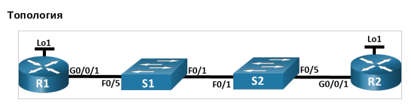

**Таблица адресации**

| Устройство | Interface | IP-адрес    | Маска подсети |
| :--------- | :-------- | :---------- | :------------ |
| R1         | G0/0/1    | 10.53.0.1   | 255.255.255.0 |
|            | Loopback1 | 172.16.1.1  | 255.255.255.0 |
| R2         | G0/0/1    | 10.53.0.2   | 255.255.255.0 |
|            | Loopback1 | 192.168.1.1 | 255.255.255.0 |

## Часть 1. Создание сети и настройка основных параметров устройства

Собираем сеть согласно топологии, проводим привычные настройки устройств с заданием паролей на привилегированный режим, консольную и vty линии, message-of-the-day, отключение dns-lookup-ов, и т.д.

## Часть 2. Настройка и проверка базовой работы протокола OSPFv2 для одной области

### Шаг 1. Настройка адреса интерфейса и базового OSPFv2 на каждом маршрутизаторе


Добавили адреса на интерфейсы маршрутизаторов, согласно таблице:
```
R1(config)#int e0/1
R1(config-if)#ip addr 10.53.0.1 255.255.255.0
R1(config-if)#exit
R1(config)#int loopback1
R1(config-if)#ip addr 172.16.1.1 255.255.255.0
R1(config-if)#exit
R1(config)#
```

```
R2(config)#interface e0/1
R2(config-if)#ip address 10.53.0.2 255.255.255.0
R2(config-if)#exit
R2(config)#interface Loopback 1
R2(config-if)#ip address 192.168.1.1 255.255.255.0
R2(config-if)#exit
```

Переходим в режим конфигурации маршрутизатора OSPF, используя идентификатор процесса 56:

```
R1(config)#router ospf 56
```

```
R2(config)#router ospf 56
```

Задаем router_id для R1 и R2, и помещаем сеть между ними в область 0 (добавили адреса конкретных интерфейсов, поэтому wildcard-маска нулевая - никаких бит, которые могли бы принимать разные значения):

```
R1(config-router)#router-id 1.1.1.1
R1(config-router)#network 10.53.0.1 0.0.0.0 area 0
```

```
R2(config-router)#router-id 2.2.2.2
R2(config-router)#network 10.53.0.2 0.0.0.0 area 0
```

Только на R2 добавляем конфигурацию, необходимую для объявления сети Loopback 1 в область OSPF 0 (сетевая маска 255.255.255.0 - т.е. у хоста в этой сети последние 8 бит могут быть любыми, так что wildcard-маска будет иметь вид 0.0.0.255):

```
R2(config-router)#network 192.168.1.0 0.0.0.255 area 0
```

Убеждаемся, что OSPFv2 работает между маршрутизаторами:


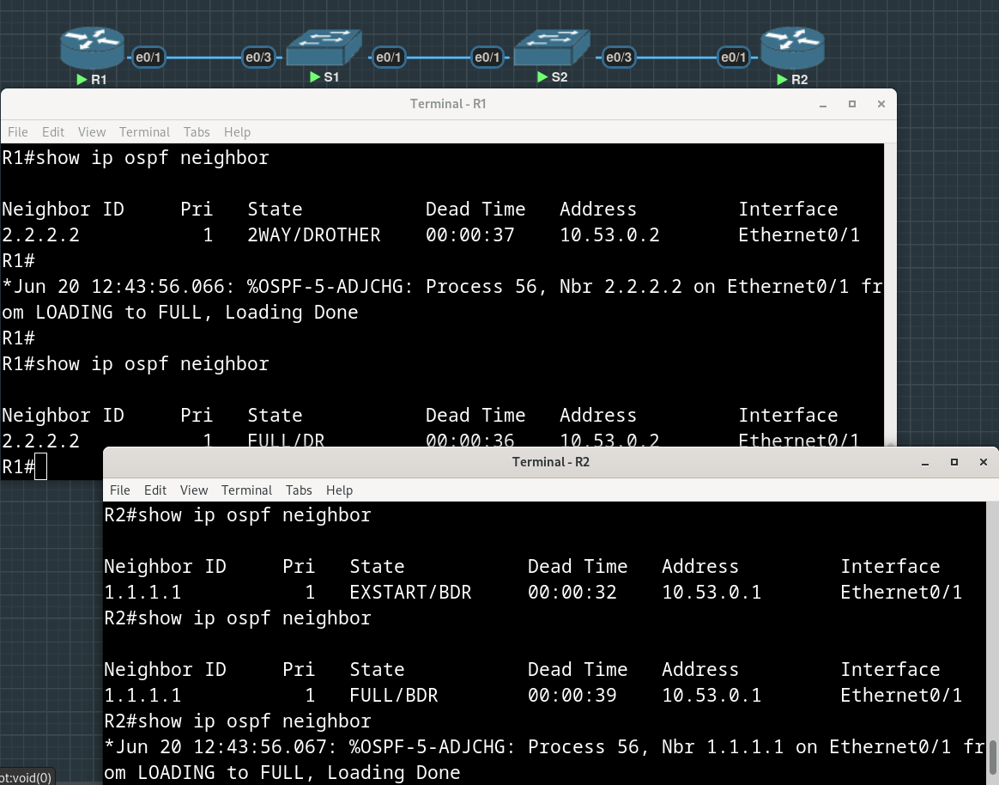

Видим, что R1 и R2 стали соседями, R1 стал BDR, R2 стал DR - приоритеты не были заданы, так что выбор осуществлялся на основании величины router-id, он выше у R2.

На R1 выполняем команду ```show ip route ospf``, чтобы убедиться, что сеть R2 Loopback1 присутствует в таблице маршрутизации.

>Обратите внимание, что поведение OSPF по умолчанию заключается в объявлении интерфейса обратной связи в качестве маршрута узла с использованием 32-битной маски.

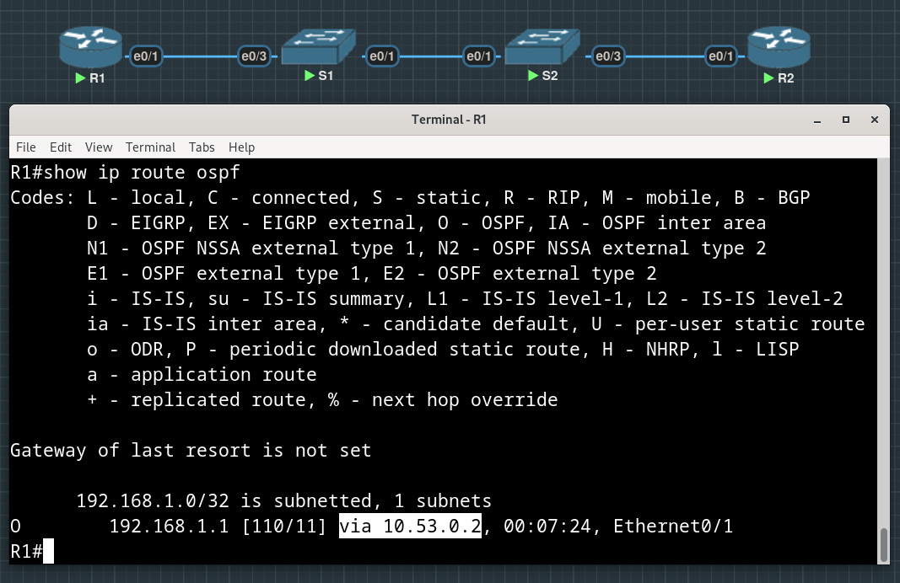

Запускаем ping до адреса интерфейса R2 Loopback 1 из R1:

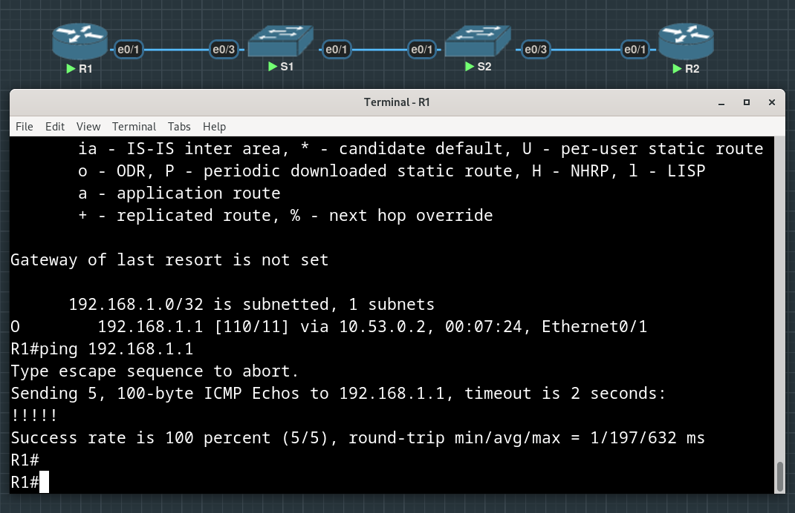

## Часть 3. Оптимизация и проверка конфигурации OSPFv2 для одной области

### Шаг 1. Реализация различных оптимизаций на каждом маршрутизаторе

На R1 настраиваем приоритет OSPF интерфейса e0/1 на 50, чтобы сделать R1 назначенным маршрутизатором (designated router).

Было (приоритет 1):

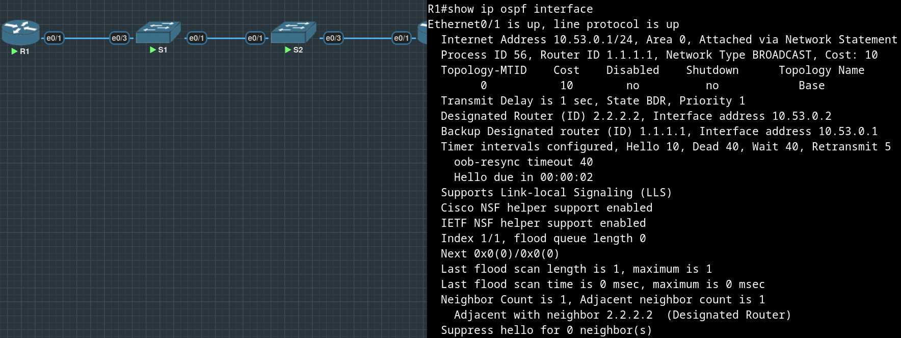

Стало (приоритет 50):

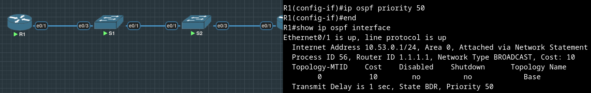

Настраиваем таймеры OSPF на e0/1 каждого маршрутизатора для таймера приветствия, составляющего 30 секунд (на скрине выше видели Hello 10):

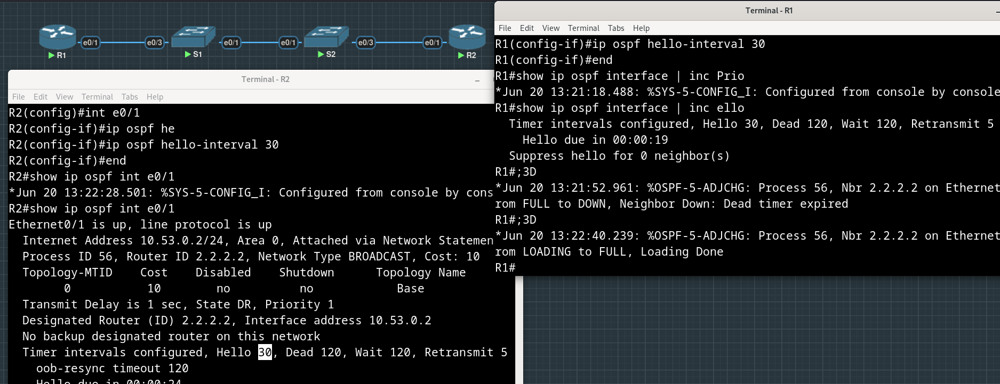

На R1 настраиваем статический маршрут по умолчанию, который использует интерфейс Loopback 1 в качестве интерфейса выхода:

```
R1(config)#ip route 0.0.0.0 0.0.0.0 Loopback 1
%Default route without gateway, if not a point-to-point interface, may impact performance
```

> Обратите внимание на сообщение консоли после установки маршрута по умолчанию.

Распространяем маршрут по умолчанию в OSPF:

```
R1(config)#router ospf 56
R1(config-router)#default?
default  default-information  default-metric  

R1(config-router)#default-information originate 
```

Кажется, что маршрут пророс на R2:

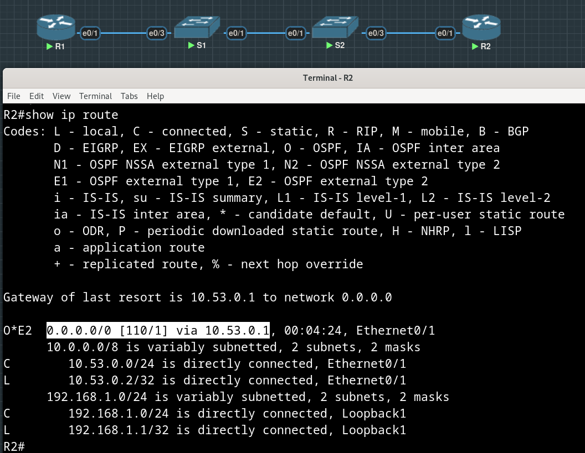

Добавляем конфигурацию, необходимую для OSPF для обработки R2 Loopback 1 как сети точка-точка. Это приводит к тому, что OSPF объявляет Loopback 1 использует маску подсети интерфейса.

"Было" (/32) и "стало" (/24) в таблице маршрутизации на R1 после выполнения ```ip ospf network point-to-point``` на Loopback 1 интерфейсе R2:

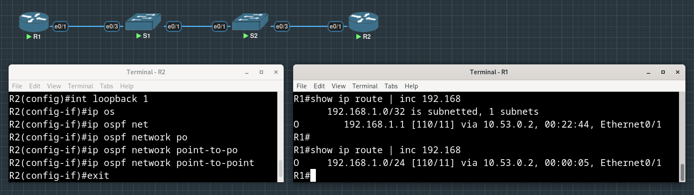

Только на R2 добавляем конфигурацию, необходимую для предотвращения отправки объявлений OSPF в сеть Loopback 1 (passive-interface):

```
R2(config)#router ospf 56
R2(config-router)#passive-interface loopback 1
```

Изменяем базовую пропускную способность для маршрутизаторов (было 100, выставили 50):

```
R1#show interfaces e0/1 | inc BW
  MTU 1500 bytes, BW 10000 Kbit/sec, DLY 1000 usec, 
R1#conf t
Enter configuration commands, one per line.  End with CNTL/Z.
R1(config)#router
R1(config)#router osp
R1(config)#router ospf 56
R1(config-router)#auto
R1(config-router)#auto-cost re
R1(config-router)#auto-cost reference-bandwidth 50
% OSPF: Reference bandwidth is changed. 
        Please ensure reference bandwidth is consistent across all routers.
R1(config-router)#
```

```
R2#show ip ospf | inc bandwidth
 Reference bandwidth unit is 100 mbps
R2#conf t
Enter configuration commands, one per line.  End with CNTL/Z.
R2(config)#router ospf 56
R2(config-router)#auto
R2(config-router)#auto-cost re
R2(config-router)#auto-cost reference-bandwidth ?  
  <1-4294967>  The reference bandwidth in terms of Mbits per second

R2(config-router)#auto-cost reference-bandwidth 50
% OSPF: Reference bandwidth is changed. 
        Please ensure reference bandwidth is consistent across all routers.
R2(config-router)#end
R2#show ip ospf | inc bandwidth
 Reference bandwidth unit is 50 mbps
R2#
```

Видим изменение cost (cost = reference_bandwidth / actual_bandwidth = 50 / 10 = 5)

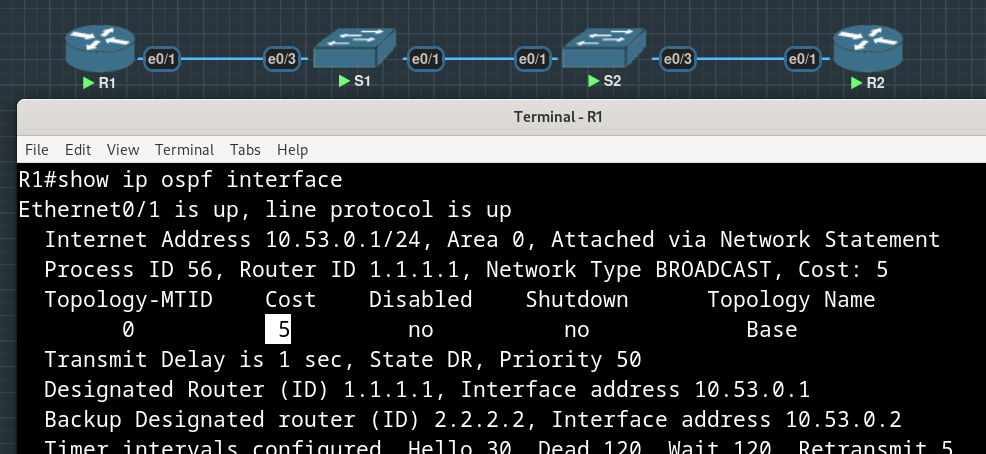

После этой настройки перезапускаем OSPF с помощью команды ```clear ip ospf process```:


>Обратите внимание на сообщение консоли после установки новой опорной полосы пропускания.

Видимо, речь об этом предупреждении:
```
% OSPF: Reference bandwidth is changed. 
        Please ensure reference bandwidth is consistent across all routers.
```

### Шаг 2. Проверка реализации оптимизаций OSPFv2

Выполняем команду ```show ip ospf interface e0/1``` на R1 и убеждаемся, что приоритет интерфейса установлен равным 50, а временные интервалы — Hello 30, Dead 120, а тип сети по умолчанию — Broadcast:

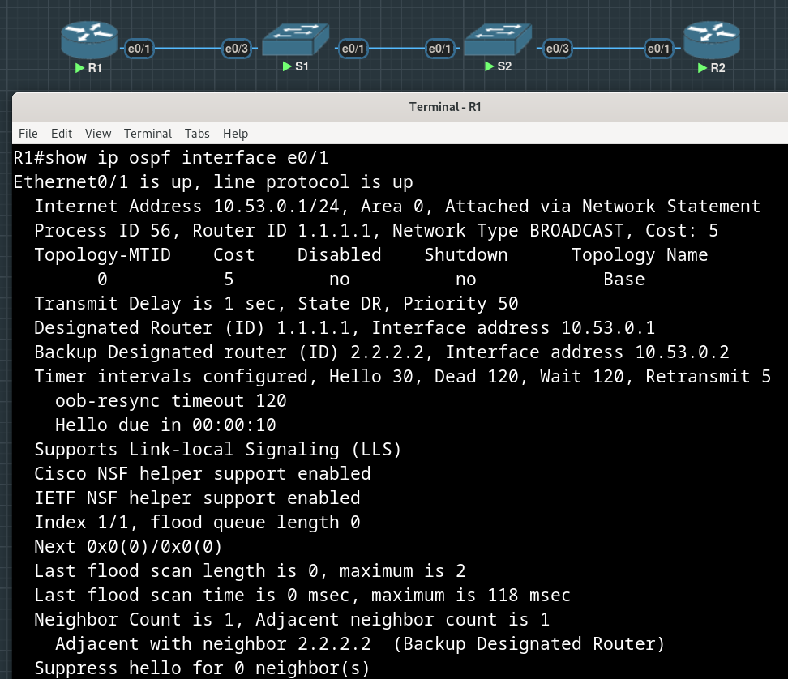

На R1 выполняем команду ```show ip route ospf```, чтобы убедиться, что сеть R2 Loopback1 присутствует в таблице маршрутизации. 

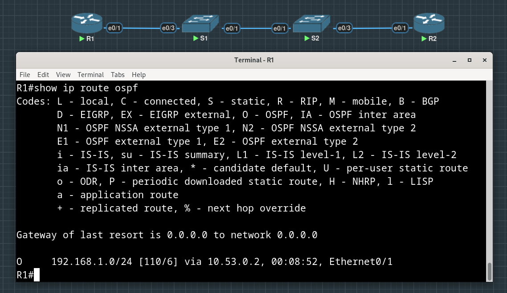

>Обратите внимание на разницу в метрике между этим выходным и предыдущим выходным.

Метрика была равна 11 (до изменения эталонной полосы пропускания), стала 6.

>Также обратите внимание, что маска теперь составляет 24 бита, в отличие от 32 битов, ранее объявленных.

Выполняем команду ```show ip route ospf``` на маршрутизаторе R2. Единственная информация о маршруте OSPF должна быть распространяемый по умолчанию маршрут R1 (так и есть, видим ```0.0.0.0/0``` через ```10.53.0.1```, адрес соединенного с R2 интерфейса R1).

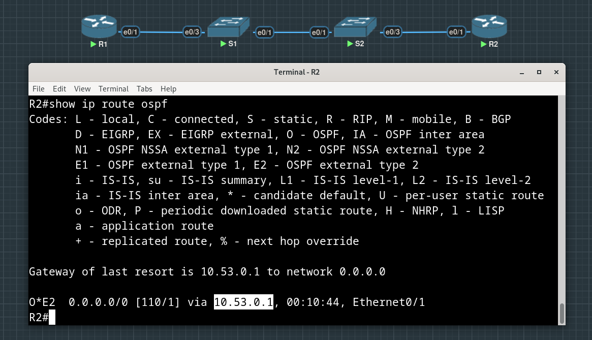

Запускаем ping до адреса интерфейса R1 Loopback 1 (172.16.1.1) из R2:

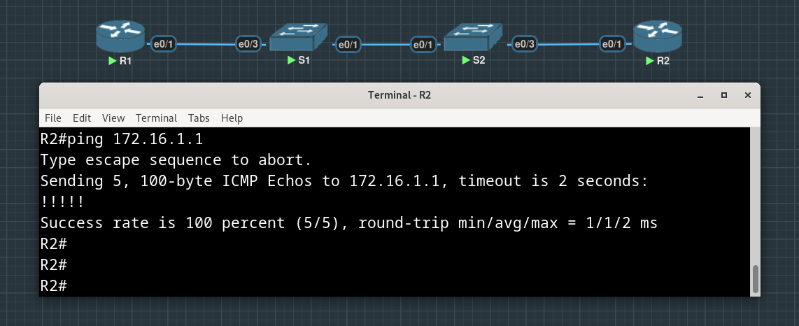

Успешно.

Вопрос:

Почему стоимость OSPF для маршрута по умолчанию отличается от стоимости OSPF в R1 для сети 192.168.1.0/24?

Ответ:

Стоимость маршрута по умолчанию на R2 равна единице, поскольку это статический маршрут, который мы руками прописали на R1 (E в записи этого маршрута как раз значит external, т.е. внешний). Маршрут же до 192.168.1.0/24 на R1 получился просто включением в OSPF интерфейса Loopback 1 на R2, где косты высчитываются с учетом эталонной полосы пропускания.

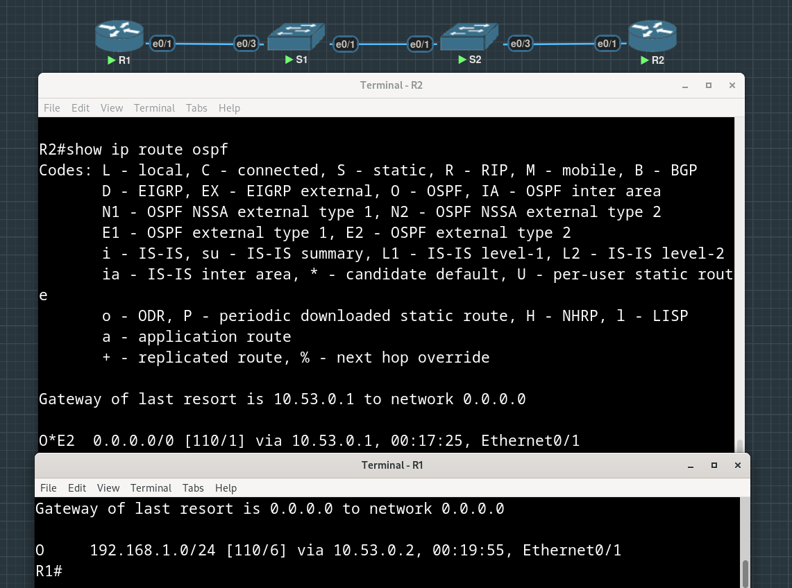