# Лабораторная работа №11. Настройка и проверка расширенных списков контроля доступа

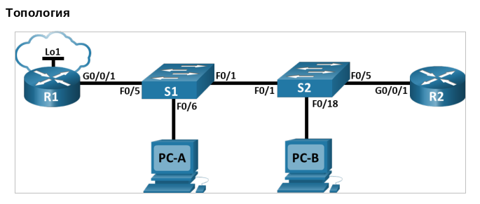

**Таблица адресации**

| Устройство | Интерфейс   | IP-адрес   | Маска подсети | Шлюз по умолчанию |
| :--------  | :---------- | :--------- | :------------ | :---------------- |
| R1         | G0/0/1      | -          | -             | -                 |                 
|            | G0/0/1.20   | 10.20.0.1  | 255.255.255.0 |                   |
|            | G0/0/1.30   | 10.30.0.1  | 255.255.255.0 |                   |
|            | G0/0/1.40   | 10.40.0.1  | 255.255.255.0 |                   |
|            | G0/0/1.1000 | -          | -             |                   |
|            | Loopback1   | 172.16.1.1 | 255.255.255.0 |                   |
| R2         | G0/0/1      | 10.20.0.4  | 255.255.255.0 | -                 |
| S1         | VLAN 20     | 10.20.0.2  | 255.255.255.0 | 10.20.0.1         |
| S2         | VLAN 20     | 10.20.0.3  | 255.255.255.0 | 10.20.0.1         |
| PC-A       | NIC         | 10.30.0.10 | 255.255.255.0 | 10.30.0.1         |
| PC-B       | NIC         | 10.40.0.10 | 255.255.255.0 | 10.40.0.1         |

**Таблица VLAN**

| VLAN  | Имя         | Назначенный интерфейс                 |
| :---- | :---------- | :------------------------------------ |
| 20    | Management  | S2: F0/5                              |
| 30    | Operations  | S1: F0/6                              |
| 40    | Sales       | S2: F0/18                             |
| 999   | Parking_lot | S1: F0/2-4, F0/7-24, G0/1-2           |
|       |             | S2: F0/2-4, F0/6-17, F0/19-24, G0/1-2 |
| 1000  | Native      | -                                     |

## Часть 1. Создание сети и настройка основных параметров устройств

Собираем сеть согласно топологии, проводим привычные настройки устройств с заданием паролей на привилегированный режим, консольную и vty линии, message-of-the-day, отключение dns-lookup-ов, и т.д.

## Часть 2. Настройка сетей VLAN на коммутаторах

### Шаг 1. Создание сети VLAN на коммутаторах

Создаем необходимые VLAN с номерами и именами согласно табличке на каждом коммутаторе.

```
S1(config)#vlan 20
S1(config-vlan)#name MNGMNT
S1(config-vlan)#exit
S1(config)#vlan 30
S1(config-vlan)#name Operations
S1(config-vlan)#vlan 40
S1(config-vlan)#name Sales
S1(config-vlan)#vlan 999
S1(config-vlan)#name Parking_lot
S1(config-vlan)#vlan 1000
S1(config-vlan)#name Native
S1(config-vlan)#end
```

Настраиваем интерфейс управления и шлюз по умолчанию на каждом коммутаторе, используя информацию об IP-адресе в таблице адресации

```
S1(config)#int Vlan 20
S1(config-if)#
%LINK-5-CHANGED: Interface Vlan20, changed state to up

S1(config-if)#
S1(config-if)#ip address 10.20.0.2 255.255.255.0
S1(config-if)#exit
S1(config)#ip default-gateway 10.20.0.1
S1(config)#exit
S1#
%SYS-5-CONFIG_I: Configured from console by console

S1#copy ru st
Destination filename [startup-config]? 
Building configuration...
[OK]
```

Переводим все неиспользуемые порты коммутатора в VLAN Parking Lot, настраиваем их для статического режима доступа (имеется в виду ```switchport mode access```?) и административно деактивируем их.

```
S1(config)#int range fa0/2-4,fa0/7-24,g0/1-2
S1(config-if-range)#switchport access vlan 999
S1(config-if-range)#shut

%LINK-5-CHANGED: Interface FastEthernet0/2, changed state to administratively down
....
%LINK-5-CHANGED: Interface GigabitEthernet0/2, changed state to administratively down
```

### Шаг 2. Назначение VLAN соответствующим интерфейсам коммутатора

Назначаем используемые порты соответствующим VLAN из таблички:

```
S1(config)#int fa0/6
S1(config-if)#switchport mode access
S1(config-if)#switchport access vlan 30
```

```
S2(config)#int fa0/18
S2(config-if)#switchport mode access 
S2(config-if)#switchport access vlan 40
```
Убеждаемся, что сети VLAN назначены правильным интерфейсам:

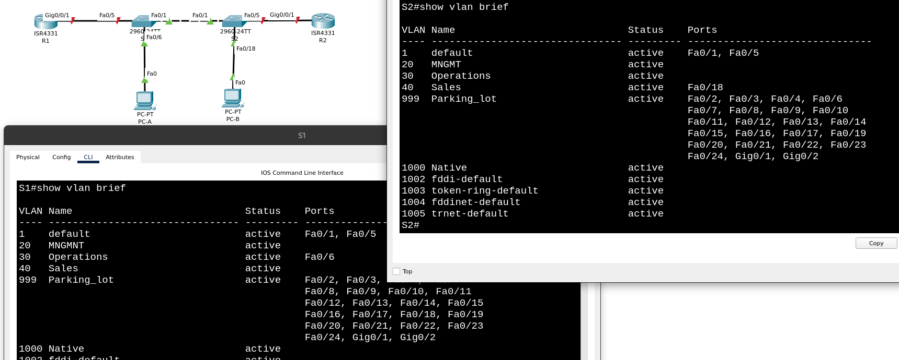

Вспомнимаем, что по табличке VLAN-ов интерфейс Fa0/5 на S2 - не магистральный, а принадлежит VLAN-у 20 (конечно же мы об этом вспомнили уже после настройки транков, когда пытались с R2 попинговать 10.20.0.1 на R1):

```
S2(config)#int fa0/5
S2(config-if)#switchport mode access
S2(config-if)#switchport access vlan 20
S2(config-if)#switchport nonegotiate 
S2(config-if)#exit
```

## Часть 3. Настройка транков (магистральных каналов)

### Шаг 1. Настройка магистрального интерфейса F0/1

На S1:
```
S1(config)#int fa0/1
S1(config-if)#switchport mode trunk

S1(config-if)#
%LINEPROTO-5-UPDOWN: Line protocol on Interface FastEthernet0/1, changed state to down

%LINEPROTO-5-UPDOWN: Line protocol on Interface FastEthernet0/1, changed state to up

%LINEPROTO-5-UPDOWN: Line protocol on Interface Vlan20, changed state to up

S1(config-if)#switchport trunk allowed vlan 20,30,40
S1(config-if)#switchport trunk native vlan 1000
S1(config-if)#switchport nonegotiate 
S1(config-if)#
%CDP-4-NATIVE_VLAN_MISMATCH: Native VLAN mismatch discovered on FastEthernet0/1 (1000), with S2 FastEthernet0/1 (1).
```

На S2:
```
S2(config)#int fa0/1
S2(config-if)#switchport mode trunk

S2(config-if)#
%LINEPROTO-5-UPDOWN: Line protocol on Interface FastEthernet0/1, changed state to down

%LINEPROTO-5-UPDOWN: Line protocol on Interface FastEthernet0/1, changed state to up

%LINEPROTO-5-UPDOWN: Line protocol on Interface Vlan20, changed state to up

S2(config-if)#%SPANTREE-2-RECV_PVID_ERR: Received BPDU with inconsistent peer vlan id 1000 on FastEthernet0/1 VLAN1.

%SPANTREE-2-BLOCK_PVID_LOCAL: Blocking FastEthernet0/1 on VLAN0001. Inconsistent local vlan.

S2(config-if)#switchport trunk allowed vlan 20,30,40
%SPANTREE-2-RECV_PVID_ERR: Received BPDU with inconsistent peer vlan id 1000 on FastEthernet0/1 VLAN1.

%SPANTREE-2-BLOCK_PVID_LOCAL: Blocking FastEthernet0/1 on VLAN0001. Inconsistent local vlan.


S2(config-if)#switchport trunk native vlan 1000
%SPANTREE-2-UNBLOCK_CONSIST_PORT: Unblocking FastEthernet0/1 on VLAN1000. Port consistency restored.

%SPANTREE-2-UNBLOCK_CONSIST_PORT: Unblocking FastEthernet0/1 on VLAN0001. Port consistency restored.

S2(config-if)#switchport nonegotiate
```

Забыли добавить native vlan в разрешенные:

```
S1(config-if)#switchport trunk allowed vlan add 1000
```
```
S2(config-if)#switchport trunk allowed vlan add 1000
```

Смотрим, что получилось:
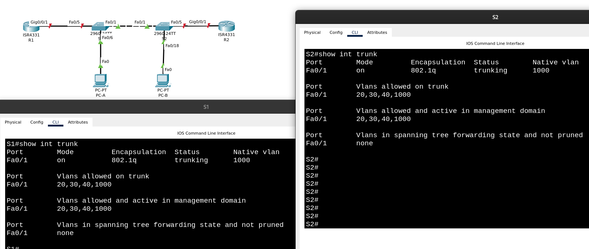

### Шаг 2. Настройка магистрального интерфейса F0/5 на коммутаторе S1

```
S1(config)#int fa0/5
S1(config-if)#switchport mode trunk
S1(config-if)#switchport trunk allowed vlan 20,30,40,1000
S1(config-if)#switchport trunk native vlan 1000
S1(config-if)#switchport nonegotiate
```

## Часть 4. Настройка маршрутизации

### Шаг 1. Настройка маршрутизации между сетями VLAN на R1

Поднимаем интерфейс:

```
R1(config)#int g0/0/1
R1(config-if)#no shut
```

Настраиваем подинтерфейсы для каждой VLAN, как указано в таблице IP-адресации. Все подинтерфейсы используют инкапсуляцию 802.1Q.

```
R1(config)#int g0/0/1.20
R1(config-subif)#
%LINK-5-CHANGED: Interface GigabitEthernet0/0/1.20, changed state to up

%LINEPROTO-5-UPDOWN: Line protocol on Interface GigabitEthernet0/0/1.20, changed state to up

R1(config-subif)#ip addr 10.20.0.1 255.255.255.0

% Configuring IP routing on a LAN subinterface is only allowed if that
subinterface is already configured as part of an IEEE 802.10, IEEE 802.1Q,
or ISL vLAN.

R1(config-subif)#encapsulation dot1Q 20
R1(config-subif)#ip addr 10.20.0.1 255.255.255.0
R1(config-subif)#
```

Убеждаемся, что подинтерфейс для собственной (native) VLAN не имеет назначенного IP-адреса.

```
R1(config)#int g0/0/1.1000
R1(config-subif)#
%LINK-5-CHANGED: Interface GigabitEthernet0/0/1.1000, changed state to up

%LINEPROTO-5-UPDOWN: Line protocol on Interface GigabitEthernet0/0/1.1000, changed state to up

R1(config-subif)#description Subinterface for Native VLAN (1000)
R1(config-subif)#encapsulation dot1Q 1000
R1(config-subif)#exit
```

Включаем описание для каждого подинтерфейса.

```
R1(config-subif)#description Subinterface for MNGMT VLAN (20)
```

В running-config:

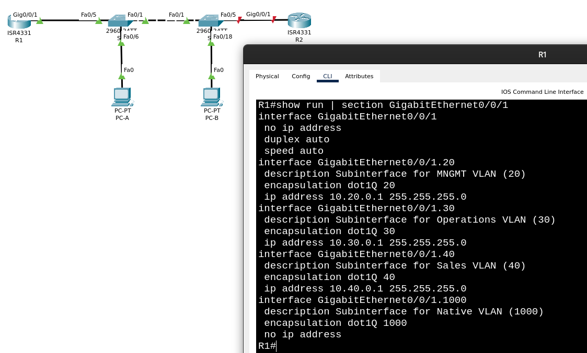

Настраиваем интерфейс Loopback 1 на R1 с адресацией из таблицы:

```
R1(config)#int Loopback 1

R1(config-if)#
%LINK-5-CHANGED: Interface Loopback1, changed state to up

%LINEPROTO-5-UPDOWN: Line protocol on Interface Loopback1, changed state to up

R1(config-if)#ip address 172.16.1.1 255.255.255.0
R1(config-if)#exit
R1(config)#
```

С помощью команды ```show ip interface brief``` проверьте конфигурацию интерфейсов и подынтерфейсов:

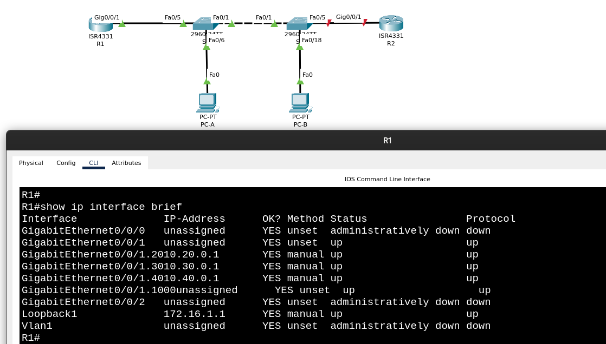

### Шаг 2. Настройка интерфейса R2 g0/0/1 с использованием адреса из таблицы и маршрута по умолчанию с адресом следующего перехода 10.20.0.1

```
R2(config)#int g0/0/1
R2(config-if)#no shut

R2(config-if)#
%LINK-5-CHANGED: Interface GigabitEthernet0/0/1, changed state to up

%LINEPROTO-5-UPDOWN: Line protocol on Interface GigabitEthernet0/0/1, changed state to up

R2(config-if)#ip addr 10.20.0.4 255.255.255.0
R2(config-if)#exit
R2(config)#ip route 0.0.0.0 0.0.0.0 10.20.0.1
```

## Часть 5. Настройка удаленного доступа

### Шаг 1. Настройка ВСЕХ сетевыех устройств для базовой поддержки SSH

>Создайте локального пользователя с именем пользователя SSHadmin и зашифрованным паролем $cisco123!

>Используйте ccna-lab.com в качестве доменного имени.

>Генерируйте криптоключи с помощью 1024 битного модуля.

>Настройте первые пять линий VTY на каждом устройстве, чтобы поддерживать только SSH-соединения и с локальной аутентификацией.

```
S1(config)#username SSHadmin privilege 15 password $cisco123!
S1(config)#ip domain-name ccna-lab.com
S1(config)#crypto key generate rsa general-keys modulus 1024
The name for the keys will be: S1.ccna-lab.com

% The key modulus size is 1024 bits
% Generating 1024 bit RSA keys, keys will be non-exportable...[OK]
*Mar 1 3:14:49.408: %SSH-5-ENABLED: SSH 1.99 has been enabled
S1(config)#
S1(config)#ip ssh version 2
S1(config)#
S1(config)#line vty 0 4
S1(config-line)#login local 
S1(config-line)#transport input ssh 
```

Пробуем зайти на Vlan 20 интефейс S1 по ssh и по telnet:
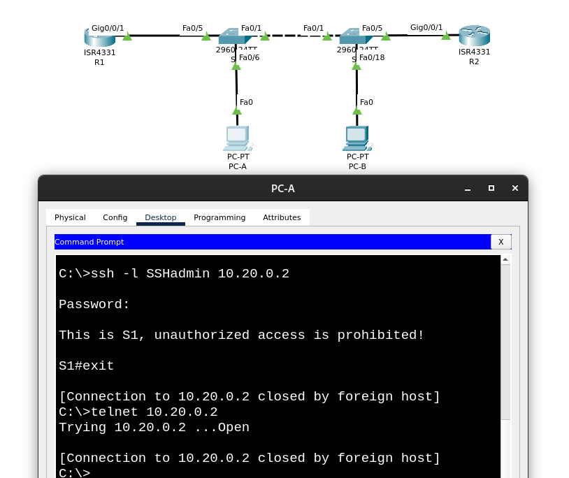

Заходим по ssh на остальные устройства:
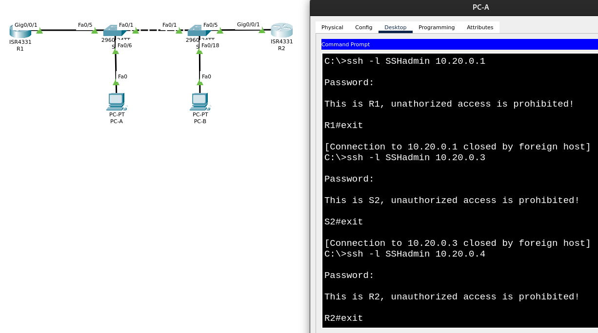

### Шаг 2. Включение защищенных веб-служб с проверкой подлинности на R1

Включаем сервер HTTPS на R1:

```
R1(config)# ip http secure-server 
```

Настраиваем R1 для проверки подлинности пользователей, пытающихся подключиться к веб-серверу:

```
R1(config)# ip http authentication local
```

На Cisco Packet Tracer-е такое снова не провернуть.

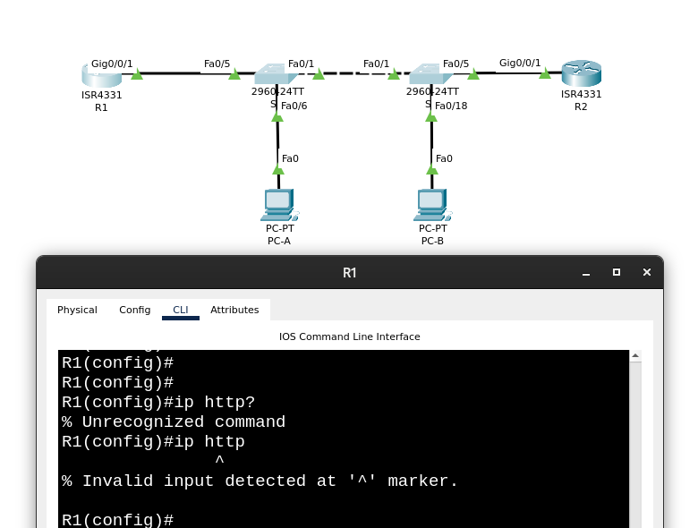


Вместо http secure-server возьмем просто http server

```
R1(config)#ip http authentication local
R1(config)#ip http server
```

Во всяком случае видно, что ответ от сервера приезжает (нам этого достаточно для будущей проверки работы ACL, просто будем использовать 80ый порт вместо 443)

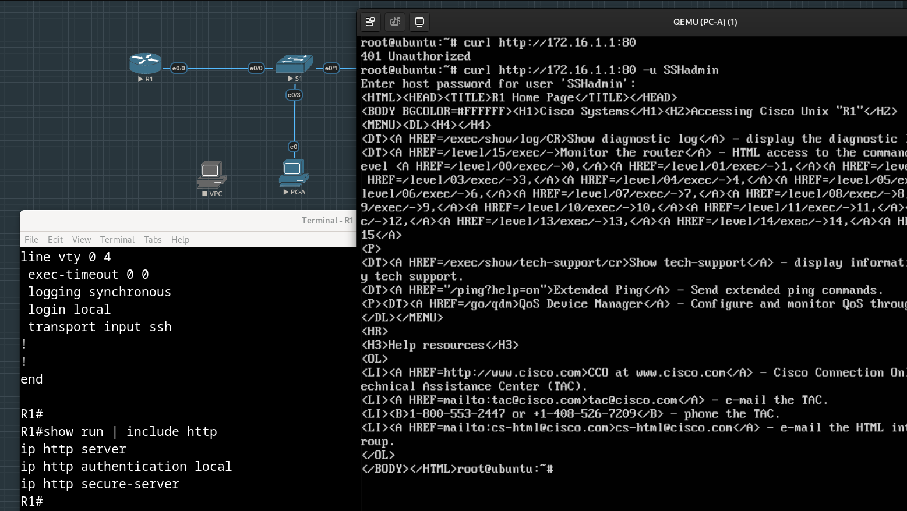

Или вместо loopback 1 сделать физический интерфейс, с серверами в сети 172.16.1.0/24


## Часть 6. Проверка подключений

Пинг 10.40.0.10 (PC-B) и 10.20.0.1 (G0/0/1.20 на R1) с PC-A:

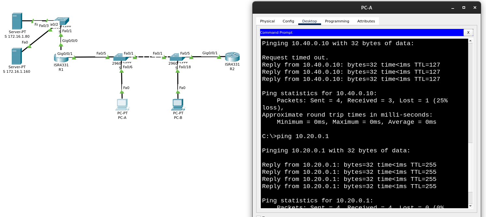

Пинг 10.30.0.10 (PC-A) и 10.20.0.1 (G0/0/1.20 на R1) с PC-B:

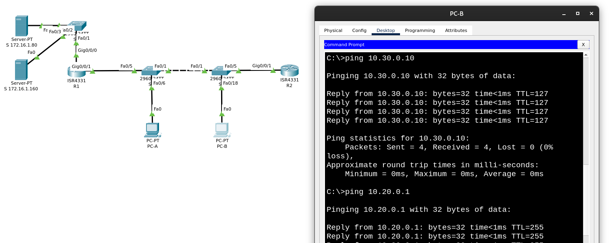

Заходим на http-сервер с PC-B:

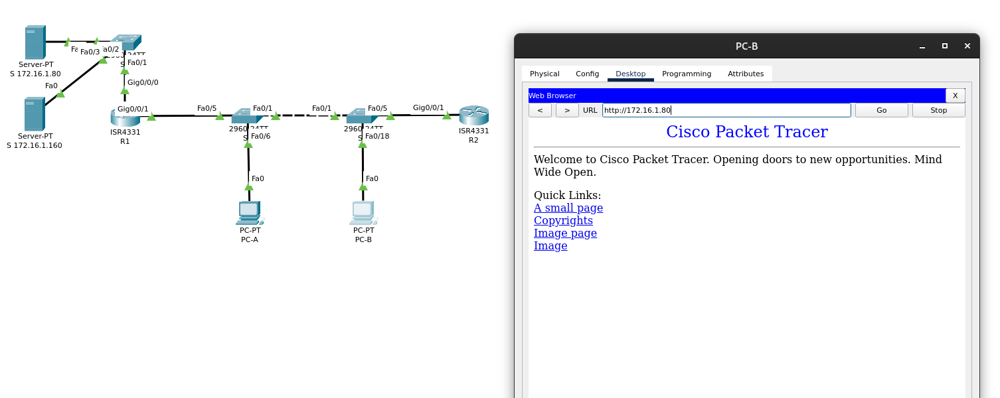

Заходим по SSH на R1 с PC-B:

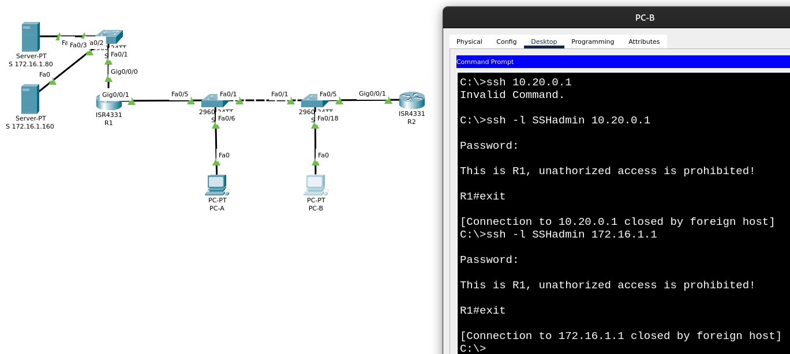

## Часть 7. Настройка и проверка списков контроля доступа (ACL)

>При проверке базового подключения компания требует реализации следующих политик безопасности:

>Политика 1. Сеть Sales не может использовать SSH в сети Management (но в другие сети SSH разрешен).

>Политика 2. Сеть Sales не имеет доступа к IP-адресам в сети Management с помощью любого веб-протокола (HTTP/HTTPS). Сеть Sales также не имеет доступа к интерфейсам R1 с помощью любого веб-протокола. Разрешён весь другой веб-трафик (обратите внимание — Сеть Sales может получить доступ к интерфейсу Loopback 1 на R1).

>Политика 3. Сеть Sales не может отправлять эхо-запросы ICMP в сети Operations или Management. Разрешены эхо-запросы ICMP к другим адресатам.

>Политика 4. Cеть Operations не может отправлять ICMP эхозапросы в сеть Sales. Разрешены эхо-запросы ICMP к другим адресатам.

### Политика 1

Сеть Sales - это сеть 10.40.0.0/24, его default gateway 10.40.0.1 - sub-интерфейс на R1,поэтому я полагаю, что для этой политики список правил можно прикрепить именно к этому sub-интерфейсу.

Политик, где хосты из сети Sales выступают в качестве источников, несколько, поэтому сделаем отдельный список для Sales, и добавим последним (с достаточно большим номером) разрешающее правило.

```
R1(config)#ip access-list extended POLICY-SALES
R1(config-ext-nacl)#100 permit ip any any
```

Чтобы правило, соответствующее политике 1, не было добавлено в конец, за разрешающим правилом, явно пропишем его номер:

```
R1(config-ext-nacl)#10 deny tcp 10.40.0.0 0.0.0.255 10.20.0.0 0.0.0.255 eq 22
```

Сеть Management - это 10.20.0.0/24, порт SSH - 22.

Смотрим получившийся список:

```
R1#show access-lists
Extended IP access list POLICY-SALES
    10 deny tcp 10.40.0.0 0.0.0.255 10.20.0.0 0.0.0.255 eq 22
    100 permit ip any any

R1#
```

Прибиваем список к подынтерфейсу G0/0/1.40 на R1:

```
R1(config)#int g0/0/1.40
R1(config-subif)#ip access-group POLICY-SALES in
```

Проверяем работу правила, пытаемся с PC-B (VLAN 40, 10.40.0.10) сходить по SS на 10.20.0.1:

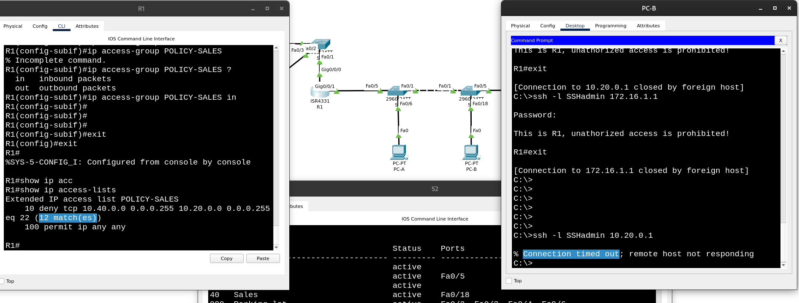

Видим, что PC-B не дождался установления SSH-сессии, а на R1 запрещающее правило сработало 12 раз.

### Политика 2

Тут мы, к сожалению, не сможем проверить отрыв доступа именно на сам R1 по HTTP/HTTPS, поэтому добавим помимо требуемых дополнительные правила для S 171.16.0.80 (не запрещать) и для S 171.16.0.160 (запретить), которые сможем проверить.

Этими правилами запрещаем сети Sales ходить в сеть Management по HTTP/HTTPSЖ
```
R1(config)#ip access-list extended POLICY-SALES
R1(config-ext-nacl)#20 deny tcp 10.40.0.0 0.0.0.255 10.20.0.0 0.0.0.255 eq www
R1(config-ext-nacl)#30 deny tcp 10.40.0.0 0.0.0.255 10.20.0.0 0.0.0.255 eq 443
```

Эти два новых правила на Packet Tracer-e мы не проверим:

```
R1#show ip access-lists
Extended IP access list POLICY-SALES
    10 deny tcp 10.40.0.0 0.0.0.255 10.20.0.0 0.0.0.255 eq 22 (12 match(es))
    20 deny tcp 10.40.0.0 0.0.0.255 10.20.0.0 0.0.0.255 eq www
    30 deny tcp 10.40.0.0 0.0.0.255 10.20.0.0 0.0.0.255 eq 443
    100 permit ip any any (20 match(es))
```

> Сеть Sales также не имеет доступа к интерфейсам R1 с помощью любого веб-протокола
У интерфейсов R1 известные адреса (10.30.0.1 и 10.40.0.1), добавим правила для них:

```
R1(config-ext-nacl)#40 deny tcp 10.40.0.0 0.0.0.255 host 10.30.0.1 eq 443
R1(config-ext-nacl)#50 deny tcp 10.40.0.0 0.0.0.255 host 10.30.0.1 eq www
R1(config-ext-nacl)#60 deny tcp 10.40.0.0 0.0.0.255 host 10.40.0.1 eq www
R1(config-ext-nacl)#70 deny tcp 10.40.0.0 0.0.0.255 host 10.40.0.1 eq 443
```

Правило для sub-интерфейса R1 с адресом 10.20.0.1 мы не добавляли, ибо оно покрывается более общим запрещающим правилом для всей сети Management.

```
R1#show ip access-lists
Extended IP access list POLICY-SALES
    10 deny tcp 10.40.0.0 0.0.0.255 10.20.0.0 0.0.0.255 eq 22
    20 deny tcp 10.40.0.0 0.0.0.255 10.20.0.0 0.0.0.255 eq www
    30 deny tcp 10.40.0.0 0.0.0.255 10.20.0.0 0.0.0.255 eq 443
    40 deny tcp 10.40.0.0 0.0.0.255 host 10.30.0.1 eq 443
    50 deny tcp 10.40.0.0 0.0.0.255 host 10.30.0.1 eq www
    60 deny tcp 10.40.0.0 0.0.0.255 host 10.40.0.1 eq www
    70 deny tcp 10.40.0.0 0.0.0.255 host 10.40.0.1 eq 443
    100 permit ip any any (20 match(es))
```

Запретим дополнительно ходить из сети Sales на сервер 171.16.0.160:

```
R1(config-ext-nacl)#80 deny tcp 10.40.0.0 0.0.0.255 host 172.16.1.160 eq www
R1(config-ext-nacl)#90 deny tcp 10.40.0.0 0.0.0.255 host 172.16.1.160 eq 443
```

Проверим выполнение последних двух правил c PC-B:

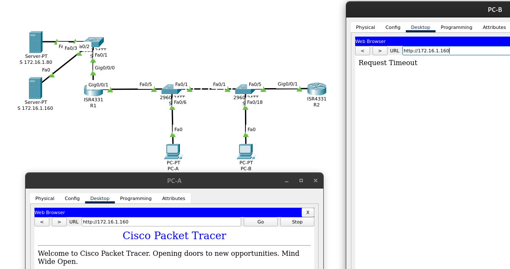

По значениям счетчиков можно убедиться, что последние два запрещающих правила работают:

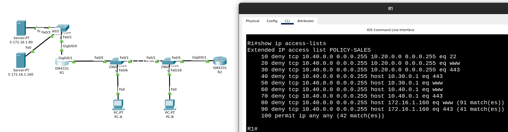

### Политика 3

Сеть Sales не может отправлять эхо-запросы ICMP в сети Operations или Management

Придется подвинуть разрешающее все правило (в Packet Tracer-e мы подключаемся у настраиваемому устройству не через SSH, так что во время этих манипуляций доступ себе мы не оторвали):

```
R1(config)#ip access-list extended POLICY-SALES
R1(config-ext-nacl)#no 100 permit any any
R1(config-ext-nacl)#no 100 permit ip any any
R1(config-ext-nacl)#200 permit ip any any
```

Добавляем правила на icmp echo-реквесты из Sales в Operations и Management:
```
R1(config-ext-nacl)#100 deny icmp 10.40.0.0 0.0.0.255 10.20.0.0 0.0.0.255 echo
R1(config-ext-nacl)#110 deny icmp 10.40.0.0 0.0.0.255 10.30.0.0 0.0.0.255 echo
```

Проверяем пинги с PC-B в сторону PC-A и SVI коммутаторов:

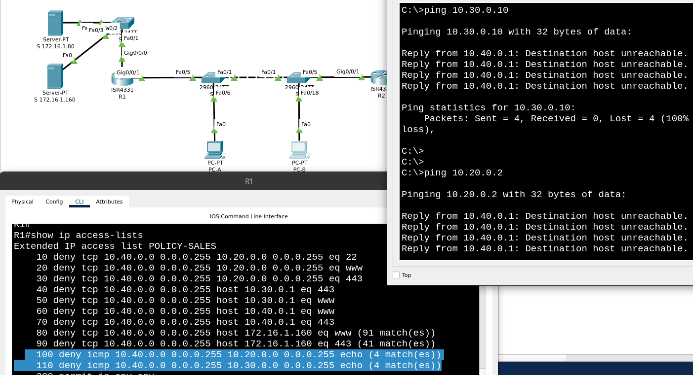

В другие сети пинги по-прежнему ходят:

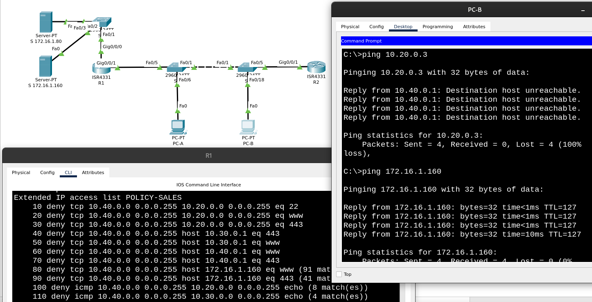

### Политика 4

Теперь ограничения накладываются на сеть Operations (10.30.0.0/24), так что создадим для этой политики отдельный список (вместе с разрешающим "все остальное" правилом):

```
R1(config)#ip access-list ext POLICY-OPERATIONS
R1(config-ext-nacl)#
R1(config-ext-nacl)#100 permit ip any any
R1(config-ext-nacl)#10 deny icmp 10.30.0.0 0.0.0.255 10.40.0.0 0.0.0.255 echo
```

Привяжем список к sub-интерфейсу G0/0/1 (10.30.0.1):

```
R1(config)#int g0/0/1.30
R1(config-subif)#ip access-group POLICY-OPERATIONS in
```

Попробуем попинговать с PC-A 10.40.0.1 и PC-B, чтобы убедиться, что правило работает:

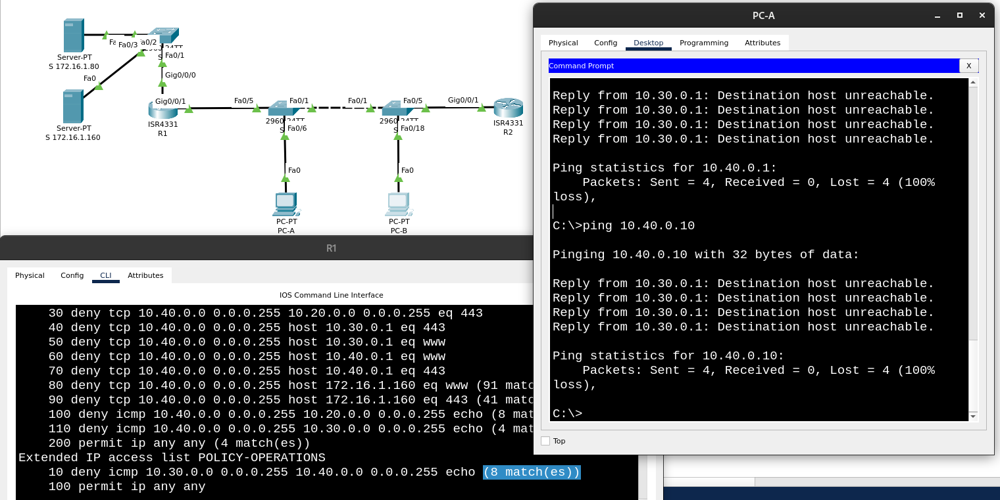