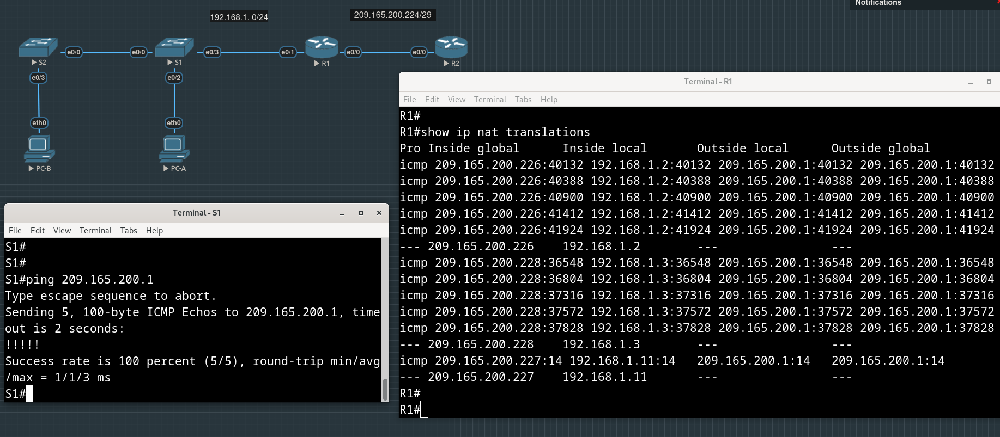

# Лабораторная работа №12. Настройка NAT для IPv4


**Таблица адресации**

| Устройство | Интерфейс   | IP-адрес        | Маска подсети   |
| :--------  | :---------- | :-------------- | :-------------- |
| R1         | e0/0        | 209.165.200.230 | 255.255.255.248 |
|            | e0/1        | 192.168.1.1     | 255.255.255.0   |
| R2         | e0/0        | 209.165.200.225 | 255.255.255.248 |
|            | Lo1         | 209.165.200.1   | 255.255.255.224 |
| S1         | VLAN 1      | 192.168.1.11    | 255.255.255.0   |
| S2         | VLAN 1      | 192.168.1.12    | 255.255.255.0   |
| PC-A       | NIC         | 192.168.1.2     | 255.255.255.0   |
| PC-B       | NIC         | 192.168.1.3     | 255.255.255.0   |

## Часть 1. Создание сети и настройка основных параметров устройства

Создаем топологию, настраиваем адреса на маршрутизаторах и SVI интерфейсах коммутаторов и прописываем маршруты.

Отдельно пришлось вспомнить, что для хождения на SVI с R2 пришлось добавить default gateway на коммутаторах:

```
S1(config)#ip default-gateway 192.168.1.1
```

Только почему-то этого мало, как потом заметим, пинги с S1 в другие сети не ходят, а в ```show ip route``` видно, что ```Gateway of last resort is not set```, несмотря на запись ```ip default-gateway 192.168.1.1``` в running-config.

```
S1(config)#ip route 0.0.0.0 0.0.0.0 192.168.1.1
```

То же самое на S2

```
S2(config)#ip default-gateway 192.168.1.1
S2(config)#ip route 0.0.0.0 0.0.0.0 192.168.1.1
```

## Часть 2. Настройка и проверка NAT для IPv4

### Шаг 1. Настройка NAT на R1

Внутренний интерфейс - интерфейс, смотрящий в сторону клиентов (немаршрутизируемая сеть 192.168.1.0/24), хотим, чтобы пакеты от этих источников уходили по крайней мере во внешнюю сеть 209.165.200.0/24, для этого на маршрутизаторе R1 нужно подменить их адреса на маршрутизируемые (из той же сети, в которую входят смотрящие друг на друга интерфейсы R1 и R2).

Используем для такой подмены ("во что") пул из трех адресов ```209.165.200.226 - 209.165.200.228```:

```R1(config)#ip nat pool PUBLIC_ACCESS 209.165.200.226 209.165.200.228 netmask 255.255.255.248```

Адреса, которые хотим подменить ("что"), опишем списком ACL:

```R1(config)#access-list 1 permit 192.168.1.0 0.0.0.255```

Связываем пул и ACL:

```R1(config)#ip nat inside source list 1 pool PUBLIC_ACCESS```


Внутренний интерфейс (в сторону локальной сети) в нашем случае E0/1,

внешний интерфейс (в сторону маршрутизатора R2) - E0/0:

```
R1(config)#int e0/0
R1(config-if)#ip nat outside
R1(config-if)#exit
R1(config)#
R1(config)#int e0/1
R1(config-if)#ip nat inside
R1(config-if)#exit
```


### Шаг 2. Проверка конфигурации

С PC-B пингуем интерфейс Lo1 (209.165.200.1) на R2.

Добавляем на R1 такой маршрут, чтобы включал в себя и сеть, в которую входит Lo1 на R2:

```
R1(config)#ip route 209.165.200.0 255.255.255.0 209.165.200.225
```

Смотрим ```show ip nat translations```:


> Во что был транслирован внутренний локальный адрес PC-B?

В первый адрес 209.165.200.226 из пула PUBLIC_ACCESS, который мы указали, когда настраивали NAT на R1. Он же появился и как Local route в таблице маршрутов.

> Какой тип адреса NAT является переведенным адресом?

Inside Global Address.

Теперь пробуем пинговать тот же адрес 209.165.200.1 с PC-A:


Видим, что в таблице трансляций появилось сопоставление следующего адреса из пула внутреннему адресу PC-A: ```209.165.200.227 - 192.168.1.2```.

Снова пингуем адрес 209.165.200.1, на этот раз с S1:



В таблице трансляций появилось соответствие внешнего (из пула) и внутреннего адресов S1.

Теперь пингуем адрес 209.165.200.1 с S2:


Как и ожидалось, пинг не проходит, в пуле всего три адреса, и все они уже заняты.

После очистки таблицы трансляций видим, что пинг с S2 проходит, а в таблице появилась новая запись, один из адресов пула был выделен уже S2:


## Часть 3. Настройка и проверка PAT для IPv4

### PAT с пулом

Чтобы уйти от преобразования "один-к-одному", учитывая, что адресов в пуле меньше, чем устройств за NAT-ом, заменим команду соответствия пула списку ACL на "соответствие с перерузкой":

```
R1(config)#no ip nat inside source list 1 pool PUBLIC_ACCESS 
R1(config)#ip nat inside source list 1 pool PUBLIC_ACCESS overload  
```

На PC-A и PC-B запускаем безостановочный пинг
```
VPCS> ping 209.165.200.1 -t
```

В таблице трансляций видим, что используется один и тот же глобальный адрес из пула для обоих внутренних адресов:


> Как маршрутизатор отслеживает, куда идут ответы?

По таблице трансляций, теперь порты помогают идентифицировать внутренний адрес (на скрине выше заметно, что значения портов в столбцах Inside local и Inside global не всегда совпадают).

Смотрим статистику:


### PAT с интерфейсом

При использовании "PAT с пулом" только один адрес из пула был задействован, поэтому хотим избавиться от пула вообще, и подставлять "наружу" в качестве src ip исходящего из-за NAT-а пакета адрес интерфейса маршрутизатора.

Сначала нужно отвязать пул от ACL:

```
R1(config)#no ip nat inside source list 1 pool PUBLIC_ACCESS overload
```

Теперь можем удалить пул:

```
R1(config)# no ip nat pool PUBLIC_ACCESS
```

Теперь привязываем список внутенних адресов уже к внешнему интерфейсу:

```
R1(config)#ip nat inside source list 1 interface e0/0 overload
```

Теперь пробуем пинговать 209.165.200.1 со всех устройств за NAT-ом:


Видим, что в таблице трансляций в качестве Inside Global Address подставляется всегда, для всех внутренних источников, адрес интерфейса e0/0.


## Часть 4. Настройка и проверка статического NAT для IPv4

Настроим статический NAT таким образом, чтобы PC-A был доступен напрямую из Интернета.

PC-A будет доступен из R2 по адресу 209.165.200.229.

Почистили статистику и таблицу преобразований на R1:

```
R1#clear ip nat translations *
                           ^
% Invalid input detected at '^' marker.

R1#clear ip nat translation * 
R1#clear ip nat st           
R1#clear ip nat statistics
```

Зададим статическое сопоставление внутреннего адреса PC-A видимому "снаружи" 209.165.200.229:

```
R1(config)#ip nat inside source static 192.168.1.2 209.165.200.229 
```

Тестируем: пингуем адрес 209.165.200.229 с R2 и смотрим таблицу трансляций на R1:


Пинги возвращаются, статический NAT работает.