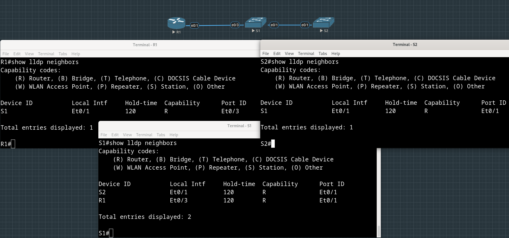

# Лабораторная работа №13. Настройка протоколов CDP, LLDP и NTP


**Таблица адресации**

| Устройство | Интерфейс   | IP-адрес   | Маска подсети | Шлюз по умолчанию |
| :--------  | :---------- | :--------- | :------------ | :---------------- |
| R1         | Loopback1   | 172.16.1.1 | 255.255.255.0 | -                 |
|            | e0/1        | 10.22.0.1  | 255.255.255.0 |                   |
| S1         | SVI VLAN 1  | 10.22.0.2  | 255.255.255.0 | 10.22.0.1         |
| S2         | SVI VLAN 1  | 10.22.0.3  | 255.255.255.0 | 10.22.0.1         |

## Часть 1. Создание сети и настройка основных параметров устройств

Создаем топологию, настраиваем адреса на маршрутизаторах и SVI интерфейсах коммутаторов, приветственные баннеры, пароли и т.п.

Фрагменты конфига и команд, введенных на устройствах:

```
hostname R1
!
............
!
enable secret 5 $1$PITw$L1Xgx873tqQnQGYQQvLG./
!
............
!         
banner motd ^CThis is R1, unauthorized access is strictly prohibited!^C
!         
line con 0
 exec-timeout 0 0
 password 7 121A0C041104
 logging synchronous
 login    
line aux 0
line vty 0 4
 exec-timeout 0 0
 password 7 02050D480809
 logging synchronous
 login    
 transport input none
!
```

```
S2(config)#int vlan 1
S2(config-if)#ip address 10.22.0.3 255.255.255.0
S2(config-if)#no shut
S2(config-if)#exit
S2(config)#ip default-gateway 10.22.0.1
```

## Часть 2. Обнаружение сетевых ресурсов с помощью протокола CDP

Смотрим вывод команды ```show cdp``` на R1:

```
R1#show cdp
Global CDP information:
	Sending CDP packets every 60 seconds
	Sending a holdtime value of 180 seconds
	Sending CDPv2 advertisements is  enabled
```

Сколько интерфейсов включено, и какие из них используют CDP:

```
R1#show cdp interface 
Ethernet0/0 is administratively down, line protocol is down
  Encapsulation ARPA
  Sending CDP packets every 60 seconds
  Holdtime is 180 seconds
Ethernet0/1 is up, line protocol is up
  Encapsulation ARPA
  Sending CDP packets every 60 seconds
  Holdtime is 180 seconds
Ethernet0/2 is administratively down, line protocol is down
  Encapsulation ARPA
  Sending CDP packets every 60 seconds
  Holdtime is 180 seconds
Ethernet0/3 is administratively down, line protocol is down
  Encapsulation ARPA
  Sending CDP packets every 60 seconds
  Holdtime is 180 seconds

 cdp enabled interfaces : 4
 interfaces up          : 1
 interfaces down        : 3
```

Узнаем больше о соседях R1:

```
R1#show cdp entry  S1
-------------------------
Device ID: S1
Entry address(es): 
  IP address: 10.22.0.2
Platform: cisco WS-C2960+24LC-L, Capabilities: Switch IGMP 
Interface: Ethernet0/1,  Port ID (outgoing port): Ethernet0/3
Holdtime : 165 sec
Second Port Status: Unknown

Version :
Cisco IOS Software, C2960 Software (C2960-LANBASEK9-M), Version 15.2(4)E8, RELEASE SOFTWARE (fc3) 
Technical Support: http://www.cisco.com/techsupport
Copyright (c) 1986-2019 by Cisco Systems, Inc.
Compiled Fri 15-Mar-19 17:28 by prod_rel_team 

advertisement version: 2
Native VLAN: 1
Duplex: half
Management address(es): 
  IP address: 10.22.0.2
```

На S1 смотрим статистику полученных и отправленныъ пакетов CDP:

```
S1#show cdp traffic 
CDP counters :
	Total packets output: 156, Input: 67
	Hdr syntax: 0, Chksum error: 0, Encaps failed: 0
	No memory: 0, Invalid packet: 0, 
	CDP version 1 advertisements output: 0, Input: 0
	CDP version 2 advertisements output: 156, Input: 67
```

Глобально отключаем CDP на всех устройствах:

```
S1(config)#no cdp run 
S1(config)#exit
S1#show cdp 
% CDP is not enabled
```
## Часть 3. Обнаружение сетевых ресурсов с помощью протокола LLDP

На всех устройствах глобально включаем LLDP:

```
R1(config)#lldp run 
R1(config)#
R1(config)#exit
R1#show lldp

Global LLDP Information:
    Status: ACTIVE
    LLDP advertisements are sent every 30 seconds
    LLDP hold time advertised is 120 seconds
    LLDP interface reinitialisation delay is 2 seconds
R1#
```

На S1 изучаем информацию о соседе S2:

```
S1#show lldp entry S2 

Capability codes:
    (R) Router, (B) Bridge, (T) Telephone, (C) DOCSIS Cable Device
    (W) WLAN Access Point, (P) Repeater, (S) Station, (O) Other
------------------------------------------------
Local Intf: Et0/1
Chassis id: aabb.cc00.3000
Port id: Et0/1
Port Description: Ethernet0/1
System Name: S2

System Description: 
Cisco IOS Software, C2960 Software (C2960-LANBASEK9-M), Version 15.2(4)E8, RELEASE SOFTWARE (fc3) 
Technical Support: http://www.cisco.com/techsupport
Copyright (c) 1986-2019 by Cisco Systems, Inc.
Compiled Fri 15-Mar-19 17:28 by prod_rel_team 

Time remaining: 97 seconds
System Capabilities: B,R
Enabled Capabilities: R
Management Addresses:
    IP: 10.22.0.3
Auto Negotiation - not supported
Physical media capabilities - not advertised
Media Attachment Unit type - not advertised
Vlan ID: - not advertised
          
          
Total entries displayed: 1
S1#
```

>Что такое chassis ID для коммутатора S2?

Похоже, что это Base ethernet MAC address коммутатора S2, который можно увидеть в ```show version``` и используемый в BridgeId в STP.

>Соединитесь через консоль на всех устройствах и используйте команды LLDP, необходимые для отображения топологии физической сети только из выходных данных команды show.

Поскольку LLDP-сообщения получившими их устройствами не пробрасываются дальше, то соседство может означать только прямое подключение интерфейса одного устройства к интерфейсу другого устройства, никого промежуточного между ними быть не может.



## Часть 4. Настройка NTP

Текущее время на R1:
```
R1#show clock 
*17:44:35.447 UTC Tue Jul 30 2024
```

С помощью команды ```clock set``` устанавливаем время на R1:

```
R1#clock set 21:00:00 May 27 2017
R1#show clock                    
21:00:01.427 UTC Sat May 27 2017
R1#
```

Делаем R1 мастером в stratum-е 4:

```
R1(config)#ntp master 4 
```

Смотрим статус и associations:

```
R1#show ntp status 
Clock is synchronized, stratum 4, reference is 127.127.1.1
........
```

Видим, что в качестве NTP-сервера - источника знания о времени указан loopback адрес (т.е. как мы и настроили, мы сами и есть этот источник).

```
R1#show ntp associations 

  address         ref clock       st   when   poll reach  delay  offset   disp
*~127.127.1.1     .LOCL.           3      1     16     3  0.000   0.000 3938.2
 * sys.peer, # selected, + candidate, - outlyer, x falseticker, ~ configured
R1#
```

На S1 и S2 указываем в качестве NTP-сервера Loopback интерфейс R1 (адрес Loopback интерфейса R1 однозначно идентифицирует его во всех сетях, в которые смотрят его физические интерфейсы, имеющие в каждой их этих сетей разные (соответстующие этим сетям) адреса):

```
S1(config)#ntp server 172.16.1.1
```

```
S2(config)#ntp server 172.16.1.1
```

В выводе ```show ntp associations``` на NTP-клиентах S1 и S2 появился NTP-сервер 172.16.1.1 со stratum 4 (каким мы его и конфигурировали)

```
S1#show ntp associations 

  address         ref clock       st   when   poll reach  delay  offset   disp
*~172.16.1.1      127.127.1.1      4     58     64     7  2.999 1190491  2.664
 * sys.peer, # selected, + candidate, - outlyer, x falseticker, ~ configured
S1#
```

```
S2#show ntp associations 

  address         ref clock       st   when   poll reach  delay  offset   disp
*~172.16.1.1      127.127.1.1      4      6     64    17  2.999 1190491  2.814
 * sys.peer, # selected, + candidate, - outlyer, x falseticker, ~ configured
S2#
```

Часы показывают то же время, что и на NTP-сервере:
```
S1#show clock detail 
21:08:56.488 UTC Sat May 27 2017
Time source is NTP
```


## Вопрос для повторения
>Для каких интерфейсов в пределах сети не следует использовать протоколы обнаружения сетевых ресурсов? Поясните ответ.

Видимо, для интерфейсов, направленных в сторону пользователей, среди который может оказаться злоумышленник, желающий узнать, что за устройство находится следующим в сети. В CDP/LLDP сообщениях есть информация, например, о версии операционной системе устройства, злоумышленник может попытаться воспользоваться какими-то известными в ней уязвимостями.